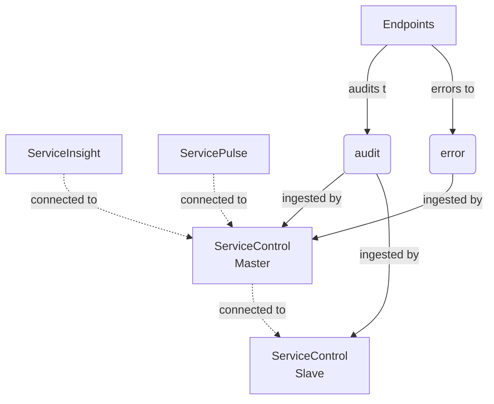
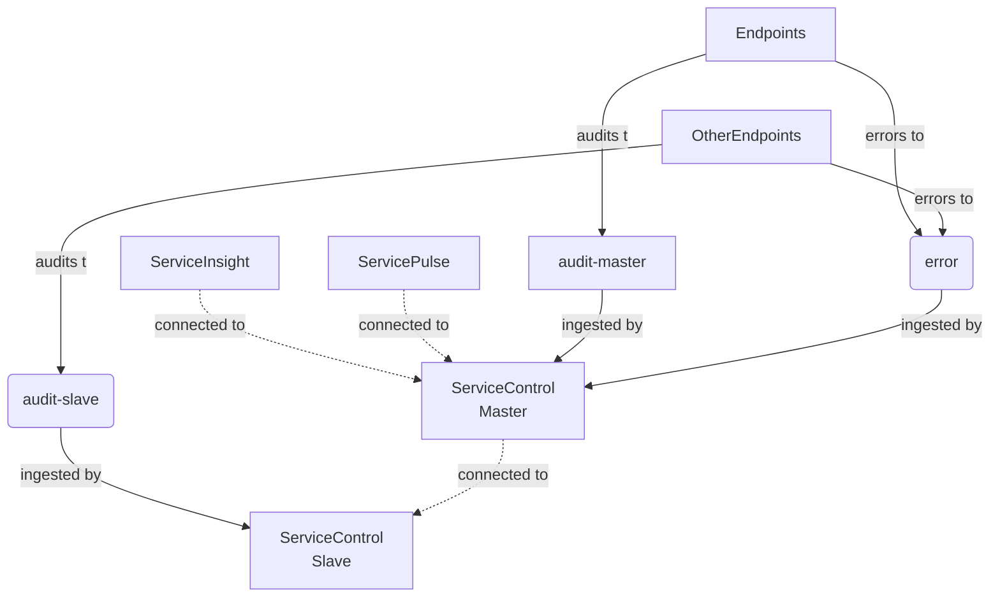
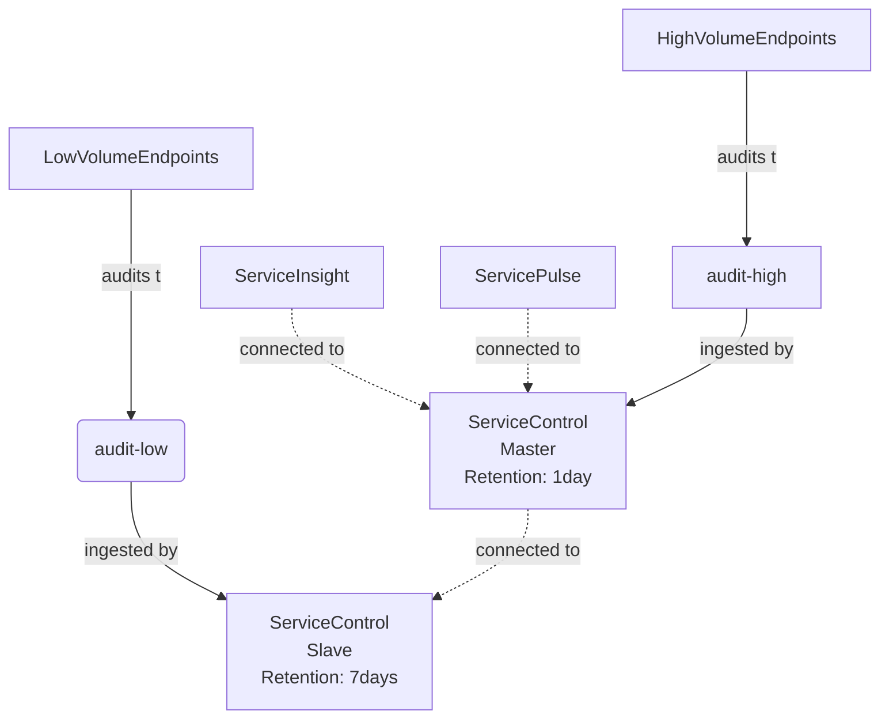
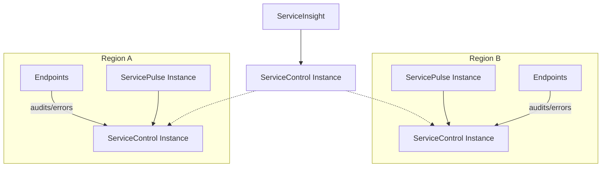

NOTE: A multi-instance ServiceControl installation can be complex to maintain. Before splitting ServiceControl, it is recommended to follow the capacity planning guides described in the [ServiceControl Capacity Planning](/servicecontrol/capacity-and-planning.md) documentation.

Audit message processing can become a performance challange when running NServiceBus systems at a scale. Multi-instance deployment enables sharding audit data between ServiceControl instances. 

ServiceControl multi-intance deployments should be considered in scenarios when the audit message load in continously high and too big for a single instance to handle.

## Overview

Multi-instance deployments consist of at least two ServiceControl instances. In such a setup there is a single designated instance - a master responsible for processing error messages and optionally audit messages. All other existing ServiceControl instances are slaves responsible **only** for processing audit messages. 

It is only the master instance that handles the external API requests (from ServicePulse or ServiceInstance). Master is the only party communicating with slave instances directly for the purpose of query execution.

The following is a high-level look at the steps needed to deploy ServiceControl in multi-instance mode:

- Install a ServiceControl master instance and configure it to route API queries to its slave instances
- Install one or more ServiceControl slave instances
- Audit message sharding can be performend at the queue level (separate audit queue per shard). In such case the production endpoints must forward audit messages to different [audit queues](/nservicebus/operations/auditing.md) consumed by different ServiceControl instances

NOTE: Apart from mulit-region deployments ServicePulse and ServiceInsight should always connect to the ServiceControl master.

WARNING: All instances of ServiceControl MUST have a unique name

### Sharding audit messages with competing consumers

This section walks through a fresh installation of multiple ServiceControl instances where audit messages are sharded with competing consumers approach - two instances of ServiceControl (master and slave) compete for audit messages on a single audit queue. All of the endpoints will forward their audit messages to `audit`. All error messages are forwarded to the `error` queue. ServiceInsight and ServicePulse are connected to the master instance.



Setup steps:
1. Install the ServiceControl slave instance (on separate infrastructure) which points to `audit` according to the [installation guidelines](/servicecontrol/installation.md). Each slave instance must have a unique name. The ServiceControl instance name and the port are required to configure the master instance (for example `Particular.ServiceControl.Slave` and the port `33334`). Make sure error queue processing is disabled by specifying `!disable` as the error queue field in the ServiceControl Management Utility, or as the error queue parameter of the [Powershell](/servicecontrol/installation-powershell.md) installation script, or by editing `ServiceControl.exe.config` as shown below:

```xml
<?xml version="1.0" encoding="utf-8"?>
<configuration>
    <appSettings>
        <add key="ServiceBus/ErrorQueue" value="!disable" />
    </appSettings>
</configuration>
```

If the error queue is set to `!disable` then error forwarding will be ignored even if enabled.

2. Install the ServiceControl master instance which points to `audit` according to the [installation guidelines](/servicecontrol/installation.md).
3. Stop the ServiceControl master instance and edit the [`ServiceControl.exe.config` ](/servicecontrol/creating-config-file.md) with the `RemoteInstances` key. The value for the key is a json array.

```xml
<configuration>
  <appSettings>
    <add key="ServiceControl/RemoteInstances" value="[{'api_uri':'http://localhost:33334/api', 'queue_address':'Particular.ServiceControl.Slave'}]'"/>
  </appSettings>/
</configuration>
```

4. Start the ServiceControl master instance.
5. Validate ServiceInsight and ServicePulse are connecting to the master instance only.

### Sharding audit messages with split audit queue

This section walks through a fresh installation of multiple instances of ServiceControl in which audit messages are sharded with separate audit queues. Some of the endpoints will forward their audit messages to `audit-master` processed by the master while others will forward their audit messages to `audit-slave` processed by the slave. All error messages are forwared to the `error` queue. ServiceInsight and ServicePulse are connected to the master instance.



Setup steps:

1. Install the ServiceControl slave instance (on separate infrastructure) which ingests messages from the `audit-slave` queue according to the [installation guidelines](/servicecontrol/installation.md). Each slave instance must have a unique name. The ServiceControl instance name and the port are required to configure the master instance. In this example, the name `Particular.ServiceControl.Slave` and the port `33334` is used. Make sure error queue processing is disabled by specifying `!disable` as the error queue field in the ServiceControl Management Utility, or as the error queue parameter of the [Powershell](/servicecontrol/installation-powershell.md) installation script, or by editing `ServiceControl.exe.config` as shown below:

```xml
<?xml version="1.0" encoding="utf-8"?>
<configuration>
    <appSettings>
        <add key="ServiceBus/ErrorQueue" value="!disable" />
    </appSettings>
</configuration>
```

If the error queue is set to `!disable` then error forwarding will be ignored even if enabled.

2. Install the ServiceControl master instance which ingests messages from the `audit-master` queue according to the [installation guidelines](/servicecontrol/installation.md).
3. Stop the ServiceControl master instance and edit the [`ServiceControl.exe.config` ](/servicecontrol/creating-config-file.md) with the `RemoteInstances` key. The value for the key is a json array.

```xml
<configuration>
  <appSettings>
    <add key="ServiceControl/RemoteInstances" value="[{'api_uri':'http://localhost:33334/api', 'queue_address':'Particular.ServiceControl.Slave'}]'"/>
  </appSettings>/
</configuration>
```

4. Start the ServiceControl master instance.
5. Validate ServiceInsight and ServicePulse are connecting to the master instance only.

### Splitting an existing installation

This section walks through converting a single existing ServiceControl installation into a master-slave configuration.

1. Add an additional ServiceControl instance (on separate infrastructure and with a unique name) intended to ingest audit messages only. Disable error queue processing as described above. This will be a slave instance.
2. Configure production endpoints to send audit messages to the newly added ServiceControl instance.
3. Make the original endpoint a designated master by adding `ServiceControl/RemoteInstances` setting, pointing to the slave instance of ServiceControl.

## Advanced scenarios

### Audit retention



Each ServiceControl instance can have different settings. For example it is possible to have different [audit retention periods](/servicecontrol/creating-config-file.md#data-retention-servicecontrolauditretentionperiod). With that in mind, high volume endpoints can report audits to a ServiceControl instance with shorter retention periods (thus evicting old messages faster). This allows catering settings as well as resources being used by ServiceControl to the needs of the endpoints configured to audit to a specific ServiceControl instance.

NOTE: If there are conversations that span `HighVolumenEndpoints` and `LowVolumeEndpoints` data available in audit store might be incomplete.

### Migration

Sometimes it is necessary to migrate a ServiceControl master to a different machine with better hardware. By taking the audit retention period into account it is possible to migrate ServiceControl instances without needing to backup and restore data.

Describe

Server Slow: Master (7 days, error enabled, audit enabled)
Server Fast 1: Slave 1 (error disabled, audit enabled)
Server Fast 2: Slave 2 (error disabled, audit enabled)

endpoints point to Slave 1 Audit and Slave 2 audit
after 7 days
Configure slave 1 to be the new master, enable error
Shutdown master
Point tools to Slave 1 which is the new master

### Multi-region deployments

Mutli-region deployments are partially supported (error data sharding is not supported). Such setup consists of ServiceControl slave deployed in each region and a master instance responsible for aggregating audit data. 

In this scenario all cross-region audit data can be queried via ServiceInsight connected to the master. However to use the recoverability features a dedicated ServicePulse installation in each region is required. 


## Configuration of multiple slaves

Multiple slave instances can be configured as follows:

```xml
<configuration>
  <appSettings>
    <add key="ServiceControl/RemoteInstances" value="[{'api_uri':'http://localhost:33334/api', 'queue_address':'Particular.ServiceControl.Slave1'},{'api_uri':'http://localhost:33335/api', 'queue_address':'Particular.ServiceControl.Slave2'}]'"/>
  </appSettings>/
</configuration>
```

## Disabling auditing

With multiple instances in place, it is possible to disable the auditing in the master instance and only perform auditing in the slaves. Auditing can be disabled by specifying `!disabled` in the audit queue name field in the ServiceControl Management utility, or by editing the `ServiceControl.exe.config` as follows:

```xml
<?xml version="1.0" encoding="utf-8"?>
<configuration>
    <appSettings>
        <add key="ServiceBus/AuditQueue" value="!disable" />
    </appSettings>
</configuration>
```
Audit forwarding, if enabled, will be ignored.

# Known limitations

- Splitting into multiple ServiceControl instances is supported only for auditing.
- Only one ServiceControl instance should have error handling / recoverability enabled (usually the master) unless the multi-region scenario is used.
- Pagination with ServiceInsight may not work as traditional pagination would. For example, some pages might be filled unevenly depending on how the load is scattered between the different ServiceControl instances.
- Data from remote instances that cannot be reached by the master instance will not be included in the results.
- Multi-instance configuration is a manual setup process and cannot be done via the ServiceControl Management application.
- Incorrect configuration could introduce cyclic loops.
- Having multiple masters is discouraged.
