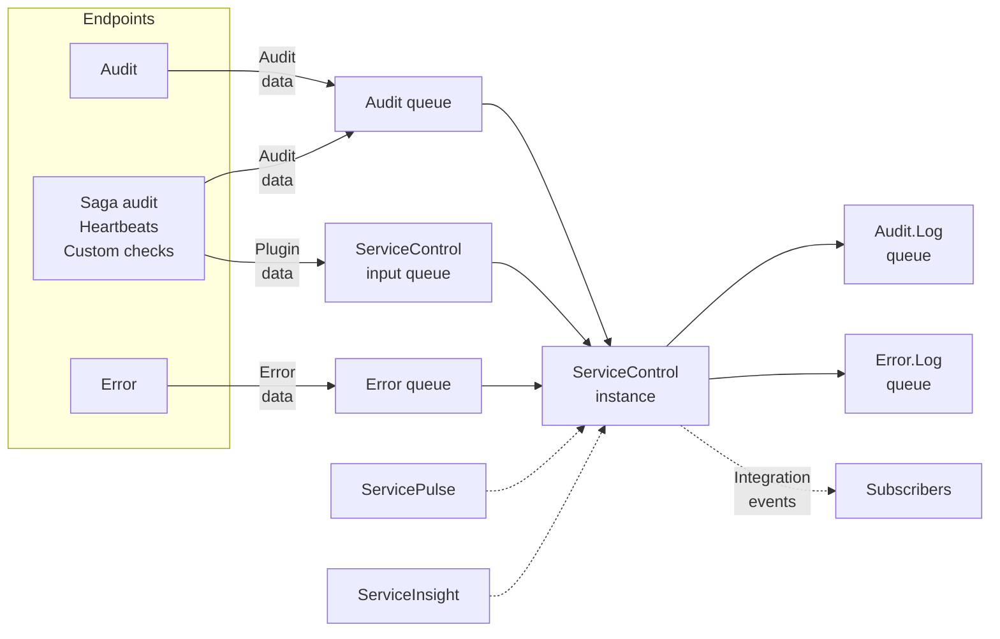

ServiceControl instances collect and analyze data about the endpoints that make up a system and the messages flowing between them. This data is exposed to [ServiceInsight](/serviceinsight/) and [ServicePulse](/servicepulse/) by an HTTP API and is exposed for other uses by [external integration events](/servicecontrol/contracts.md).

NOTE: The ServiceControl HTTP API is designed for use by ServicePulse and ServiceInsight only and may change at any time. Use of this HTTP API for other purposes is discouraged.

Note: In versions of ServiceControl prior to 4.13.0, saga audit plugin data can only be processed by the main ServiceControl instance using the input queue. Starting with version 4.13.0, saga audit plugin data can also be processed by a ServiceControl audit instance using the `audit` queue. The latter approach is recommended.

All endpoints in the system should be [configured to send a copy of every message that is processed to a central audit queue](/nservicebus/operations/auditing.md). A ServiceControl instance consumes the messages from the audit queue and makes them available for visualization in ServiceInsight. If required, the messages may also be forwarded to an [audit log queue](/servicecontrol/errorlog-auditlog-behavior.md) for further processing.

NOTE: In ServiceControl version 4 and above, messages in the audit queue are consumed by one or more separate [ServiceControl Audit](/servicecontrol/audit-instances/) instances. The main ServiceControl instance is configured to aggregate data from all connected ServiceControl Audit instances.

All endpoints in the system should be [configured to send failed messages to a central error queue](/nservicebus/recoverability/) after those messages have exhausted immediate and delayed retries. A ServiceControl instance consumes the messages from the error queue and makes them available for manual retries in ServicePulse and ServiceInsight. If required, the messages may also be forwarded to an [error log queue](/servicecontrol/errorlog-auditlog-behavior.md) for further processing.

An endpoint may also have plugins installed which collect and send data to a ServiceControl instance. The [heartbeat plugin](/monitoring/heartbeats/) detects which endpoint instances are running and which are offline. The [custom checks plugin](/monitoring/custom-checks/) sends user-defined health reports to ServiceControl on a regular schedule. The [saga audit plugin](/servicecontrol/plugins/saga-audit.md) enriches audit messages with the details of saga state changes, for [visualization in ServiceInsight](/serviceinsight/#the-saga-view).

All ServiceControl instances publish [external integration events](/servicecontrol/contracts.md) which may be subscribed to by any endpoint.

All ServiceControl instances store data in an embedded database. Audit data is retained for 30 days. Failed message data is retained until the message is retried or manually deleted. [These retention periods may be changed](/servicecontrol/creating-config-file.md#data-retention).

Each environment should have a single audit queue and a single error queue that all endpoints are configured to use. Each environment should have at least one ServiceControl instance that is connected to its audit and error queues. The [planning documentation](/servicecontrol/servicecontrol-in-practice.md) should be consulted before creating a new ServiceControl instance.

### Self-monitoring via custom checks

include: self-monitoring
