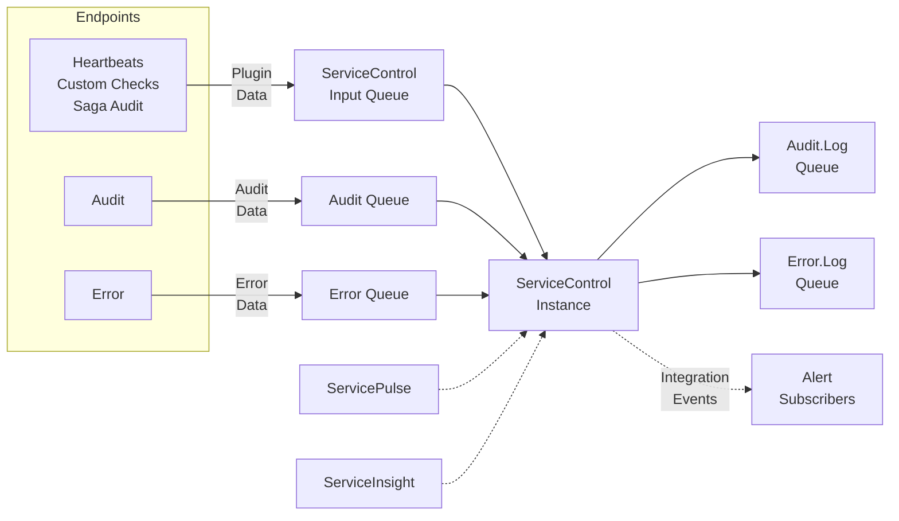

ServiceControl instances collect and analyze data about the endpoints that make up a system and the messages flowing between them. This data is exposed to [ServiceInsight](/serviceinsight/) and [ServicePulse](/servicepulse/) via an HTTP API and SignalR, and via [external integration events](/servicecontrol/contracts.md).

NOTE: The ServiceControl HTTP API is designed for use by ServicePulse and ServiceInsight only and may change at any time. Use of this HTTP API for other purposes is discouraged.

Each endpoint in the system should be [configured to send audit copies of every message that is processed into a central audit queue](/nservicebus/operations/auditing.md). A ServiceControl instance reads the messages in the audit queue and makes them available for visualization in ServiceInsight. ServiceControl can [optionally forward these messages into an Audit Log queue](/servicecontrol/errorlog-auditlog-behavior.md) for further processing if required.

Each endpoint in the system should be [configured to send failed messages to a central error queue](/nservicebus/recoverability/) after those messages have gone through immediate and delayed retries. A ServiceControl instance reads the messages in the error queue and makes them available to be retried manually in ServicePulse and ServiceInsight. ServiceControl can [optionally forward these messages into an Error Log queue](/servicecontrol/errorlog-auditlog-behavior.md) for further processing if required. 

Each endpoint may have additional plugins installed which collect and send data to a ServiceControl instance. The [Heartbeats plugin](/monitoring/heartbeats/) can be used to detect which endpoint instances are running and which are offline. The [Custom Checks plugin](/monitoring/custom-checks/) enables endpoints to send user-defined health reports to ServiceControl on a regular schedule. The [Saga Audit plugin](/nservicebus/sagas/saga-audit) instruments audit messages with details of saga state changes for [visualization in ServiceInsight](/serviceinsight/#the-saga-view).

Each ServiceControl instance raises external integration events when important situations are detected. These are standard NServiceBus events that can be subscribed to by any NServiceBus endpoint. See [Use ServiceControl events](/servicecontrol/contracts.md) for a complete list.

Each ServiceControl instance stores data in an embedded database. Audit data is retained for 30 days. Failed message data is retained until the message is retried or manually archived. [These retention periods can be customized](/servicecontrol/creating-config-file.md#data-retention).

Each environment should have a single audit queue and a single error queue that all endpoints are configured to use. Each environment should have a single ServiceControl instance that is connected to it's audit and error queues. Consider the advice given in the [Planning](/servicecontrol/servicecontrol-in-practice.md) section of the documentation before creating a new ServiceControl instance.

