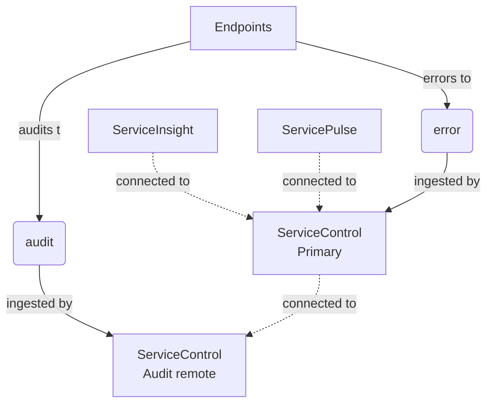
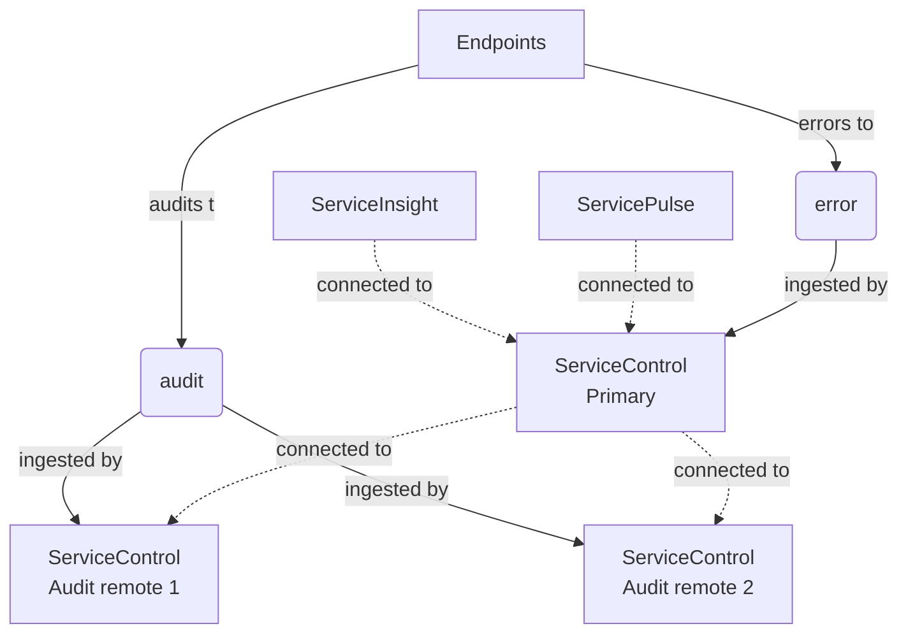
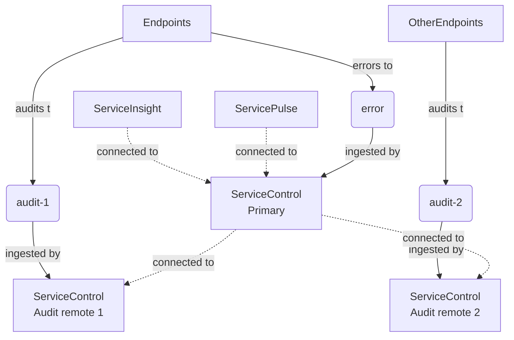

[ServiceInsight](/serviceinsight/) connects to a [ServiceControl instance](/servicecontrol/servicecontrol-instances/) via an http api in order to create visualizations. In some installations, data to complete a visualization may reside in multiple ServiceControl instances. The ServiceControl Remotes features allows a ServiceControl instance to include results from other ServiceControl instances when responding to queries about audit messages, providing a unified experience in ServiceInsight.

## Overview

Designate one ServiceControl instance to be the _primary_ instance. All other ServiceControl instances will be _remote_ instances. Queries to the primary ServiceControl instance will include results from the primary instance and from all of the remote ServiceControl instances. ServiceInsight should be configured to connect to the primary ServiceControl instance.

NOTE: The term remote refers to the fact that instances run in a separate process. A primary instance can run on the same machine as one or more of it's remote instances.

In ServiceControl version 4 and above, a primary ServiceControl instance can be configured with remote instances that are [ServiceControl instances](/servicecontrol/servicecontrol-instances/) and [ServiceControl Audit instances](/servicecontrol/audit-instances/). ServiceControl Audit instances cannot be configured as primary instances.

### Default deployment

In ServiceControl version 4 and above, the ServiceControl Management utility will create a primary ServiceControl instance and a remote ServiceControl Audit instance.



### Sharding audit messages with competing consumers

Two ServiceControl Audit instances manage the same audit queue. This approach can be applied to handle large audit queues.



### Sharding audit messages with split audit queue

Endpoints are partitioned to send processed messages to different audit queues. Each audit queue is managed by a different ServiceControl Audit instance. This approach is useful if different audit retention periods are required for different sets of endpoints.



## Configuration

The ServiceControl primary instance maintains a list of remotes in it's configuration file under the key `ServiceControl/RemoteInstances`. The value of this setting is a json array of remote instances. Each entry must have an `api_url` property that contains the api url of the remote instance. In version 3 and below, each entry must also have a `queue_address` property that contains the queue address for the remote instance.

NOTE: Changes to the configuration file will not take effect until the primary instance is restarted.

### Version 3 and below

```xml
<configuration>
  <appSettings>
    <add key="ServiceControl/RemoteInstances" value="[{'api_uri':'http://localhost:33334/api', 'queue_address':'Particular.ServiceControl.Remote'}]"/>
  </appSettings>/
</configuration>
```

### Version 4 and above

```xml
<configuration>
  <appSettings>
    <add key="ServiceControl/RemoteInstances" value="[{'api_uri':'http://localhost:33334/api'}]"/>
  </appSettings>/
</configuration>
```

## PowerShell

The following cmdlets are available in ServiceControl version 4 and above, for the management of ServiceControl remotes.

| Alias                  | Cmdlet                                        |
| ---------------------- | --------------------------------------------- |
| sc-addremote           | Add-ServiceControlRemote                      |
| sc-deleteremote        | Remove-ServiceControlRemote                   |
| sc-remotes             | Get-ServiceControlRemotes                     |

See [Manage ServiceControl instances via PowerShell](/servicecontrol/installation-powershell.md) and [Managing ServiceControl Audit instances via PowerShell](/servicecontrol/audit-instances/installation-powershell.md) for details on how to find ServiceControl instance names and urls.

### Add a remote instance

Use the `Add-ServiceControlRemote` cmdlet to add a remote instance to a primary ServiceControl instance.

```ps
Add-ServiceControlRemote -Name Particular.ServiceControl -RemoteInstanceAddress "http://localhost:44444/api"
```

### Remove a remote instance

Use the `Remove-ServiceControlRemote` cmdlet to remove a remote instance from a primary ServiceControlInstance.

```ps
Remove-ServiceControlRemote -Name Particular.ServiceControl -RemoteInstanceAddress "http://localhost:44444/api"
```

### List remote instance

Use the `Get-ServiceControlRemotes` cmdlet to get a list of remote instances for a primary ServiceControl instance.

```ps
Get-ServiceControlRemotes -Name Particular.ServiceControl
```

### Moving a remote instance

If a remote instance must be moved to a different host or port number, follow these steps:

1. Remove the old address from the list of remote instances
   - `Remove-ServiceControlRemote -Name $primaryServiceControl.Name -RemoteInstanceAddress $oldAddress`
2. Restart the primary ServiceControl instance to refresh the list of remote instances
3. Stop the remote instance to be moved
4. Modify the host and port number of the remote instance using the ServiceControl Management utility
5. Start the remote instance at it's new address
6. Add the new address to the list of remote instances
   - `Add-ServiceControlRemote -Name $primaryServiceControl.Name -RemoteInstanceAddress $newAddress`
7. Restart the primary ServiceControl instance to refresh the list of remote instances

## Considerations

- Pagination with ServiceInsight may not work as traditional pagination would. For example, some pages might be filled unevenly depending on how the load is scattered between the different ServiceControl instances.
- Data from remote instances that cannot be reached by the primary instance will not be included in the results.
- Multi-instance configuration cannot be done via the ServiceControl Management application.
- An incorrect configuration could introduce cyclic loops.
- Having multiple primary instances is discouraged.
