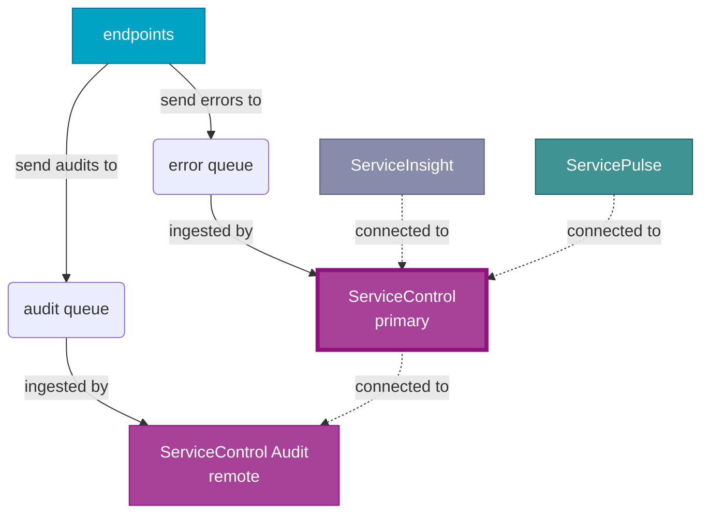
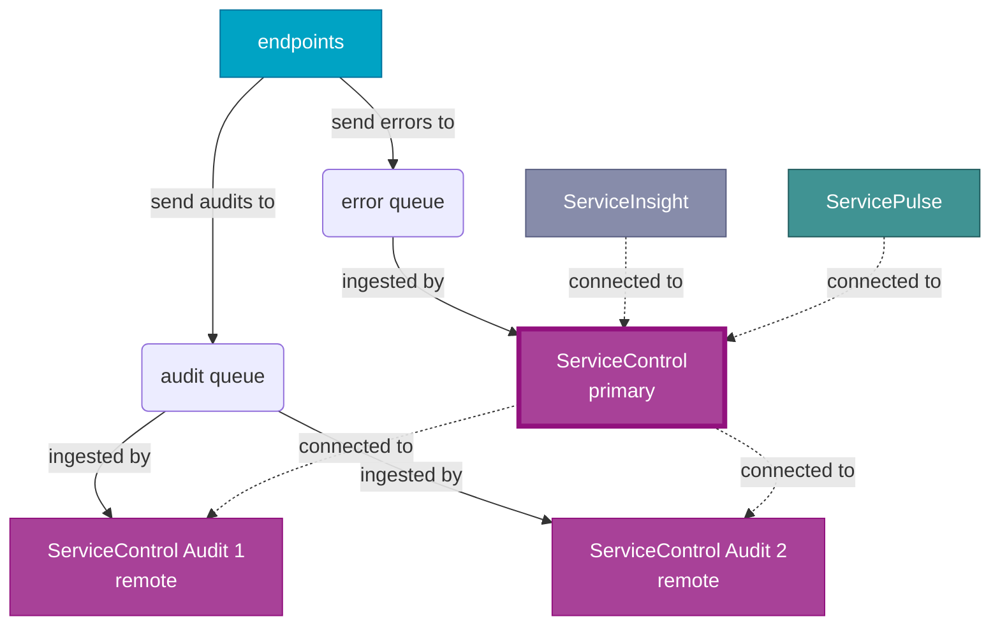
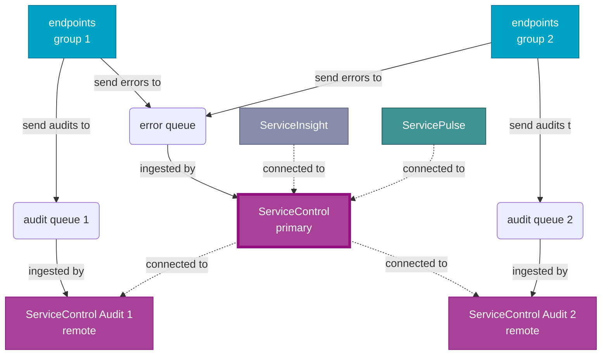

[ServiceInsight](/serviceinsight/) and [ServicePulse](/servicepulse) retrieve data from a [ServiceControl instance](/servicecontrol/servicecontrol-instances/) using an HTTP API. In some installations, that data may reside in multiple ServiceControl instances. The ServiceControl Remotes features allows a ServiceControl instance to aggregate data from other ServiceControl instances, providing a unified experience in ServiceInsight and ServicePulse.

## Overview

One ServiceControl instance is designated as the _primary_ instance. All other ServiceControl instances are _remote_ instances. The HTTP API of the primary instance aggregates data from the primary instance and from all the remote instances. ServiceInsight and ServicePulse are configured to connect to the primary instance.

NOTE: The term _remote_ refers to the fact that remote instances are run in separate processes. The primary instance and one or more remote instances can run on the same machine.

In ServiceControl version 4 and later, a primary ServiceControl instance can be configured with remote instances that are [ServiceControl instances](/servicecontrol/servicecontrol-instances/) and [ServiceControl Audit instances](/servicecontrol/audit-instances/). ServiceControl Audit instances cannot be configured as primary instances.

### Default deployment

In ServiceControl version 4 and above, the ServiceControl Management utility creates a primary ServiceControl instance and a remote ServiceControl Audit instance.



### Sharding audit messages with competing consumers

Two ServiceControl Audit instances ingest messages from the same audit queue. This approach can be used to scale out the ingestion of messages from high-volume audit queues.



### Sharding audit messages with split audit queues

Endpoints are partitioned into groups. Each group sends messages to its own a different audit queue. Each audit queue is managed by a different ServiceControl Audit instance. This approach is useful if different audit retention periods are required for specific groups of endpoints.



## Configuration

Remote instances are listed in the `ServiceControl/RemoteInstances` app setting in the primary instance [configuration file](/servicecontrol/creating-config-file.md). The value of this setting is a JSON array of remote instances. Each entry requires an `api_url` property specifying the API URL of the remote instance. For ServiceControl version 3 and earlier, each entry requires a `queue_address` property specifying the queue address of the remote instance.

NOTE: Changes to the configuration file do not take effect until the primary instance is restarted.

### Version 4 and later

```xml
<configuration>
  <appSettings>
    <add key="ServiceControl/RemoteInstances" value="[{'api_uri':'http://localhost:33334/api'}]"/>
  </appSettings>/
</configuration>
```

### Version 3 and earlier

```xml
<configuration>
  <appSettings>
    <add key="ServiceControl/RemoteInstances" value="[{'api_uri':'http://localhost:33334/api', 'queue_address':'Particular.ServiceControl.Remote'}]"/>
  </appSettings>/
</configuration>
```

## Managing remote instances using PowerShell

The following cmdlets are available in ServiceControl version 4 and above, for the management of remote instances:

| Alias                  | Cmdlet                                        |
| ---------------------- | --------------------------------------------- |
| sc-addremote           | Add-ServiceControlRemote                      |
| sc-deleteremote        | Remove-ServiceControlRemote                   |
| sc-remotes             | Get-ServiceControlRemotes                     |

NOTE: The names and addresses of instances are controlled by the cmdlets for managing [ServiceControl](/servicecontrol/installation-powershell.md) and [ServiceControl Audit](/servicecontrol/audit-instances/installation-powershell.md) instances.

### Add a remote instance

`Add-ServiceControlRemote` adds a remote instance to a primary instance.

```ps
Add-ServiceControlRemote -Name Particular.ServiceControl -RemoteInstanceAddress "http://localhost:44444/api"
```

### Remove a remote instance

`Remove-ServiceControlRemote` removes a remote instance from a primary instance.

```ps
Remove-ServiceControlRemote -Name Particular.ServiceControl -RemoteInstanceAddress "http://localhost:44444/api"
```

### List remote instances

`Get-ServiceControlRemotes` gets a list of remote instances from a primary instance.

```ps
Get-ServiceControlRemotes -Name Particular.ServiceControl
```

### Changing the address of a remote instance

To change the address of a remote instance to a new host and/or port number:

1. Remove the current address from the list of remote instances:
   - `Remove-ServiceControlRemote -Name $primaryServiceControl.Name -RemoteInstanceAddress $currentAddress`
2. Restart the primary instance to refresh the list of remote instances
3. Stop the remote instance
4. Change the host and/or port number of the remote instance using the ServiceControl Management utility
5. Start the remote instance at its new address
6. Add the new address to the list of remote instances:
   - `Add-ServiceControlRemote -Name $primaryServiceControl.Name -RemoteInstanceAddress $newAddress`
7. Restart the primary instance to refresh the list of remote instances

## Considerations

- Pagination in ServiceInsight may not work as expected. For example, each page may contain a different number of items, depending on how those items are distributed across the various ServiceControl instances.
- If the primary instance cannot contact a given remote instance, data from that remote instance will not be included in any views in either ServiceInsight or ServicePulse.
- Multi-instance configuration is not possible the ServiceControl Management utility.
- Incorrect configuration may cause cyclical dependencies. For example, instance A may attempt to get data from instance B, and instance B may attempt to get data from instance A.
- It is recommended to run _only one_ primary instance. Multiple primary instances are _not recommended_.
