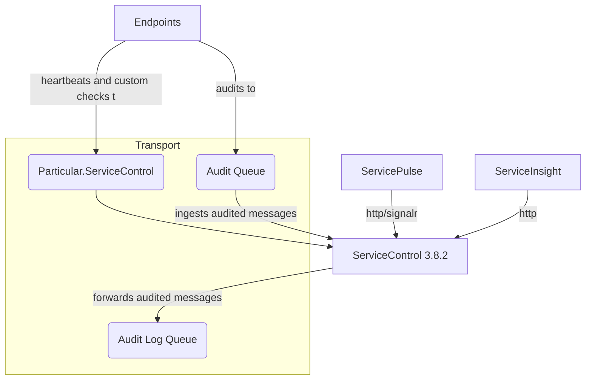
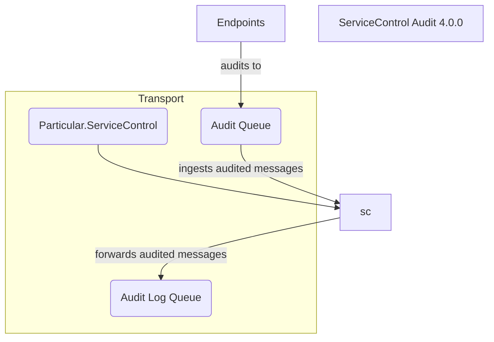

If the ServiceControl instance is configured to ingest messages from the audit queue, but not from the error queue, it can be converted to a ServiceControl Audit instance.

NOTE: In this case, it is assumed that this instance was a part of a multi-instance installation. There must be a main instance (not pictured below) for the ServiceControl Audit instance to connect to.

### Before upgrade



### After upgrade



## Upgrading with ServiceControl Management Studio

TODO

## Upgrading with Powershell

Use the following cmdlet to convert an existing ServicControl instance into a ServiceControl Audit instance:

```ps
Invoke-ServiceControlInstanceConvert `
  -Name <Name of instance to convert> `
  -ServiceControlAddeess <Name of the main instance to report to>`
  [-ServiceAccountPassword <password for service account>]
```

NOTE: If this instance uses a domain account, the the account password must be supplied