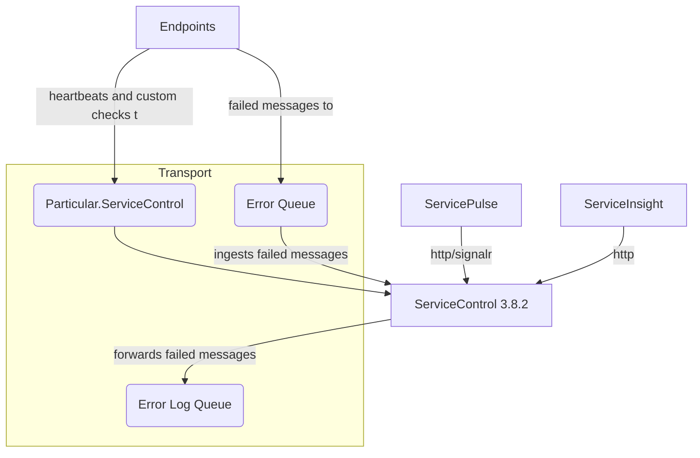

If the ServiceControl instance is configured to ingest messages from the error queue, but not from the audit queue, it can be directly upgraded to version 4.0.0.

### Before upgrade



### After upgrade


## Upgrading with ServiceControl Management Studio

TODO

## Upgrading with Powershell

Use the following cmdlet to perform a direct upgrade of an existing ServicControl instance:

```ps
Invoke-ServiceControlInstanceUpgrade <Name of instance to upgrade>
```
