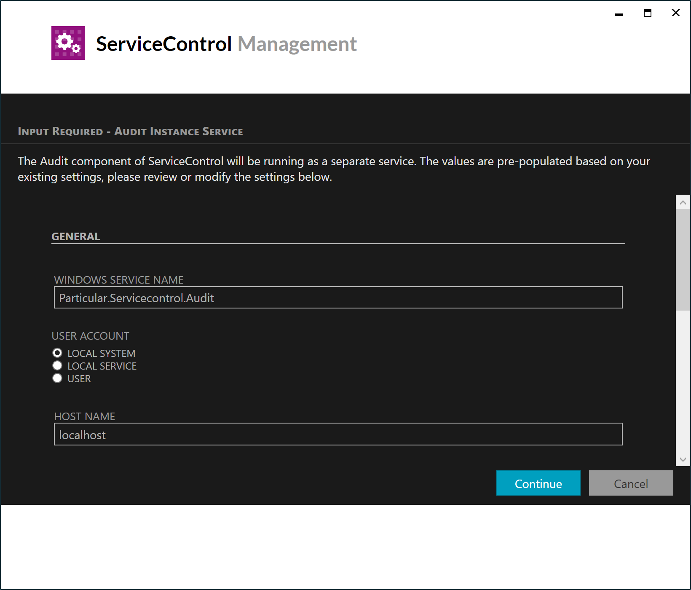

## Overview

Upgrading ServiceControl from version 3 to version 4 is a major upgrade and requires careful planning. During the upgrade process, the instance of ServiceControl that is being upgraded will no longer be available and will not be ingesting any messages.

## Planning

### Time for upgrade

This upgrade does not contain any data migrations, so the size of the database does not have any impact on the time to perform the upgrade.

### Required minimum version

Before upgrading to ServiceControl version 4 the instance being upgraded must be upgraded to at least [version 3.8.2](https://github.com/Particular/ServiceControl/releases/tag/3.8.2).

For more information how to upgrade from Version 1.x to 3.8.2 consult the [upgrade documentation](/servicecontrol/upgrades/).

### Editing older instances

ServiceControl Management version 4 cannot be used to edit ServiceControl instances until they have been upgraded to version 4. These instances can still be started, stopped, put into maintenance mode, and removed using ServiceControl Managament. Ensure any planned changes have been made to existing ServiceControl instances before installing ServiceControl version 4. 

### Disk space requirements

Upgrades that include the separate Audit embedded database will increase disk usage since databases are not automatically compacted. The new Audit embedded database will grow to the same peak storage usage as the original ServiceControl instance embedded audit message storage usage unless the original instance database is compacted after the data is removed via the audit retention process. This could result in as much as double the data usage.

{{NOTE:
After the upgrade is complete, the Audit information contained in the original ServiceControl instance will become read-only, but will continue to be deleted as it passes the time specified by the [retention policy](/servicecontrol/creating-config-file.md#data-retention). However, since the internal database does not release storage space back to the OS, the database will continue to be the same size.

After one retention period after upgrade has elapsed, the original ServiceControl instance's database will be mostly empty. At that point, the original database can be compacted to a very small size. See [Compacting RavenDB](/servicecontrol/db-compaction.md) for instructions on compacting the database of the original ServiceControl instance once old audit messages have been cleaned up by the retention policy.
}}


## ServiceControl Audit

ServiceControl version 4 introduces a new separate process to manage the audit queue called a ServiceControl Audit instance. This instance reads messages from the audit queue, stores them in it's dedicated internal database, and (optionally) forwards the processed messages to an audit log queue.

The original ServiceControl instance will no longer manage the audit queue. It can still contain audit messages that have already been read from the audit queue prior to upgrade. These messages will be retained until the configured audit retention period has lapsed.

This split is transparent to the other components of the Particular Software Platform, which should continue to connect to the main ServiceControl instance. All queries to the main ServiceControl instance will contain results from the Audit instance as well.

When upgrading a ServiceControl instance to version 4, if it is configured to manage an audit queue, a new ServiceControl Audit instance will be created as a part of the upgrade process. A user will need to supply additional information about the new ServiceControl Audit instance.



NOTE: If the ServiceControl instance being upgraded is not configured to manage an audit queue (by setting the audit queue name to `!disable`), then no new ServiceControl Audit instance will be created.

### Upgrading with PowerShell

Use the `Invoke-ServiceControlInstanceUpgrade` PowerShell cmdlet to  upgrade an existing ServiceControl instance to version 4.

```ps
Invoke-ServiceControlInstanceUpgrade -Name <Instance to Upgrade>
```

If the ServiceControl instance being upgraded manages an audit queue, then additional parameters must be specified for the creation of a new ServiceControl Audit instance.

WARN: The settings specified must not be for the current instance, but for the audit instance that will be created as part of this upgrade. Specifying settings that match the current instance will result in a failed upgrade.

```ps
Invoke-ServiceControlInstanceUpgrade `
  -Name <Name of main instance> `
  -InstallPath <Path for Audit instance binaries> `
  -DBPath <Path for the Audit instance database> `
  -LogPath <Path for the Audit instance logs> `
  -Port <Port for the Audit instance api> `
  -DatabaseMaintenancePort <Port for the Audit instance embedded database> `
  [-ServiceAccountPassword <password for service account>] `
  [-Force]
```
The following information is copied from the existing ServiceControl instance:

- Audit queue
- Audit log queue
- Forward audit messages
- Audit retention period
- Transport
- Connection string
- Host name
- Service account

NOTE: If this instance uses a domain account, the the account password must be supplied.

The name of the new audit instance will be derived from the name of the original instance.


## Upgrading multi-instance deployments

Upgrading a multi-instance ServiceControl deployment must be done in stages. Some stages may require the use of the powershell scripts. 

### Upgrade the primary instance

The first step is to upgrade the primary ServiceControl instance. If the primary instance has audit ingestion enabled, then a new ServiceControl Audit instance will be created for it.

NOTE: Once the primary instance has been upgraded, it will not subscribe to events being published by new secondary instances. All subscriptions to existing secondary instances will be retained. As the primary instance no longer requires the transport address of the secondary instances to send subscription requests, the `Queue_Address` property has been dropped from the `ServiceControl/RemoteInstances` configuration setting.

### Upgrade the secondary instances

Once the primary instance has been upgraded to version 4, secondary instances can be upgraded one at a time. If a secondary instance has audit ingestion enabled, then a new ServiceControl Audit instance will be created for it.

If a secondary instance has error ingestion turned off, then it cannot be upgraded to version 4. The recommended course of action is to replace the existing instance with a new ServiceControl Audit instance. Follow this sequence of steps:

- Note the name of the primary instance
- Check the configuration file of the secondary instance and note the following values:
  - Transport
  - Connection string
  - Audit queue
  - Audit log queue
  - Audit forwarding
  - Audit retention period
  - Database folder
  - Host
  - Port
- Remove the existing secondary instance. **Do not delete the database folder.**
  - Use the `Remove-ServiceControlInstance` powershell cmdlet
- Create a new ServiceControl Audit instance to create a new secondary instance
  - Use the `New-ServiceControlAuditInstance` powershell cmdlet
  - Set the `ServiceControlQueueAdddress` to the name of the primary instance
  - Use the same transport, connection string, database folder, and audit settings as the original secondary instance

Putting it all together into a single script:

```ps
$originalInstanceName = "ServiceControl.Secondary"
$primaryInstanceName = "ServiceControl.Primary"

$original = Get-ServiceControlInstances | Where-Object { $_.Name -eq $originalInstanceName }

Remove-ServiceControlInstance -Name $originalInstanceName -RemoveDB:$false

New-ServiceControlAuditInstance `
  -Name $originalInstanceName `
  -InstallPath $original.InstallPath `
  -DBPath $original.DBPath `
  -LogPath $original.LogPath `
  -HostName $original.HostName `
  -Port $original.Port `
  -DatabaseMaintenancePort $original.DatabaseMaintenancePort `
  -AuditQueue $original.AuditQueue `
  -AuditLogQueue $original.AuditLogQueue `
  -Transport $original.TransportPackageName `
  -ConnectionString $original.ConnectionString `
  -DisplayName $original.Name `
  -ForwardAuditMessages:$original.ForwardAuditMessages `
  -AuditRetentionPeriod $original.AuditRetentionPeriod `
  -ServiceControlQueueAddress $primaryInstanceName `
  -Force
```

NOTE: Service account details cannot be copied from the original instance. If the ServiceControl Audit instance must run under a service account, supply the `ServiceAccount` and `ServiceAccountPassword` parameters to the `New-ServiceControlAuditInstance` cmdlet.
