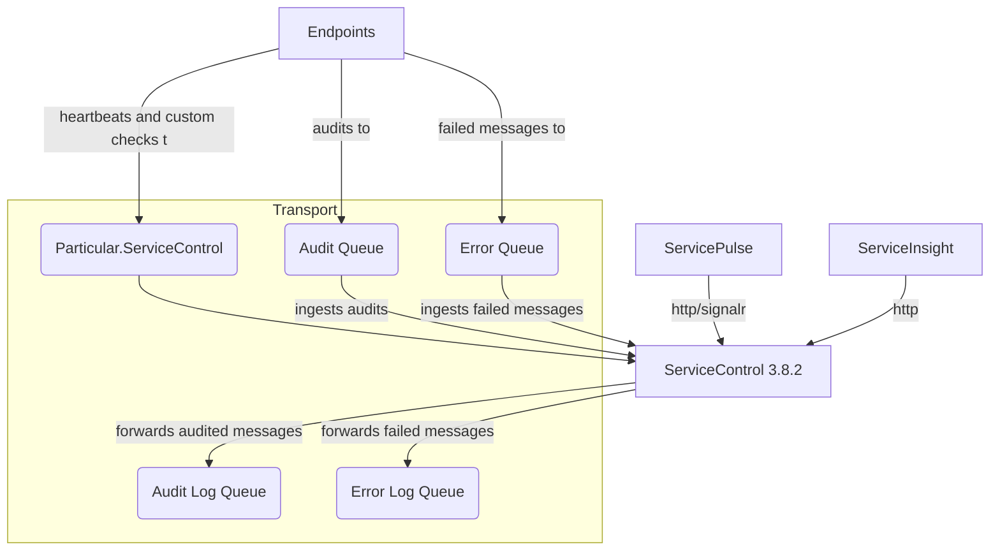
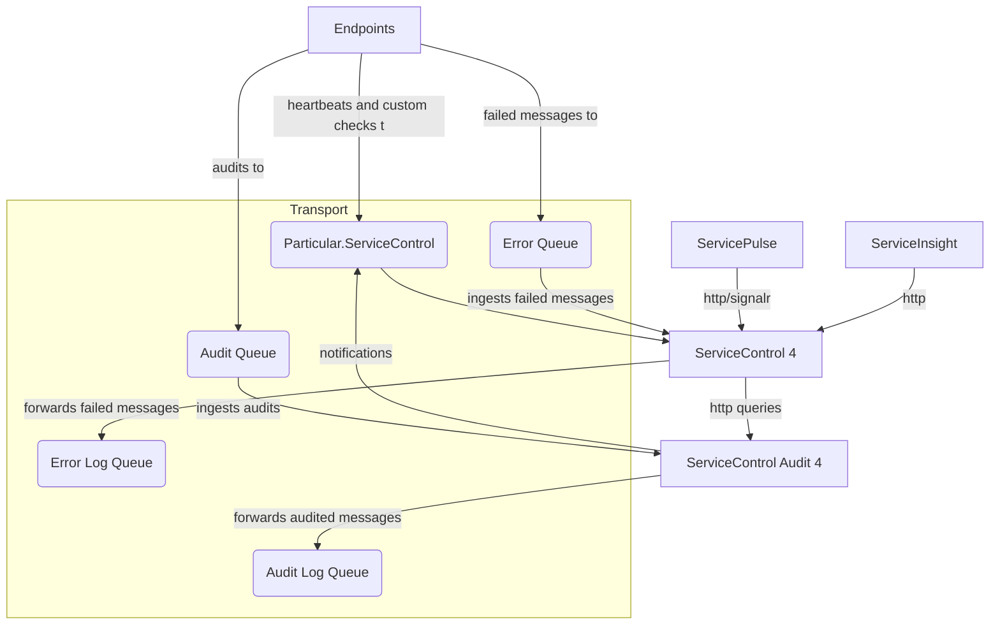

If the ServiceControl instance is configured to ingest both audit and error messages before the upgrade, then the instance will be split into two separate processes: a ServiceControl instance, and a ServiceControl Audit instance.

All other Particular Service Platform components should continue to connect to the main ServiceControl instance.

### Before upgrade



### After upgrade



## Upgrading with ServiceControl Management Studio

TODO

## Upgrading with Powershell

Use the following cmdlet to split an existing ServicControl instance:

```ps
Invoke-ServiceControlInstanceSplit `
  -Name <Name of main instance> `
  -InstallPath <Path for Audit instance binaries> `
  -DBPath <Path for the Audit instance database> `
  -LogPath <Path for the Audit instance logs> `
  -Port <Port for the Audit instance api> `
  -DatabaseMaintenancePort <Port for the Audit instance embedded database> `
  [-ServiceAccountPassword <password for service account>] `
  [-Force]
```

The following information is copied from the existing ServiceControl instance:

- Audit queue
- Audit log queue
- Forward audit messages
- Audit retention period
- Transport
- Connection string
- Host name
- Service account (NOTE: If this instance uses a domain account, the the account password must be supplied)

The name of the new audit instance will be derived from the name of the original instance.

