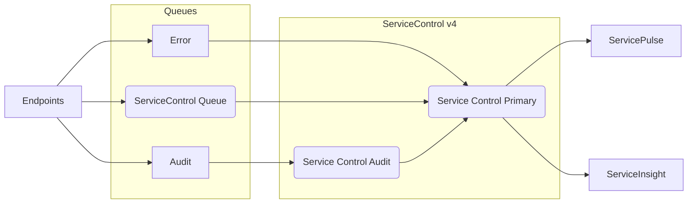
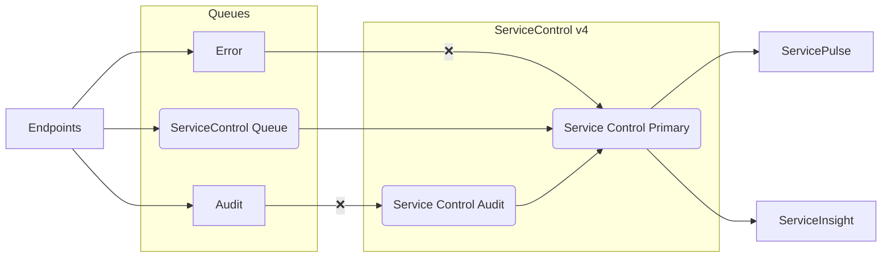
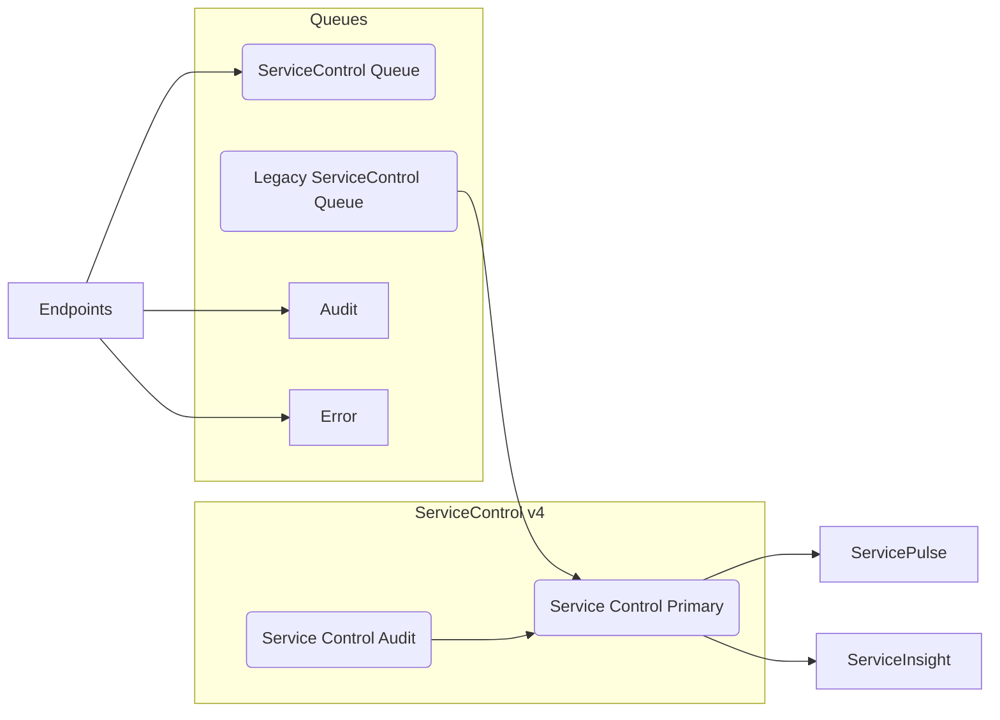
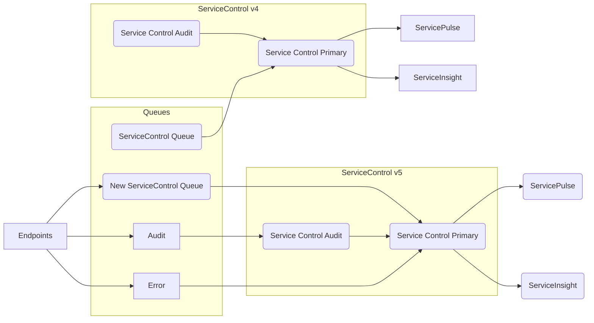
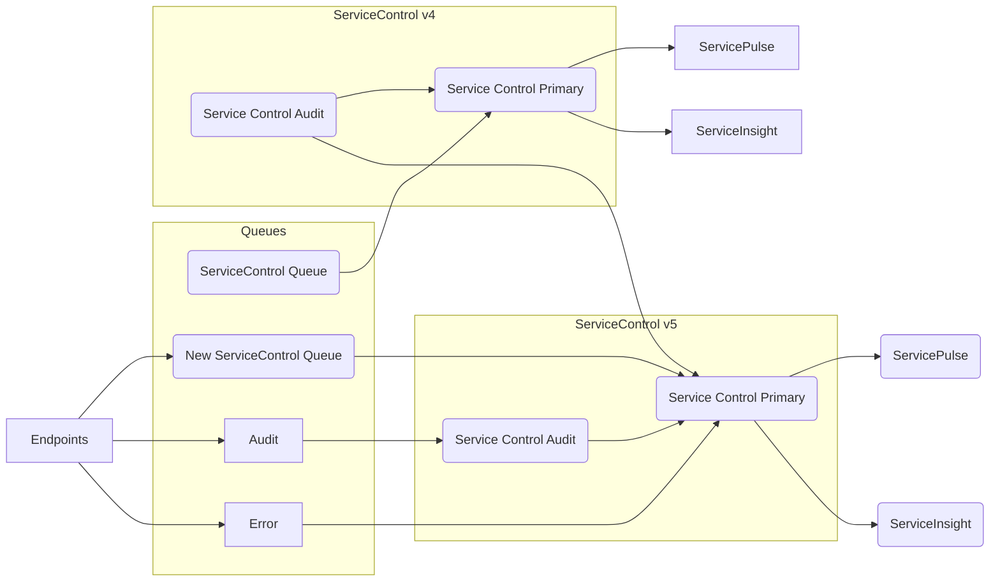

In a side-by-side installation, all endpoints continue to send data to the same ServiceControl queues. The existing ServiceControl version 4 instances are disconnected from these input queues, but remain for a period of time to allow management of the data within them. New ServiceControl version 5 instances are created on the existing input queues and immediately start collecting audit, error, and plugin data.

Once the audit retention period has passed, the old audit instance can be shut down and removed from the system.

Once all of the failed messages in the old primary instance have been archived or retried, the old primary instance can be shut down and removed from the system.

When this upgrade is started, make note of the following configuration on existing (version 4) instances:

ServiceControl Primary Instance
- Instance name
- Error queue name

ServiceControl Audit Instance
- Instance name
- Audit queue name
- Audit retention period

## Running side-by-side

The first phase of a side-by-side installation is to disconnect the existing version 4 instances of ServiceControl and ServiceControl Audit from their input queues and to plug new version 5 instances of ServiceControl and ServiceControl Audit into the same input queues. This will allow a seamless transition for the endpoints which will continue to send messages to the same input queues.

WARN: It is recommended to complete all steps during the same change window. Once the first step has been completed, the audit and error queues are no longer being consumed and can grow in size indefinitely. In high-throughput environments, this may have an impact on the queuing system.

Before commencing, the target environment will look like this:



### 1. Disconnect version 4 instances from input queues

The first step is to stop the existing instances from consuming any more messages from the error and audit queues.

On the audit instance, change the audit queue name to `!disable`. Restart the audit instance.

SCREENSHOT of doing this

On the primary instance, change the error queue name to `!disable`. Restart the primary instance.

SCREENSHOT of doing this

After completing this step, the target environment will look like this:



### 2. Rename version 4 instances

Each ServiceControl installation has an input queue that is based on the primary instance name. This input queue is used by ServiceControl plugins and integration events. This step will re-name the existing instances, so that the new instances can re-use the original names. This allows swapping out ServiceControl instances without having to reconfigure or redeploy business critical endpoints.

The log folder, database folder, installation folder, and windows service name of each instance are all based off of the instance name by default and will need to be changed to prevent a clash with the new instances.

NOTE: If ServiceControl plugins or integration events are not being used, this step can be skipped and the new instances can be installed with a different name.

Perform the following steps on the primary ServiceControl instance and the ServiceControl Audit instance that are being replaced.

1. Stop the instance in the ServiceControl Management utility
2. Open the Log folder and rename it to match the new instance name
3. Open the Database folder and rename it to match the new instance name
4. Open the Installation folder and rename it to match the new instance name
5. In the Installation folder make the following edits to the configuration file:
  - Change the log path to match the updated path from step 2
  - Change the database path to match the updated path from step 3
  - NOTE: The audit instance contains a setting for the address of it's primary ServiceControl instance. This does not need to be updated. The audit instance will send health check and successful retry detection messages to the new primary ServiceControl instance that will be installed in step 3 below.
6. Open regedit.exe
  - Find the key that matches the instance name under `HKEY_LOCAL_MACHINE\SYSTEM\CurrentControlSet\Services` and rename it to match the new instance name
  - Underneath the service key find the DisplayName string value and change it to match the new instance name
  - Underneath the service key find the ImagePath string value and change it to match the new instance name
    - NOTE: This will require changing the path to the executable as well as the `serviceName` parameter
7. From an administrative console, run the instance in setup mode. This will ensure that all of the configured folders and queues are reachable
  - `ServiceControl.exe /s --serviceName=Particular.Servicecontrol.Old`
  - `ServiceControl.Audit.exe /s --serviceName=Particular.Servicecontrol.Audit.Old`
8. Restart the server
  - Changes to the Windows Services data in the windows registry are not picked up until the operating system is restarted.

TODO: Screenshots of these steps 

When this step is complete, the target environment will look like this:



### 3. Install version 5 instances

Once the old instances are no longer consuming messages from the error and audit queues, it is time to create the new instances using ServiceControl Management (or powershell). Make sure to use the same instance names, audit queue, and error queue that the old instances were using before they were disabled. 

After completing this step the target environment will look like this:



NOTE: Although this diagram shows separate installations of ServicePulse and ServiceInsight, both applications can switch which instance of ServiceControl they are connected to at runtime.

TODO: Changing integration event subscribers for MSMQ environments to point to the correct publisher

## Querying old audit instances from new primary instance

It is possible to configure the new ServiceControl primary instance to query audit data from the old ServiceControl Audit instance. This allows users of ServiceInsight to connect to the version 5 ServiceControl primary instance and visualize message flows containing messages stored in either the version 4 or version 5 audit instances.

After completing this step, the target environment will look like this:



NOTE: This step is optional and is only required if ServiceInsight is being used to visualize message flow across version 4 and version 5 installations.

To set this up, follow these steps in order.

### 1. Configure remote

When a ServiceControl primary instance handles a query for audit data, it sends the query to a list of remote instances, collects all of the results and then sends them back to the client. To include data from the version 4 ServiceControl Audit instance in the query results from the version 5 primary ServiceControl instance, a remote needs to be configured.

On the machine with the primary ServiceControl instance open a powershell console and execute the following command:

```ps
Add-ServiceControlRemote -Name "Version 5 primary ServiceControl instance name" -RemoteInstanceAddress "Version 4 Audit ServiceControl instance URI"
```

Verify that the remote has been configured correctly:

```ps
Get-ServiceControlRemotes -Name "Version 5 primary ServiceControl instance name"
```

NOTE: The version 4 primary ServiceControl instance also includes the version 4 Audit ServiceControl instance in its list of remotes by default. This is not a problem and both primary instances can treat the same Audit instance as a remote instance without any clash. If this is not desired, use the [`Remove-ServiceControlRemote`](/servicecontrol/servicecontrol-instances/remotes.md#powershell-remove-a-remote-instance) powershell cmdlet to break the link.

### 2. Configure health checks and notifications

Each ServiceControl Audit instance reports to a single primary ServiceControl instance. This includes regular health check reports and notifications of successful retries. The version 4 ServiceControl Audit instance should be configured to send this data to the new version 5 ServiceControl Primary instance.

TODO: If the customer changed the name of their original primary instance and then installed the new one with the same name then this is unnecessary as the config was already coincidentally right.

## Cleaning up

When they are no longer needed, the old version 4 instances of ServiceControl and ServiceControl Audit can be safely removed.

### Version 4 audit instance

Once the audit retention period has passed, the version 4 audit instance can be safely shut down and removed. All audited messages will have been deleted by the retention policy.

NOTE: If old audit messages are not needed, the version 4 audit instance can be safely shut down and removed before the retention period has passed.

### Version 4 primary instance

Once all of the failed messages have been archived or retried, the version 4 primary instance can be safely shut down and removed. 

{{NOTE: Failed messages that are retried and fail again will go back into the error queue and will be consumed by the new, version 5, primary ServiceControl instance. These messages will retain the details of the most recent (failed) processing attempt.

Failed messages that are retried and succeed processing will go into the audit queue and will be consumed by the new, version 5, ServiceControl Audit instance.}}
