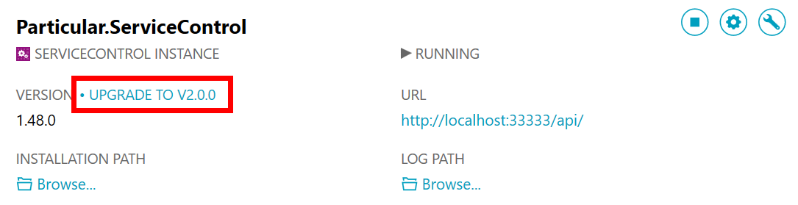
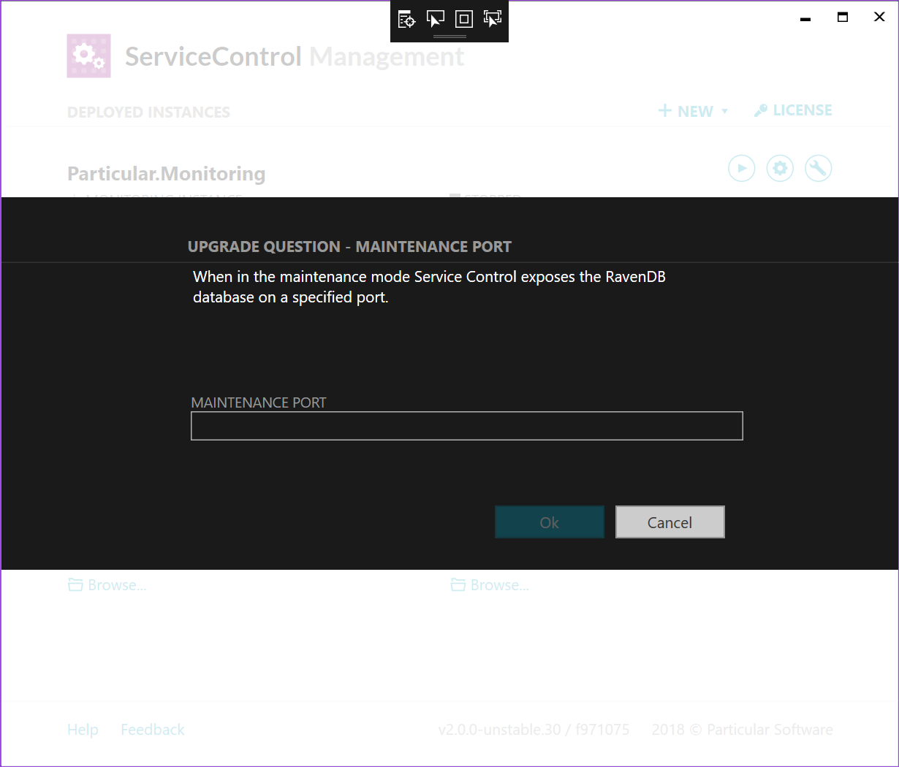

## Overview

Upgrading ServiceControl from version 1 to version 2 is a major upgrade and requires careful planning. During the upgrade process, the instance of ServiceControl being upgraded will no longer be available and will not be ingesting any messages. The upgrade process is not reversible and cannot be undone once started.

## RavenDB data files

ServiceControl Version 1 uses RavenDB 2.5 while ServiceControl Version 2 uses RavenDB 3.5. Data file formats of RavenDB 2.5 and 3.5 are different and require migration process. The migration is conducted automatically by RavenDB server (embedded in the ServiceControl process) when the database engine detects that the data files are in the old format.

WARN: The migration is managed by the ServiceControl Management Utility instance upgrade process and does not require manual intervention. It is recommended, however, to [back up the RavenDB](/servicecontrol/backup-sc-database.md) database prior to attempting the upgrade.

## Database maintenance port

In Version 1 the ServiceControl running in the maintenance mode exposed the underlying RavenDB database on the same port as it exposed the API during normal operation. This approach is no longer possible with RavenDB 3.5 hence ServiceControl Version 2 requires explicit configuration of a database maintenance port which needs to be different from the API port.

ServiceControl Management Utility automatically detects the need for this new configuration setting and is going to ask the user to provide it when performing the upgrade of a ServiceControl instance.

### Upgrading ServiceControl

Due to the intrusive nature of this upgrade, there are two main ways to upgrade to version 2 of ServiceControl. The first is to perform an in-place upgrade, while the second is to deploy a separate instance of ServiceControl version 2 while still leaving the current version 1 instance running in production. Both of these options are discussed in more details below.

### In-place upgrade to version 2

WARN: This upgrade process is intrusive and may take a long time to progress. Our tests on a 4000 IOPs server indicate that upgrading a 300Gb database can take upwards of nearly 5 hours if the server is doing nothing other than processing the upgrade.

The upgrade is triggered through the ServiceControl Management application. ServiceControl Management will display the instances of the ServiceControl service installed. If the version of the binaries used by an instance are older that those shipped with ServiceControl Management an upgrade link will be shown against the version label.

To upgrade the service to version 2, click the upgrade link next to the Service name.

WARN: This upgrade process can potentially take a very long time. Please ensure that the instance of ServiceControl being upgraded is not needed for the duration required.

Clicking the upgrade link will

 * Prompt for any additional information that is required such as values for new mandatory settings introduced in the newer version.
 * Stop the Service.
 * Remove the old binaries for ServiceControl and the configured Transport.
 * Run the new binaries to create any required queues.
 * Migrate the database.
 * Start the Service.

A new parameter was introduced between version 1 and version 2 which is the maintenance port for RavenDB maintenance. If this setting is not in the configuration file, a prompt will appear asking for it.

Once ServiceControl has been upgraded, RavenDB will begin the process up re-creating all of the indexes used by ServiceControl. This process could take even longer than the initial data migration. ServiceControl will be accessible during this process, but the data displayed in ServiceInsight and ServicePulse may not be consistent yet.

### Side-by-side upgrade process

...