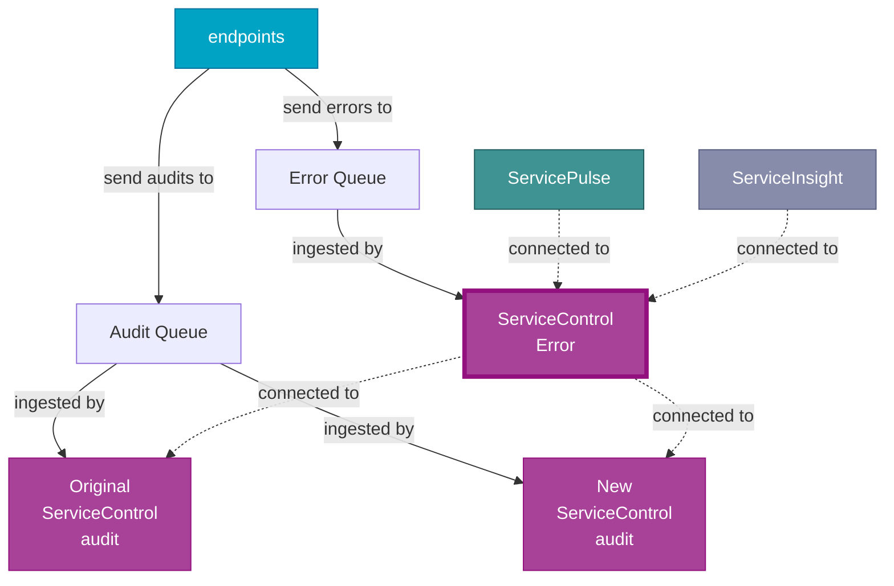
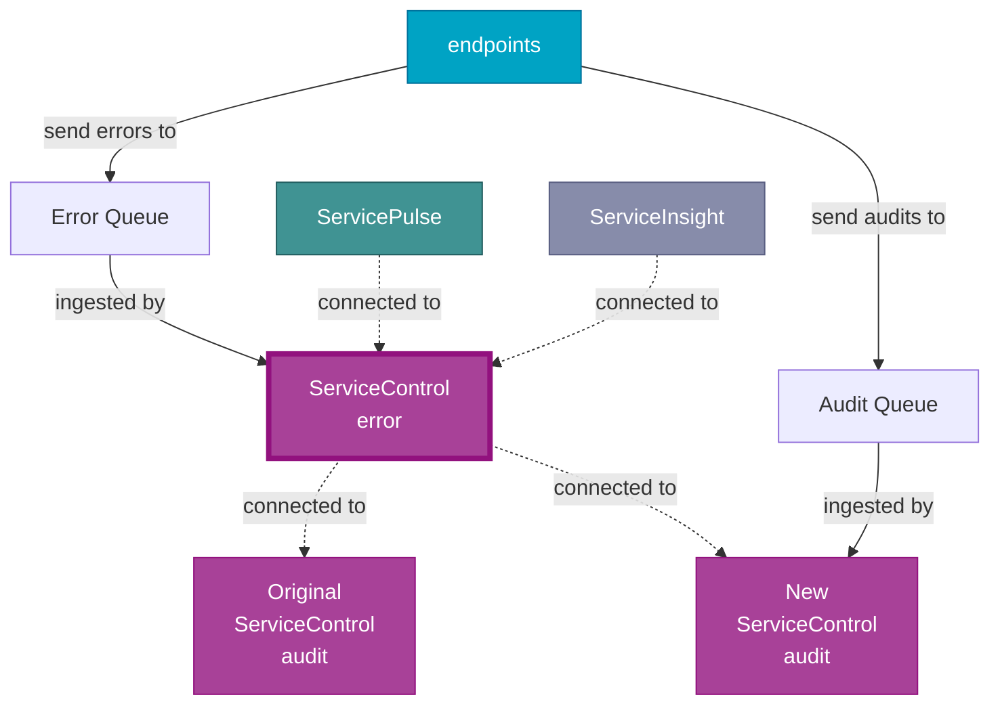
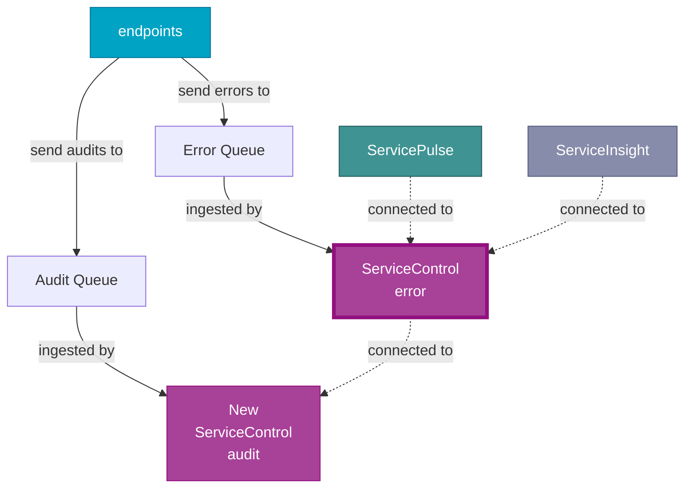

The [ServiceControl remotes feature](/servicecontrol/servicecontrol-instances/remotes.md) can be used to upgrade a ServiceControl installation without taking it offline.

> [!NOTE]
> PowerShell must be used to install individual instances. Example scripts are provided for each step.

> [!NOTE]
> For scenarios where retaining audit message data is not required (e.g. transient data that does not merit effort to retain), this process is not necessary -- the audit instance can simply be deleted and recreated with the same name.

> [!WARNING]
> This zero downtime upgrade process is only suitable for use with ServiceControl Audit instances. To upgrade ServiceControl Error instances to version 5 see the [version 4 to 5](/servicecontrol/upgrades/4to5/) upgrade guide.

## Audit instances

The process follows these steps:

1. Add a new audit instance as a remote
1. Disable audit queue management on the old audit instance
1. Decommission the old audit instance, when it is empty

### Initial state

Before doing anything, the deployment looks like this:


### Add a new audit instance

Create a new ServiceControl Audit instance, and configure it as a remote instance of the ServiceControl Error instance.

On the audit instance machine:

```ps1
$auditInstance = New-ServiceControlAuditInstance `
  -Name Particular.ServiceControl.NewAudit `
  -InstallPath C:\ServiceControl.NewAudit\Bin `
  -DBPath C:\ServiceControl.NewAudit\DB `
  -LogPath C:\ServiceControl.NewAudit\Logs `
  -Port 44446 `
  -DatabaseMaintenancePort 44447 `
  -Transport MSMQ `
  -AuditQueue audit `
  -AuditRetentionPeriod 10:00:00:00 `
  -ForwardAuditMessages:$false `
  -ServiceControlQueueAddress "Particular.ServiceControl"
```

On the ServiceControl Error instance machine:

```ps1
Add-ServiceControlRemote `
  -Name "Particular.ServiceControl" `
  -RemoteInstanceAddress "http://localhost:44446/api"
```

After this step the installation looks like this:



Although both ServiceControl Audit instances ingest messages from the audit queue, each message only ends up in a single instance. The ServiceControl Error instance queries both transparently.

### Disable audit queue ingestion on the old instance

Update the audit queue configuration on the original Audit instance and add the setting key [`ServiceControl/IngestAuditMessages`](/servicecontrol/audit-instances/configuration.md#host-settings-servicecontrolingestauditmessages) with value `false`, save, and restart the instance.

> [!NOTE]
> For versions 4.32.0 of ServiceControl and older use `!disable` as the [`AuditQueue`](/servicecontrol/audit-instances/configuration.md#transport-servicebusauditqueue) name to disable the audit message ingestion.

Alternatively, run the following PowerShell script to make the changes:

```ps1
$originalAuditInstanceName = "Particular.ServiceControl.Audit"
$auditInstance = (Get-ServiceControlAuditInstances | where Name -eq $originalAuditInstanceName)[0]

# Stop instance
Stop-Service $originalAuditInstanceName

# Update configuration
$configPath = Join-Path $auditInstance.InstallPath "ServiceControl.Audit.exe.config"
[xml]$configDoc = Get-Content $configPath
$element = $configDoc.SelectSingleNode("//configuration/appSettings/add[@key='ServiceControl/IngestAuditMessages']")
# Check if the node exists, if not, add it
if ($null -eq $element) {
    $appSettings = $configDoc.SelectSingleNode("//configuration/appSettings")
    $newElement = $configDoc.CreateElement("add")
    $newElement.SetAttribute("key", "ServiceControl/IngestAuditMessages")
    $newElement.SetAttribute("value", "false")
    $appSettings.AppendChild($newElement)
} else {   
    $element.value = "false"
}
$configDoc.Save($configPath)

# Start instance
Start-Service $originalAuditInstanceName
```

After this step the installation looks like this:



The ServiceControl Error instance continues to query both instances but the original Audit instance no longer reads new messages.

### Decommission the old audit instance, when it is empty

As the original audit instance is no longer ingesting messages, it will be empty after the audit retention period has elapsed and can be removed. The following steps describe how to determine when an audit instance is empty:

1. Put the audit instance in [maintenance mode](/servicecontrol/audit-instances/maintenance-mode.md).
2. Launch RavenDB Management Studio with a browser.
3. If the instance is using RavenDB 3.5 for persistence, go to the `<system>` database. If the instance is using RavenDB 5, go to the `audit` database.
4. Check the documents count in the `ProcessedMessages` collection.

When the `ProcessedMessages` collection is empty, the audit instance can be decomissioned.

On the ServiceControl Error instance machine:

```ps1
Remove-ServiceControlRemote `
  -Name "Particular.ServiceControl" `
  -RemoteInstanceAddress "http://localhost:44444/api"
```

On the original audit instance machine:

```ps1
Remove-ServiceControlAuditInstance `
  -Name "Particular.ServiceControl.OriginalAudit" `
  -RemoveDB `
  -RemoveLogs
```

After this step the installation looks like this:


