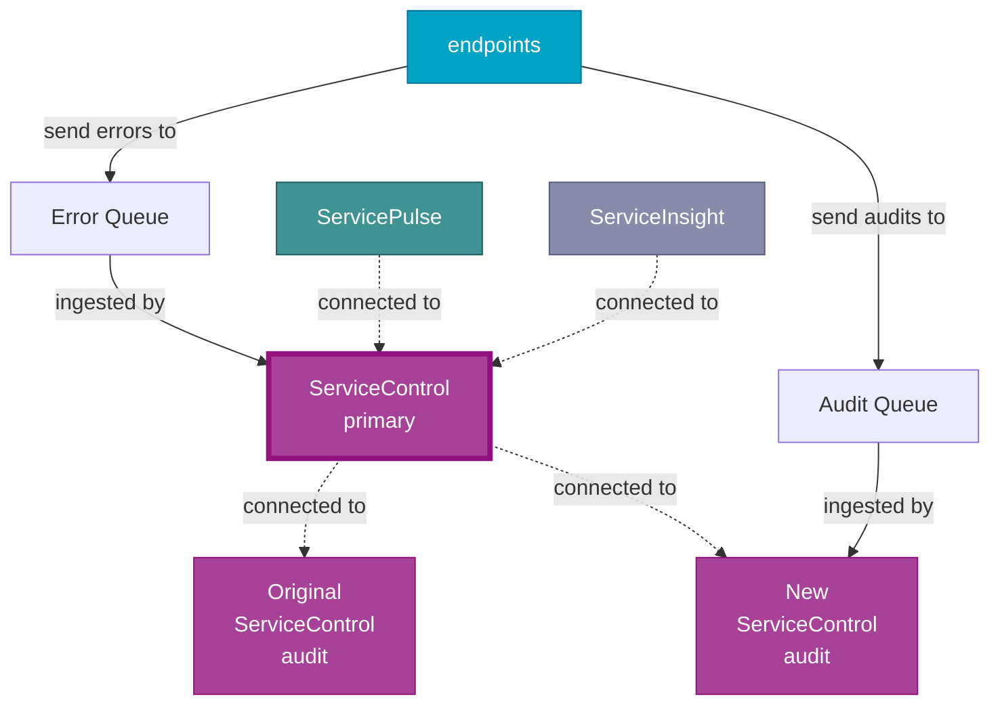

The [ServiceControl remotes feature](/servicecontrol/servicecontrol-instances/remotes.md) can be used to upgrade a ServiceControl installation without taking it offline.

## Audit instances

The process follows these steps:

1. Add a new audit instance as a remote
1. Disable audit queue management on the old audit instance
1. Decommission the old audit instance, when it is empty

### Initial state

Before doing anything, the deployment looks like this:

### Add a new audit instance

Create a new audit instance, and configure it as a remote instance of the primary instance.

Although both ServiceControl Audit instances ingest messages from the audit queue, each message only ends up in a single instance. The primary instance queries both transparently.

### Disable audit queue management on the old instance

Update the audit queue configuration on the original Audit instance to the value `!disable`.

The primary instance continues to query both instances but the original Audit instance no longer reads new messages.

### Decommission the old audit instance, when it is empty

As the original audit instance is no longer ingesting messages, it will be empty after the audit retention period has elapsed and can be removed.

