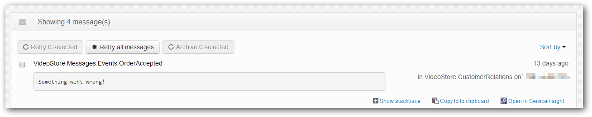

When we built the NServiceBus suite of tools, we carefully considered the integration between them. Since the tools are conceptually built for different purposes, the people using them must be able to collaborate.

If the support team uses ServicePulse to monitor your distributed system for errors. When they encounter an error message, they might want a developer to investigate it further. They can see why from the exception information provided by ServiceInsight by clicking the "Open in ServiceInsight" link and bringing up the particular message that failed.

The benefits of this feature can be leveraged without installing ServicePulse.

Click the link in ServicePulse, it opens a link in the browser, like this:

    si://localhost:33333/api?search=487b5055-11bb-4a70-a4fd-a2c00125aa43

This is the URI to which ServiceInsight listens. It launches ServiceInsight to do the following:

 - Automatically connect to localhost on port 33333
 - Perform a search on a specific Message ID

This means that a specific message that was in the error queue will be displayed as soon ServiceInsight opens, allowing you to see the cause.

There is no magic here, the URL can generated as long as the convention is followed. Construct the URI and send it via email to your development team, who can then paste it into the Run window (Win + R) or browser.

A list of the supported parameters and a description of their effects:

 - Search [String]: Performs a search using the full-text search feature of ServiceInsight. This can be a message identifier, a part of the message payload, or any value in the message header.
  - Example: `si://localhost:33333/api?search=SubmitOrder`
 - EndpointName [String]: The name of the endpoint to select upon startup. When you select an endpoint, the operations and message lists are filtered to the endpoint you have selected.
  - Example: `si://localhost:33333/api?EndpointName=VideoStore.Sales&search=SubmitOrder`
 - AutoRefresh [Integer]: Turns on the AutoRefresh option so that the view is refreshed, based on the value provided here (in seconds).
  - Example: `si://localhost:33333/api?EndpointName=VideoStore.Sales&search=SubmitOrder&Auto&AutoRefresh=5`

When ServiceInsight is launched using these parameters, notice the effects on the user interface (having the endpoint selected, message selected, etc.). If a passed-in argument is not supported, ServiceInsight will notify when it runs.
