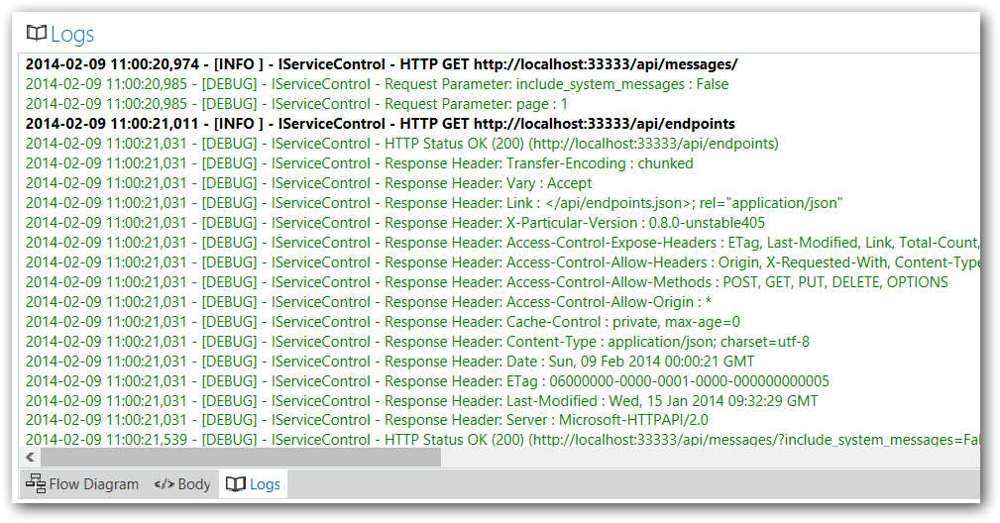

When launching ServiceInsight, you can see a Log Window. This window is like the Output window of your IDE and you can see some of the most important logs in the system without parsing log files and going through the usual hassles.

To keep the number of logs minimal and relevant, the Log Window relates mostly to HTTP operations and calls to ServiceControl, as due to the nature of the HTTP operations (timeouts, network issues, etc.) they can cause the most confusion.

You can see that all the HTTP communications with ServiceControl are logged; the request being sent, the parameters, and the request/response headers. Also if a request to ServiceControl fails, you can see it in red in the Logs window.



If you need to have access to more detailed log entries, the complete log entries can be found at the following location and file format, stored on your machine:

```
%LocalAppData%/Particular/ServiceInsight/log-{date}.txt
```


