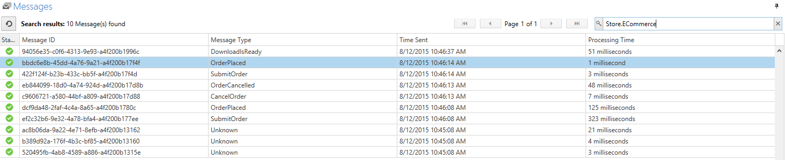
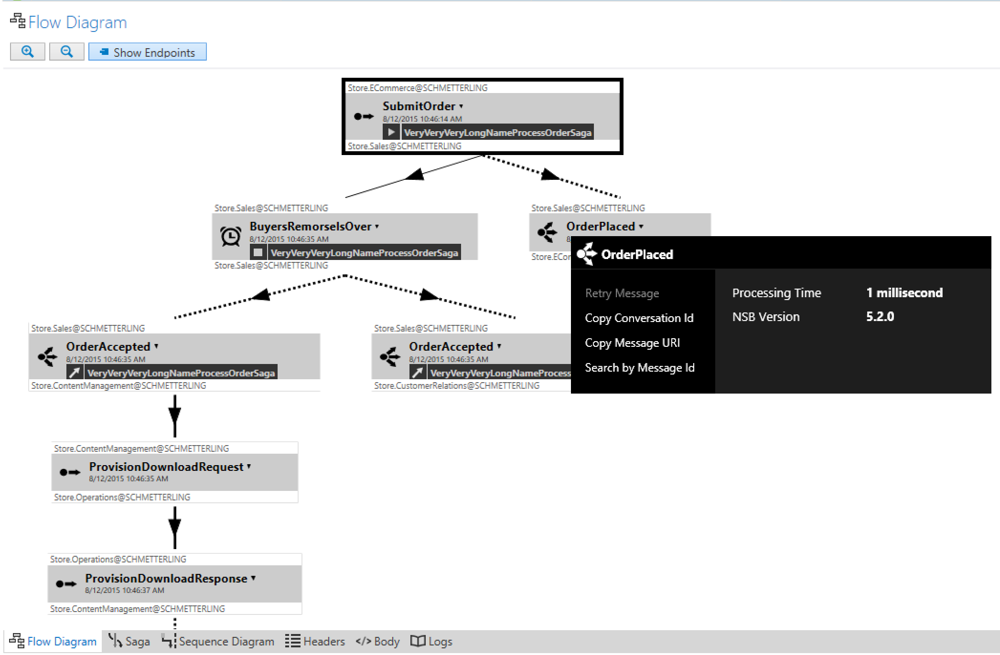
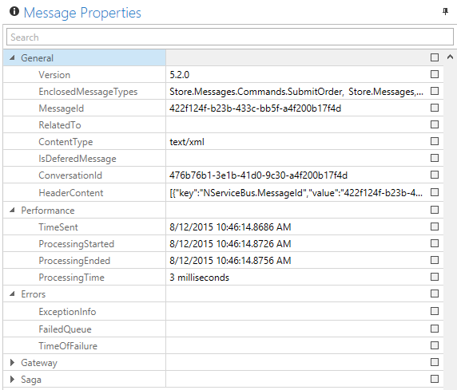
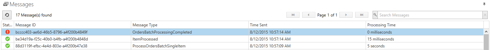
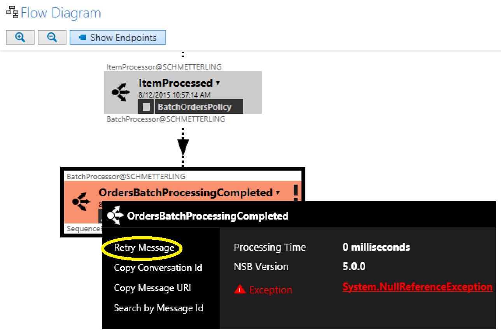

include: serviceinsight

## Visualizing the System

The ServiceInsight user interface provides multiple views of a distributed system. Using information collected in ServiceControl, ServiceInsight enumerates the endpoints and provides detailed message and relationship data, with formatted views of XML, JSON, and binary messages.

The flow diagram provides a detailed visual overview of the messages, collated by conversation. Using this view the flow in the system and which endpoints raised specific events and sent or handled messages can be seen. The Saga view illustrates the start of a saga, the timeouts, and interactions. The sequence diagram shows the order in which messages have been sent and handled by endpoints in the system.
 
As endpoints are selected, the other views within ServiceInsight respond and filter the information to show only messages pertaining to that endpoint.

## The Message Window

The Messages window is a detailed grid view indicating the message status, type, time stamp, and service level information. Filter the list based on specific message content, searching for all message data, not just commonly displayed fields.

The ServicePulse monitoring tool also supports opening ServiceInsight to a specific message to allow drill down for more detail.

### Refresh and Auto-refresh

The Refresh and Auto-Refresh toolbar buttons enable allow updating the displayed information with the latest updates from the ServiceControl database.

Auto-refresh keeps the information in ServiceInsight automatically refreshed, delivering near real-time information to the views.

The auto-refresh rate can be specified in the "View" > "Options" > "Auto-Refresh Timer" setting (default is auto-refresh every 15 seconds; lowest value is 1 second), or specify the auto-refresh rate using the ServiceInsight invocation parameter (see [ServiceInsight Invocation](application-invocation.md))

### Timing and Performance

Use the performance-related information in the message header to sort the messages in an endpoint based on the time the messages were sent, critical time, processing time, delivery time, Message Type and ID.

The message timing measurements include the following:

 * Processing Time: the amount of time it took to actually process the message, within the processing endpoint, by the message processing handler method

Using the messages window column headers the messages can be sorted in ascending or descending order (the sorting operation applies on all the relevant messages in the underlying ServiceControl instance, and is not limited to the currently displayed messages).

Select specific messages, the related properties window and flow diagram change to illustrate details of the selected message.

## Endpoint Explorer

The Endpoint Explorer indicates the connection to the ServiceControl instance providing data to ServiceInsight. The list enumerates the endpoints and the machine where they are deployed. 

Select endpoints to filter the message list. Select the root ServiceControl connection and the tree view to make the list expand to include all messages.

## Flow Diagram

The flow diagram provides extensive message and system information. When messages are selected in the message list, the flow diagram illustrates the message and all related messages from the same conversation, along with the nature of the messages and the endpoints involved.

Each message is represented by a box indicating the message type and illustrating details including the endpoints and time information. Published events and sent commands have different icons and illustrations. Dropdowns provide more message details and links to search based on this message, copy message details, and retry messages.

## Message Properties

Each message in NServiceBus contains extensive detail. As messages are selected in the flow diagram or in the list, an additional Message Properties window lists the properties for the message.

## The Saga View

Sagas play a critical role in NServiceBus systems. As coordinators of processes they are started by certain messages and interact with a variety of messages and services. To open a graphical view of Sagas, click a message in the flow diagram that is handled by a saga. 

The saga illustrates how the saga was initiated and other messages that were sent or handled, with detailed message data, time information, and details on saga data changes.

## Sequence Diagram

While the Flow Diagram is very good at showing *why* each message in a conversation was sent, the Sequence Diagram is better for understanding *when* messages were sent and handled.

Read more about the [Sequence Diagram](/serviceinsight/sequence-diagram/)

## Body and Log Views

Along the bottom edge of the flow diagram is a tab for the Body and Log views.

### Body View

ServiceInsight obviates the need for MSMQ tools provided by Windows. ServiceInsight provides raw message data in the Body tab of the flow diagram, with XML and HEX views of the body.

### Log View

ServiceInsight leverages the ServiceControl API to retrieve information. The Log tab of the Flow Diagram window displays details of the interactions as ServiceInsight polls ServiceControl for more data.

## Errors and Retries

ServiceInsight provides added visibility, and NServiceBus provides durability and retries. Where intervention is required, no manually correlation of log files or access remote servers to research an error. The views within ServiceInsight illustrate messages with errors and supply the error information.

### Status in the Message List

The status of an errant message is illustrated in the message window.

### The Flow Diagram

The flow diagram highlights errors in red and provides details with access to the stack trace.

### The Sequence Diagram

The sequence diagram highlights handlers with errors in red.

After the NServiceBus completes auto-retry, the errant message goes to an error queue. Instead of using the return-to-sender console application, to return the message to the queue from where it originated, click `Retry Message`.