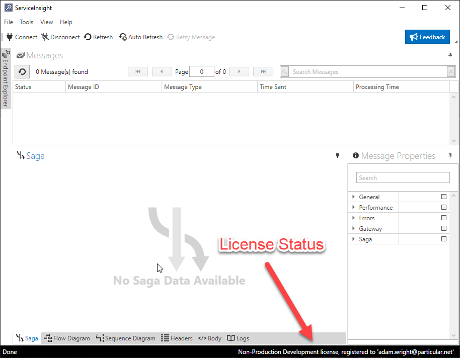

To register ServiceInsight, before or after the trial period is over, click on "Help" \> "Register" menu item. Running ServiceInsight after the trial period is expired, the following dialog will be displayed:

The license can be loaded by clicking the "Browse..." button and selecting the license file. The dialog box will then display the following confirmation message:

Note that the license file might allow running multiple products (NServiceBus Core, ServiceInsight and ServicePulse), therefore the license file can be loaded from other products such as ServiceControl Management Utility as well but the end result will be the same.

### Verifying a license is applied

Once the license file is loaded, ServiceInsight will then display licensing information on its status bar (bottom right hand side) upon launch:

