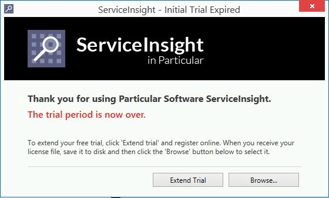
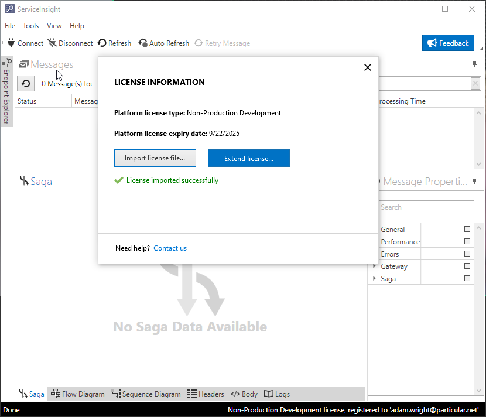

There are a few options for adding a license to ServiceInsight.

include: registry-licensing

## Via ServiceInsight

To register ServiceInsight, before or after the trial period is over, click on the `Help -> Register` menu item. Running ServiceInsight after the trial period has expired, the following dialog will be displayed:

The license can be loaded by clicking the "Browse..." button and selecting the license file. The dialog box will then display the following confirmation message:

## Using other platform tools

See the [ServiceControl licensing page](/servicecontrol/license.md) or the [instructions for licensing manually using the registry](/nservicebus/licensing/?version=core_6#license-management-using-the-registry) for more information.

## Verifying a license is applied

Once the license file is loaded, ServiceInsight will display licensing information on its status bar (bottom right hand side) upon launch:

