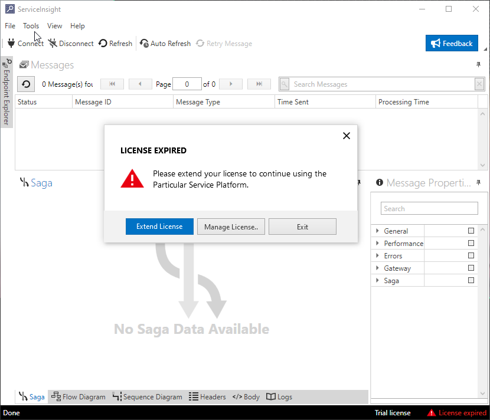

When the trial period is over, ServiceInsight will display the following dialog:

The same dialog can be displayed at any time clicking on "Help" \> "Register" menu item.

### Loading the license file

When the dialog box opens, browse and find the license file, select it and click Open. The dialog box will then display the following confirmation message:

### Verifying a license is applied

After loading the license file, click on "Help" \> "Register" menu item. ServiceInsight will then display a licensing message in the bottom right corner of the screen:

