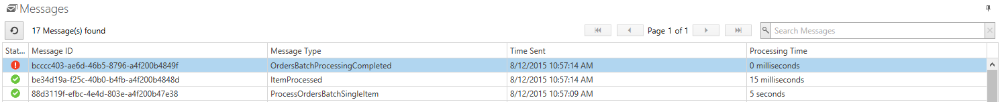
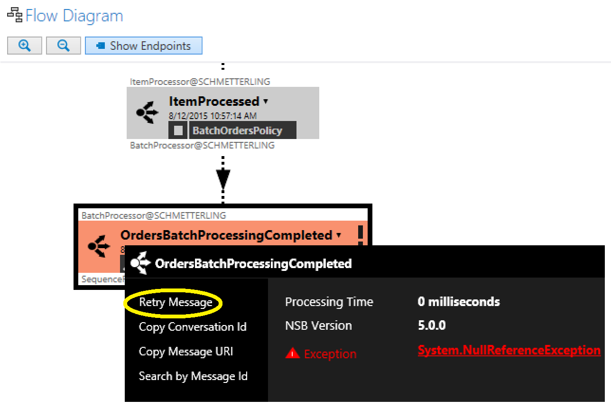
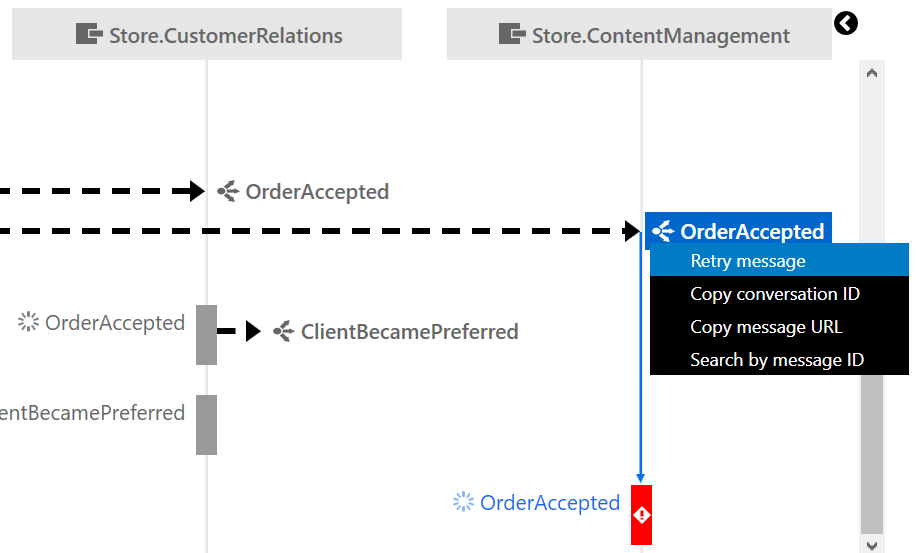

When message processing fails NServiceBus will [automatically retry it](/nservicebus/errors/automatic-retries). If a message continues to fail it will be forwarded to the [configured error queue](http://docs.particular.net/nservicebus/errors/) and become visible within ServiceInsight.

The views in ServiceInsight show information about message processing failure with the message. No manual correlation of log files or accessing of remote servers is necessary to research the reasons for an error. 

## Status in the Message List

The status of an errant message is illustrated in the message window.

## The Flow Diagram

The flow diagram highlights errors in red and provides details with access to the stack trace.

## The Sequence Diagram

The sequence diagram highlights handlers with errors in red.

## Retrying a failed message

Once the underlying cause for message processing failure has been resolved it is possible to rety a failed message from within ServiceInsight. Find the message to be retried and click `Retry Message`.