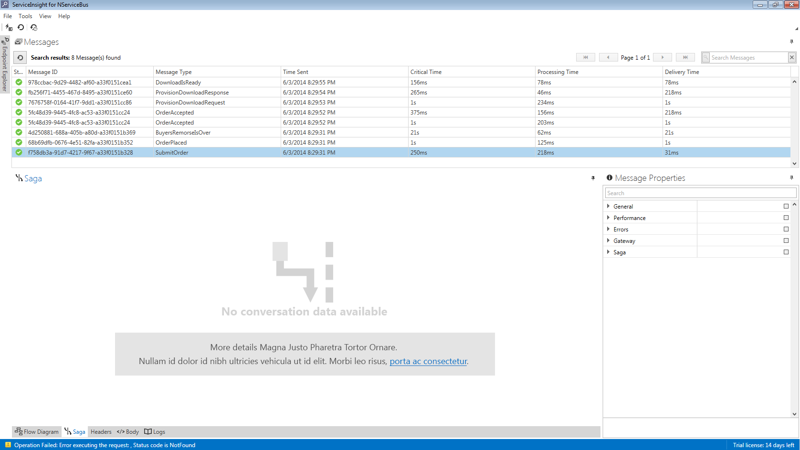

When selecting a message in ServiceInsight, the visualization windows may show the message "Data not available".

ServiceInsight visualizations are based on collections of messages called conversations. Each of these visualizations will query ServiceControl to get all of the messages that belong to a specific conversation in order to display them on the screen.

There are two reasons why ServiceControl may not find messages that belong to a given conversation.

Firstly, ServiceControl does not keep audit data forever. When messages are past a certain age they will be deleted from ServiceControl. If a message appears in a ServiceInsight list but the conversation cannot be found, it is likely because all of the messages have expired within ServiceControl and have been removed. The messages still appearing in the list are being read from an in-memory ServiceInsight cache. See [Automatic Expiration of ServiceControl Data](/servicecontrol/how-purge-expired-data.md) for instructions on how to increase the time that messages are available before they expire.

The other reason that data might not be available is when messages in ServiceControl are not linked to a conversation. ServiceControl identifies which conversation a message belongs to by looking at the `NServiceBus.ConversationId` header on each message. If this header is not present the message will not appear in any ServiceInsight visualizations.

NOTE: The [`NServiceBus.ConversationId`](/nservicebus/messaging/headers.md#messaging-interaction-headers-nservicebus-conversationid) header was introduced in NServiceBus version 4. Messages sent or published by earlier versions of NServiceBus will not have this header and will not appear in ServiceInsight visualizations.