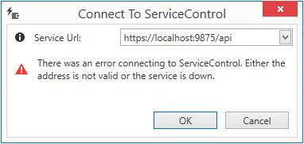

ServiceControl can be configured to run on a SSL, but if a self-signed certificate is chosen, ServiceInsight would not allow connections to that instance. While running a self-sign certificate is not recommended, ServiceInsight provides an override configuration entry to allow you to connect to such instances. 



Open `ServiceInsight.exe.config` from the installation directory and change the value for the following entry to `True` (the dafault value is False):

```XML
<appSettings>
    <add key="SkipCertificateValidation" value="False" />
</appSettings>
``` 

NOTE: Since the application by default installs in the `Program Files` folder, admninistrative priviledge might be required to edit the config file above. 