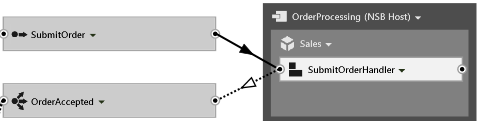
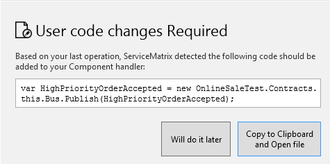
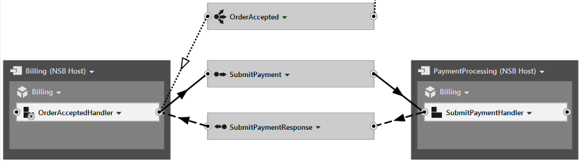

ServiceMatrix accelerates the creation of a distributed NServiceBus solution.  As the canvas and visual elements are used to design the system the Visual Studio solution is updated with generated code and content.  

This article explores how to customize the ServiceMatrix solution and add your own code.


# Introduction

ServiceMatrix is a visual design tool that accelerates the design and coding of an NServiceBus system.  It generates code and automates the creation of classes, projects and configurations that would take much longer if done manually.  The generated code is designed in a way that allows for user modification and extension. This article reviews this high level design and demonstrates the extension points.   


## Viewing The Code

NOTE: In ServiceMatrix, to view the code for any of the components, use the drop-down within that component on the design canvas and choose `View Code`. To view related partial class definitions, put your cursor in the class name, right mouse-click and select `Go to Definition` or hit `F12`.


# Message Definitions

NServiceBus messages are plain old CLR classes in C#. As you send commands or publish events in ServiceMatrix, you are prompted only for a name. When you build your solution, the messages are generated.  The generated message classes don't contain any properties but you can easily add them. To modify a message class, view the code and add whatever properties you wish.

```C#
namespace OnlineSales.InternalMessages.Commands.Sales
{
    public class SubmitOrder
    {
        public string CustomerName { get; set; }
        public string AccountNumber { get; set; }
        public string ShippingChoice { get; set; }
    }
}
```

If you build the solution again, the new message properties will be available in the components, handlers and sagas.  Since the message classes are only generated one time by ServiceMatrix, they are safe to edit.


# Customizing Components

Mixing dynamic code and user created code can be challenging.  This is especially true in an environment like ServiceMatrix where as you continue to design your system in the visual environment code is regenerated. This must be done without disturbing the users code that has been added along the way.  


## Partial Classes and Partial Methods

To solve this, the design of the generated code uses partial classes.  The dynamic files that are subject to regeneration by ServiceMatrix are created with a partial class definition in one file.  The same partial class is also defined in a separate file that is for user customization. Generated code in one file invokes virtual methods that are further defined in the user modified partial class.

The dynamic partial class includes straight forward message handlers and partial methods.  This file should not be edited and warns you of this in the comments at the top of the file.  It will be regenerated every time the ServiceMatrix solution is built and will change as the visual design or settings are modified.

```C#
//------------------------------------------------------------------------------
// <auto-generated>
// This code was generated by ServiceMatrix.
//
// Changes to this file may cause incorrect behavior and will be lost if
// the code is regenerated.
// </auto-generated>
//------------------------------------------------------------------------------
```


## Reviewing The Generated Code

The design of the generated message handlers use partial methods to provide opportunities for the modification of messages and the integration of your own code and services.  Lets look at the code for a sample component.


## NServiceBus Component Code

The code below was generated by ServiceMatrix for component that handles a `SubmitOrder` message and publishes a `Orderaccepted` event.  It looks like this on the canvas:




### The Dynamic Partial Class

The dynamic code generator has created a handler for the `SubmitOrder` method.  In the handler a  `HandleImplementation` partial method for the message is invoked.  As a partial method, it is stubbed out in one class but implemented separately in the other partial class file.  The `Bus` property  provides the code with access to the `Bus` object.

```C#
namespace OnlineSales.Sales
{
    public partial class SubmitOrderHandler : IHandleMessages<SubmitOrder>
    {
		public void Handle(SubmitOrder message)
		{
			// Handle message on partial class
			this.HandleImplementation(message);
		}

		partial void HandleImplementation(SubmitOrder message);

        public IBus Bus { get; set; }
    }
}
```


### The Customizable Partial Class

The customizable partial class is generated by ServiceMatrix and is intended to be modified with the partial method implementations and custom logic.  This class is generated only one time.  After adding elements to your design in ServiceMatrix, this code is generated the first time you build your solution.  It will contain a partial method for each the message types it handles and a publish or send method for any outbound messages.   

```C#
namespace OnlineSales.Sales
{
    public partial class SubmitOrderHandler
    {
		
        partial void HandleImplementation(SubmitOrder message)
        {
            // TODO: SubmitOrderHandler: Add code to handle the SubmitOrder message.
            Console.WriteLine("Sales received " + message.GetType().Name);
           
         
  			var orderAccepted = new OnlineSales.Contracts.Sales.OrderAccepted();

			//Access inbound messages and set outbound message properties
			//orderAccepted.ReferenceNumber = message.OrderID;
           
			Bus.Publish(orderAccepted);
        }

    }
}

```
Code is generated for both incoming and outbound messages in your design.

**Inbound Message Handlers**

In the example above, the code generator has stubbed out a simple implementation of the partial `HandleImplementation` method for the  `SubmitOrder` command message.  This is the place to put any custom handler code. 

**Outbound Messages**

In the example above the code generator has also created the code to instantiate a new `OrderAccepted` event and publish it using the bus automatically when the the `SubmitOrder` message is handled. The comments indicate this code was generated by ServiceMatrix.  This code can be completedly customized.  If the design doesn't require the event to be published in response to the inbound message, it can be removed.
##Adding Messages to the Design
The code generator will create code for handling and sending any messages that are in your design *the first time you build the solution*.  In the sample above, the code for handling the `SubmitOrder` message and publishing the `OrderAccepted` event was created because both of them were present in the ServiceMatrix design at initial build.

As you continue to added to your design the code generator after the initial build, ServiceMatrix cannot safely edit the partial class definition or custom code could be impacted.  When you add additional messages to a component, ServiceMatrix will recognize that new code is needed and warn you as shown:



Adding a new `HightPriorityOrderAccepted` event to the example above causes ServiceMatrix to prompt with the code required to create and publish the message.  ServiceMatrix can assist you by opening the partial class file and placing the code on the clipboard so you can easily add it. 


# Understanding Saga Code

ServiceMatrix supports the design of [NServiceBus sagas](/nservicebus/sagas/) and generates the necessary code to get you started.  The saga is a specialized stateful version of a ServiceMatrix component.  As we saw with the handlers, the Saga is generated with the dynamic code and user modified code in separate partial class files.  For sagas, the design has been extended to to include definitions for saga data, custom finding logic, and some convenience methods to make saga completion easier. 

The code below is based on a saga designed in ServiceMatrix that correlates the request and response with another endpoint as shown.  This saga handles the `OrderAccepted` event then publishes the `SubmitPayment` request to a payment processing service.  The saga handles and correlates the `SubmitPaymentResponse`.




## Designating the Startup Messages

Depending on the design, one or more messages can start a saga.  If the saga is handling multiple messages, you will be [prompted in ServiceMatrix](images/servicematrix-sagastarter.png "Designated Saga Starters") to indicate which messages will start the saga.  The partial class that contains the component definition will be generated to extent the `NServiceBus.Saga` base class and will use the marker interfaces to indicate the start-up message types and the message types that the saga will handle. 

The code snippet below is generated for example saga class above. This is regenerated with each build and is not safe to edit.

```C#
namespace OnlineSales.Billing
{
    public partial class OrderAcceptedHandler : Saga<OrderAcceptedHandlerSagaData>,
    	IOrderAcceptedHandler,
    	ServiceMatrix.Shared.INServiceBusComponent,
    	IAmStartedByMessages<OrderAccepted>,
    	IHandleMessages<SubmitPaymentResponse>
    {
		
	public void Handle(OrderAccepted message)
	{
		......
```
Once again this is a partial class.  In the other partial class definition it is possible to manually add additional message types that the saga will handle.  If you add new messages using the canvas, ServiceMatrix will add them to the code above automatically next time you rebuild the solution.


## Saga Data

The Saga data class defines the persisted data that is available inside handlers each time the saga is activated.  The generated saga data is implemented as a partial class in the same dynamic file as the saga handler class itself. This default generated saga data design includes default properties for a unique ID and the storage of any message that is handled.  It also stores information about the `Originator` of the message that started the saga and the NServiceBus assigned Id of that message.

```C#
public partial class OrderAcceptedHandlerSagaData : IContainSagaData
{
    public virtual Guid Id { get; set; }
    public virtual string Originator { get; set; }
    public virtual string OriginalMessageId { get; set; }
    public virtual OrderAccepted OrderAccepted { get; set; }
    public virtual SubmitPaymentResponse SubmitPaymentResponse { get; set; }
}
```

In keeping with the code separation strategy, this generated dynamic file has a separate file containing a place to modify the partial class.  Custom properties are easily added here.  Notice how in the example the `OrderID` has been added.  It is a unique identifier for the saga data and is marked with the `[Unique]` attribute.

```C#
namespace OnlineSales.Billing
{
    public partial class OrderAcceptedProcessorSagaData
    {
        [Unique]
        public Guid OrderID { get; set; }
        public string PaymentAuthorizationCode { get; set; }
    }
}
```


## Saga Message Handlers

The message handling code of the Saga is implemented very much like the handler component code.  The code will implement a message handler in the saga for each of the messages handled in the ServiceMatrix design.   Similarly, for each handled message a virtual method is created in the form `HandleImplementation(<messagetype>)`.   These virtual methods are invoked and should be implememented and customized in the custom code partial class.   View the Saga code by select the `View Code` option on the component in the canvas.


### Example Saga Code

The following is a sample of customized saga code.  It handles an `OrderAccepted` event, stores the `OrderID` then creates and sends the `SubmitPayment` command.  The saga then handles the `SubmitPaymentResponse` message and stores the `PaymentAuthorizationCode` in the saga data.

```C#
namespace OnlineSales.Billing
{
    public partial class OrderAcceptedHandler
    {
		
        partial void HandleImplementation(OrderAccepted message)
        {
            // TODO: OrderAcceptedHandler: Add code to handle the OrderAccepted message.
            Console.WriteLine("Billing received {0} for order id {1}",message.GetType().Name, message.OrderID);

            //set the saga order id.  This will be accessable in any future handler.
            Data.OrderID = message.OrderID;

            Console.WriteLine("Submitting Order {0} for payment", Data.OrderID);

            //Pasting the code from the user code pop up here so we send the payment request when the OrderAccepted Event arrives.
            var submitPayment = new OnlineSales.Internal.Commands.Billing.SubmitPayment();
            Bus.Send(submitPayment);
        }

        partial void HandleImplementation(Internal.Messages.Billing.SubmitPaymentResponse message)
        {
			//store the authorization code            
			Data.PaymentAuthorizationCode = message.AuthorizationCode;
           
            System.Console.WriteLine("Payment response received for order {0} with auth code {1}", message.AuthorizationCode, Data.OrderID);
                                  
        }

        partial void AllMessagesReceived()
        {
            //Publish the BillingCompleted event.  Assign event values from the saga data values.
            var billingCompleted = new OnlineSales.Contracts.Billing.BillingCompleted();
            billingCompleted.AuthorizationCode = Data.PaymentAuthorizationCode;
            billingCompleted.OrderID = Data.OrderID;
            Bus.Publish(billingCompleted);
           
            //Mark this saga as complete and free up the persistence resources.
            System.Console.WriteLine("Marking Saga complete for order {0}", Data.OrderID);
            MarkAsComplete();
        }

    }
}
```

The `AllMessagesReceived` is a convenient partial method.  As part of the dynamically generated handler code, every inbound message is stored in saga data. After each message is handled the saga data is checked to see if all the messages have been received.  If so, the virtual method `AllMessagesReceived` is called.  The example uses it to trigger the publishing of a `BillingCompleted` event and then mark the saga as complete.


## Custom Saga Finding Logic

When a saga handles a message it must be able to correlate the message to a unique saga instance in order to retrieve the correct saga data. It does this by mapping designated properties of the message to properties of the saga data.  ServiceMatrix generates default code for this mapping that can be modified.  In the [drop-down menu](images/servicematrix-configuresaga.png) for the saga component is an option for `Configure Saga`. The provided partial class overrides the `ConfigureHowToFindSaga` method.  The comments indicate how it can be modified for a specific situation.

When a saga uses a Bus.Send to send a request message and later handles a reply, a custom mapping is not required.  This is because the framework will put a unique saga ID in the header of the request message.  The recipient of the message will automatically put the same ID in the reply message to be used for correlation.   This automatic correlation is a nice convenience when doing request-response or full-duplex messaging.  

When using publish-subscribe messaging the events received by a saga must have a map so they will correlate correctly.  In the example below, an `OrderAccepted` and `BillingCompleted` are mapped to saga data by their `OrderID` property.

```C#
public partial class OrderAcceptedHandler
{
    public override void ConfigureHowToFindSaga()
    {
        //m represents the message and s represents the saga data in this mapping method.
           
        ConfigureMapping<OrderAccepted>(m => m.OrderID).ToSaga(s => s.OrderID );
        ConfigureMapping<BillingCompleted>(m => m.OrderID).ToSaga(s => s.OrderID );

        // If you add new messages to be handled by your saga, you will need to manually add a call to ConfigureMapping for them.
    }
}
```


# SignalR Integration

NOTE: SignalR integration was added in ServiceMatrix V2.2.

When you have an event or command handled in an ASP.NET MVC endpoint, ServiceMatrix will ask you if you would like to broadcast the message via SignalR. When you answer yes, ServiceMatrix creates additional C# classes and even JavaScript code on the 'Test Messages' page in your ASP.NET MVC project that you can use as an example for your own pages.


## Additional SignalR Message Handler and Hub

If you were to have the Sales service, hosted in the eCommerce ASP.NET MVC endpoint, subscribe to the BillingCompleted event, for example, ServiceMatrix would generate the following code in `Infrastructure\Sales\SignalRBroadcastForBillingCompleted.cs`:

````C#
namespace OnlineSales.Sales
{
  public class BroadcastBillingCompleted : IHandleMessages<BillingCompleted>
  {
    public void Handle(BillingCompleted message)
    {
      var context = GlobalHost.ConnectionManager.GetHubContext<BillingCompletedHub>();
      context.Clients.All.billingCompleted(message);
    }
  }
}
````

As you can see, ServiceMatrix has created a separate handler for the BillingCompleted event for the SignalR integration. This keeps any server side code (in the `BillingCompletedHandler`) decoupled from what happens on the client. The generated code finds the `BillingCompletedHub` and calls the billingCompleted JavaScript method on *all* connected web clients. (Calling a JavaScript method on a web client from the server does seem like magic. See the <a href="http://www.asp.net/signalr" target="_blank">documentation here from ASP.NET</a> to learn how SignalR works.)

In `Infrastructure\Sales\SignalRHubsForBillingCompletedHandler.cs` you will see the SignalR Hub class that has been auto-generated by ServiceMatrix:

````C#
namespace OnlineSales.Sales
{

	public class BillingCompletedHub : Hub
    {  
    }       
	
}
````


## SignalR Client Side Code

If you review the `Index.cshtml` view for `TestMessages` in your ASP.NET MVC endpoint, you will see the following two script tags have been added:

````HTML
<script src="~/Scripts/jquery.signalR-1.0.0.min.js"></script>
<script src="~/signalr/hubs" type="text/javascript"></script>
````

This brings down the core SignalR JavaScript library as well as the dynamically generated JavaScript for interfacing with the `BillingCompletedHub`. Scroll down in `Index.cshtml` and you will see the JavaScript code that sets up SignalR as well as the code that handles the billingCompleted event that you saw called in the handler C# code above.

````JavaScript
//Wire up events to SignalR Hub Broadcasts

	var billingCompletedHub = $.connection.billingCompletedHub;

	billingCompletedHub.client.billingCompleted = function (data) {
      console.log('Received event : BillingCompleted ');      
		var jsonBillingCompleted = JSON.stringify(data);
        $('#signalrmessages').append('<div><div class="text-lato-16">BillingCompleted</div><div>' + jsonBillingCompleted + '</div></div>');
	};

   
//Start listening to SignalR Hubs
  $.connection.hub.start().done(function () {
      console.log('Connection established!, ConnectionId = ' + $.connection.hub.id);
  });
````

This JavaScript should give you an example of what you need to place into your actual views in your ASP.NET frontend in order to make the SignalR integration work.


# Summary

The visual design environment of ServiceMatrix generates code designed to be extensible.  This article reviewed the partial classes and methods that need to be customized. 

To learn more about using sagas within ServiceMatrix refer to [this article](getting-started-sagasfullduplex-2.0.md "Using Sagas in Full Duplex").

As you design your solution, learn to use ServiceInsight.  [This article](servicematrix-serviceinsight.md "ServiceMatrix and ServiceInsight") reviews how both products work together and add efficiency to your design process.

You can monitor your sagas and bus endpoints in production using [ServicePulse](../servicepulse)
