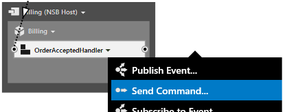
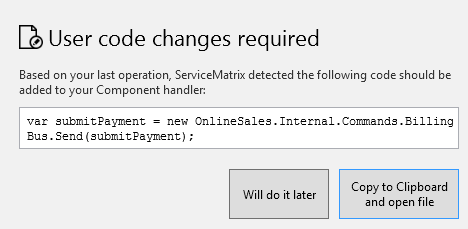
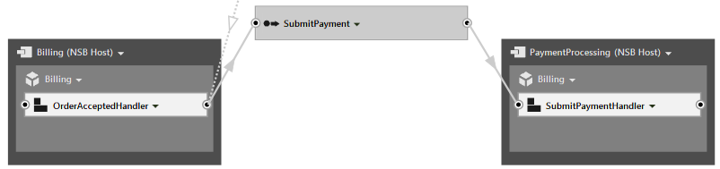
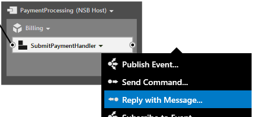
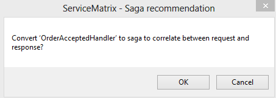
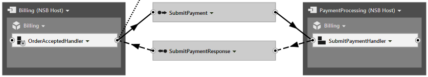
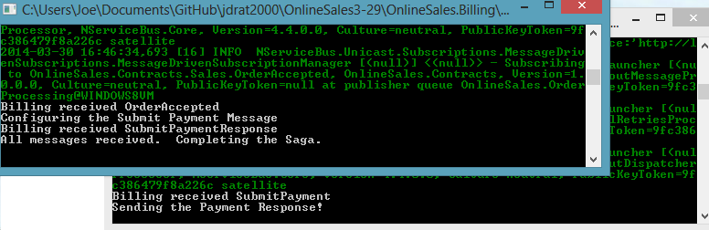
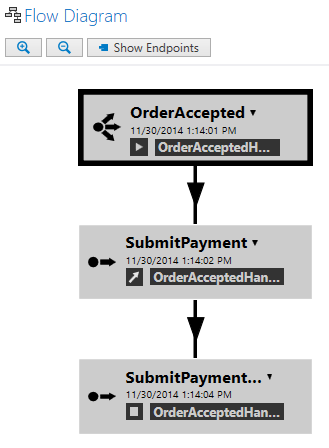

A series of articles discusses the [advantages of NServiceBus](getting-started-with-nservicebus-using-servicematrix-2.0-fault-tolerance.md "Fault Tolerance in NServiceBus").  The series also explores two patterns: [request-response](getting-started-with-servicematrix-2.0.md "ServiceMatrix Request Response ") and [publish-subscribe](getting-started-with-nservicebus-using-servicematrix-2.0-publish-subscribe.md "ServiceMatrix and PubSub").

Business processes usually involve multiple steps and require coordination of multiple systems. You can use the saga pattern when dealing with this situation with message-based and event-driven architecture.  NServiceBus has built-in [support for sagas](/nservicebus/sagas/).


# Introducing Sagas for Request-Response

To demonstrate a saga you will extend your Online Sales sample.  Before proceeding, please verify that your solution has the ECommerce website, and both the OrderProcessing and Billing endpoints, as shown.


As you may recall, in your example the ECommerce website sends the `SubmitOrder` message to the `OrderProcessing` system.  The backend `OrderProcessing` component processes the `SubmitOrder` message and raises an `OrderAccepted` event.  The `Billing` service has subscribed to this event.


## Adding a Payment Processing Service

In an e-commerce scenario you might expect the billing process to involve interaction with a payment processing gateway.  This involves submitting payment information and getting a response that includes an authorization code.  In this message-based example, the billing service uses a command message to submit the payment for processing and receives an asynchronous response message.  This type of communication is called the request-response or full-duplex pattern.

Add a payment processing component to your system. Using the drop-down menu on the `OrderAcceptedHandler` component in the `Billing` service, add a new command called `SubmitPayment`.




## Modifying the OrderAcceptedHandler

When you add this new command, ServiceMatrix will prompt you with the code necessary to send it from within the `OrderAcceptedHandler`.



Copy the code to the clipboard and add it to the `OrderAcceptedHandler` inside the handler of the `OrderAccepted` event as shown.

```C#
namespace OnlineSales.Billing
{
    public partial class OrderAcceptedHandler
    {
        partial void HandleImplementation(OrderAccepted message)
        {
            // TODO: OrderAcceptedHandler: Add code to handle the OrderAccepted message.
            Console.WriteLine("Billing received " + message.GetType().Name);

			Console.WriteLine("Configuring the SubmitPayment Message");
			//Paste the send code block here.
            var submitPayment = new OnlineSales.Internal.Commands.Billing.SubmitPayment();
            Bus.Send(submitPayment);
        }
    }
}
```

This canvas will illustrate the new `SubmitPayment` command along with an undeployed `SubmitPaymentHandler` component.  Use the drop-down menu of this component to deploy it to a [new endpoint](images/servicematrix-deploytopaymentprocessing.png) hosted in the NServiceBus host, and name it `PaymentProcessing`.   The relationship between the `Billing` and `PaymentProcessing` endpoints should look like this:



You created a new `PaymentProcessing` endpoint and a new command message that billing can use to submit payments for processing.  View the code in the `SubmitPaymentHandler` to see that it handles the `SubmitPayment` request. This component still needs to be modified to send a response message.  In a real-life scenario it could invoke a web service that processes credit cards or other payments. This web service would likely return an authorization code that would be need to be packaged in a response message and returned to the requester.  The next step is to create a response.


## Correlating the Payment Response Using a Saga

To send a response from the `SubmitPaymentHandler` component select `Reply with Message` from the drop-down menu.



This reply will automatically be routed to the requester, which in this case is the `OrderAcceptedHandler` component that sent the message. When you select this option you will be prompted as follows:



Choose **OK.**

NOTE: If you built the solution prior to creating the response message, you will be prompted with the user code changes necessary to send the reply from the `SubmitPaymentProcessor`.   Open the code for the `SubmitPaymentProcessor` and paste it into the `SubmitPayment` handler.

Why do you need a saga? Your NServiceBus system uses asynchronous messaging to communicate between services.  The `OrderAcceptedHandler` sent the `SubmitPayment` request but doesn't wait or block for a response.  Once the payment request is processed by the payment processor, the messaging system returns the response message at some point in the future for handling.  However, if you want access to any of the related data from the original `OrderAccepted` event, the `OrderAcceptedHandler` component must store the information and make it available when handling the response.  The NServiceBus saga is implemented for just this purpose.  It will automatically persist saga data and make it available in your code when a correlating message is handled.  You can read much more about sagas in [this NServiceBus article.](/nservicebus/sagas/)

When you select  **OK**, ServiceMatrix creates the `SubmitPaymentResponse` message class.  It changes the `OrderAcceptedHandler` into a saga and creates a handler for the `SubmitPaymentResponse`.  The related area of the canvas should now look like this:



Since the `OrderAcceptedHandler` is now a saga, notice the icon has changed slightly. ServiceMatrix has also generated the code needed to support a saga implementation.  The framework takes care of persisting the message data from each message processed by the saga.  The generated code provides ways to safely integrate your own custom code.


## Modifying the Saga Code

In addition to the original `OrderAccepted` event from the previous example we will need to supplement this code in a few key ways.  We'll show where to add saga data for persistence.  We'll also implement a way of handling of the `SubmitPaymentResponse` and finally mark the saga as complete. 


## Adding Saga Data

```C#
namespace OnlineSales.Billing
{
    public partial class OrderAcceptedHandlerSagaData
    {
		//Put your own custom properties here. 
		//private string OrderID{get;set;}
    }
}
```

Saga data properties can be accessed or mutated using the `Data` object from any of the Sagas `Handle` methods.


## Creating the Payment Request


## Adding the Response Handler

ServiceMatrix has implemented handlers that call partial methods on your `OrderAcceptedHandler` class that you can implement for handling the `SubmitPaymentResponse`.  Modify the partial class in `Billing\OrderAcceptedHandler.cs` to include the new partial method as shown: 

```C#
partial void HandleImplementation(Internal.Messages.Billing.SubmitPaymentResponse message)
{
   //Handle the SubmitPaymentResponse
	Console.WriteLine("Billing received " + message.GetType().Name);

	//To access and save to saga data use code like this..
	//Data.AuthCode = message.AuthorizationCode;
}
```


## Completing the Saga

The saga maintains data between calls but this persistence needs to last only until the process is over.  To end a saga and free up its resources it must be marked as complete when the final message is received.  ServiceMatrix generates code that keeps track of each message and provides a convenient partial method that can be used to complete the saga by calling the `MarkAsComplete` method.  Continue modifying the `OrderAcceptedHandler.cs` class by adding this code:

```C#
partial void AllMessagesReceived()
{
    Console.WriteLine("All messages received. Completing the Saga.");
    MarkAsComplete();
}
```


## Reviewing the SubmitPaymentProcessor Code

Use the drop-down on the `SubmitPaymentHandler` component to bring up the code window. As was the case with the saga, ServiceMatrix has generated the basic code needed  to handle the `SubmitPayment` message.  ServiceMatrix has also either generated or prompted you to add code for the creation of the `SubmitPaymentResponse` and the `Bus.Reply()` method.

```C#
namespace OnlineSales.Billing
{
    public partial class SubmitPaymentHandler
    {
        partial void HandleImplementation(SubmitPayment message)
        {
            // TODO: SubmitPaymentHandler: Add code to handle the SubmitPayment message.
            Console.WriteLine("Billing received " + message.GetType().Name);

           
			var submitPaymentResponse = new OnlineSales.Internal.Commands.Billing.SubmitPaymentResponse();
            Bus.Reply(submitPaymentResponse);
        }
    }
}
```


# Running the Solution

Press `F5` to build and run the solution.  Arrange the consoles for OrderProcessing, Billing, and the new PaymentProcessing endpoints so you can see them all simultaneously.  When the ECommerce website launches, use it to send a test message.  Notice the interaction between the Billing and PaymentProcessing endpoints. 



The `Billing` service receives the `Orderaccepted` event and handles it in the `OrderAcceptedHandler` component, now running as a saga.  It handles the event and sends the `SubmitPayment`command to the `SubmitPaymentHandler` component running in the `OrderProcessing` endpoint.  The `SubmitPaymentResponse` reply is sent back to the `OrderAcceptedHandler` saga.  Once both the `OrderAccepted` event and the `SubmitPaymentResponse` messages have been received, the saga is complete.


## Using ServiceInsight

[ServiceInsight](/serviceinsight) is an additional tool in the NServiceBus framework.  It uses audit and error data to provide a valuable view of a running system.  If you have ServiceInsight installed, it launches each time you debug.  When used at debug time, ServiceInsight lists and illustrates the messages related to your current debug session. 
###Flow Diagram
Read about [using ServiceInsight and ServiceMatrix](servicematrix-serviceinsight.md) together, then run this solution again. Review the messages as they are processed in the flow diagram:




### Saga View

When clicking on a message involved in the saga, a saga view windows will open.  It clearly illustrates which messages the saga interacted with and what they did.


# Summary

Sagas allow NServiceBus to manage long running processes and to persist data between messages.  ServiceMatrix supports the saga pattern.  It recognizes the need for a saga in the request-response implementation and efficiently generates the code to make it work.


# Next Steps

* SignalR: ServiceMatrix can generate code for you to allow SignalR integration with your MVC endpoint. This allows realtime communication with the web browser to inform the end user when an event is handled by the MVC endpoint. Read [this article](getting-started-signalr-2.2.md "Using the ServiceMatrix Code") to learn how.
* Code Customization: The code generated by ServiceMatrix is meant to be customized. Review how the messages, endpoints, components, and sagas can be modified in [Using the ServiceMatrix Code](customizing-extending.md).
