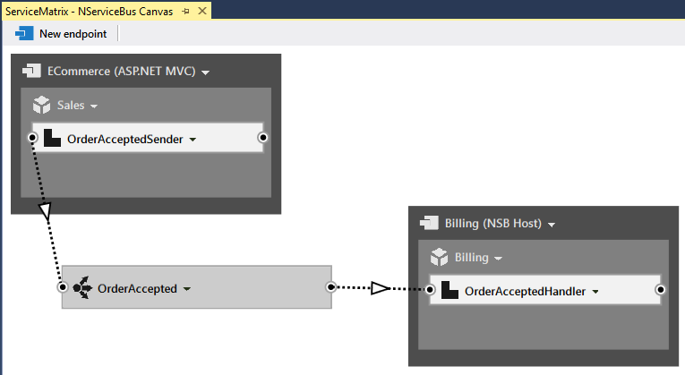

SignalR is a library that is part of ASP.NET. It allows a persistent, bi-directional communication channel between the web browser and web server. ServiceMatrix can help you utilize the power of SignalR whenever you have an ASP.NET MVC endpoint subscribe to an event.

When you build an ASP.NET MVC 4 endpoint in ServiceMatrix, it allows you to leverage SignalR v1.x to have event and reply messages to be propagated to the front-end user interface.

1.  [Getting Started](#introducing-signalr-and-servicematrix)
2.  [Adding a BillingCompleted Event](#adding-a-billingcompleted-event)
3.  [Subscribe ASP.NET MVC to BillingCompleted](#subscribe-aspnet-mvc-to-billingcompleted)
4.  [Summary](#summary)

# Introducing SignalR and ServiceMatrix

To demonstrate SignalR you will create a simple ServiceMatrix project named OnlineSalesSignalR with an ASP.NET MVC endpoint named ECommerce and an NSB Hosted endpoint named. (For a walkthrough of creating a ServiceMatrix project, see [Getting started with ServiceMatrix](getting-started-with-servicematrix-2.0.md).) Have the ECommerce project publish an event called `OrderAccepted` and deploy a subscriber component to the `Billing` service. You should have something like the following:

NOTE: Typically a front-end application would send a command to some kind of order processing service which then may be the one to publish the OrderAccepted event. For brevity, we're just using the ASP.NET project as a simple test frontend.

## Adding a BillingCompleted Event

Have the Billing service publish a new `BillingCompleted` event whenever the payment has completed processing. Click the drop-down menu for the `OrderAcceptedHandler` in the Billing endpoint and select 'Publish Event'.

Publish a new event named `BillingCompleted`. You may receive the 'User code changes required message.' Copy the code to the clipboard and paste it into the `OrderAcceptedHandler.HandleImplementation` method as shown.

<!-- import ServiceMatrix.OnlineSalesSignalR.Billing.OrderAcceptedHandler -->

## Subscribe ASP.NET MVC to BillingCompleted

Click the drop down menu for the newly created `BillingCompleted` event and select 'Add Subscriber...'

Select the Sales service and you will be given a new, undeployed `BillingCompletedHandler`. Click on the drop down for `BillingCompletedHandler` and choose 'Deploy Component...' Select the 'ECommerce' endpoint to deploy to (recall this is your ASP.NET MVC endpoint). When you do that, you should receive the following message.

Click **Yes** here to enable the SignalR broadcast. If you do not receive the message, you can simply click on the BillingCompletedHandler to open its context menu and select "Broadcast via SignalR."

NOTE: If at any time you wish to remove the SignalR broadcast from your handler, simply open the context menu again and select "Remove Broadcast via SignalR."

Now run the solution with **F5** and send a test SubmitOrder message using the web browser. You should now see a new 'SignalR Broadcasts' section on the web page.

You should see the BillingCompleted event show up as soon as the saga completes!

# Summary

There's a lot more you can do with SignalR integration but hopefully you've seen how easy ServiceMatrix makes it to harness the power of SignalR.

NOTE: SignalR integration is currently a beta feature. Please review [this GitHub issue](https://github.com/Particular/ServiceMatrix/issues/417) for more information.

Return to the ServiceMatrix [table of contents](./).