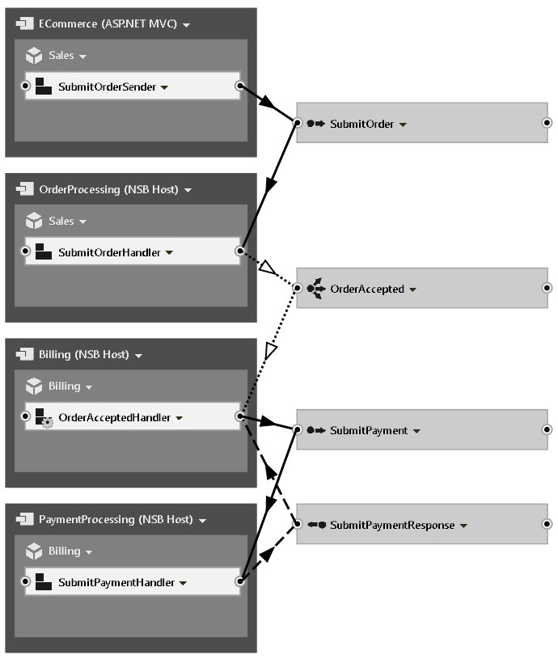
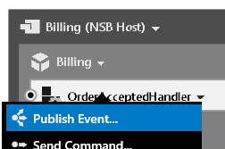
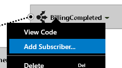
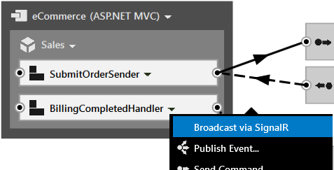
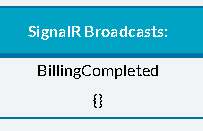

SignalR is a library that is part of ASP.NET. It allows a persistent, bi-directional communication channel between the web browser and web server. ServiceMatrix can help you utilize the power of SignalR whenever you have an ASP.NET MVC endpoint subscribe to an event.

When you build an ASP.NET MVC 4 endpoint in ServiceMatrix, it allows you to leverage SignalR v1.x to have event and reply messages to be propagated to the front-end user interface.

# Introducing SignalR and ServiceMatrix

To demonstrate the SignalR integration you will extend your Online Sales sample. Before proceeding, please verify that your solution has the ECommerce website, and the OrderProcessing, Billing, and PaymentProcessing endpoints, as shown.



As you may recall, in your example the ECommerce website sends the `SubmitOrder` message to the `OrderProcessing` system. The backend `OrderProcessing` component processes the `SubmitOrder` message and raises an `OrderAccepted` event. The `Billing` service has subscribed to this event and sends the `SubmitPayment` message to the `PaymentProcessing` system as part of a saga and waits for a `SubmitPaymentResponse` message to come back before completing the saga.

## Adding a BillingCompleted Event

Have the Billing service publish a new `BillingCompleted` event whenever the payment has completed processing. Click the drop down menu for the `OrderAcceptedHandler` in the Billing endpoint and select 'Publish Event'.



Publish a new event named `BillingCompleted`. You will receive the 'User code changes required message.' Copy the code to the clipboard and paste it into the `AllMessagesReceived` method as shown.

````C#
partial void AllMessagesReceived()
{
  Console.WriteLine("All messages received. Completing the Saga.");
  MarkAsComplete();

  var billingCompleted = new OnlineSales.Contracts.Billing.BillingCompleted();
  Bus.Publish(billingCompleted);
}
````

## Subscribe ASP.NET MVC to BillingCompleted

Click the drop down menu for the newly created `BillingCompleted` event and select 'Add Subscriber...'



Select the Sales service and you will be given a new, undeployed `BillingCompletedHandler`. Click on the drop down for `BillingCompletedHandler` and choose 'Deploy Component...' Select the 'ECommerce' endpoint to deploy to (recall this is your ASP.NET MVC endpoint). When you do that, you should receive the following message.


Click **Yes** here to enable the SignalR broadcast. If you do not receive the message, you can click on the BillingCompletedHandler to open its context menu and select "Broadcast via SignalR."



NOTE: If at any time you wish to remove the SignalR broadcast from your handler open the context menu again and select "Remove Broadcast via SignalR."

Now run the solution with **F5** and send a test SubmitOrder message using the web browser. You should now see a new 'SignalR Broadcasts' section on the web page.



You should see the BillingCompleted event show up as soon as the saga completes!

# Summary

There's a lot more you can do with SignalR integration but hopefully you've seen how easy ServiceMatrix makes it to harness the power of SignalR. In the next steps, Code Customization, we will dig into the SignalR code that gets generated by ServiceMatrix.

NOTE: SignalR integration is currently a beta feature. Please review [this GitHub issue](https://github.com/Particular/ServiceMatrix/issues/417) for more information.

# Next Steps
* Code Customization: The code generated by ServiceMatrix is meant to be customized. Review how the messages, endpoints, components, and sagas can be modified in [this article](customizing-extending.md "Using the ServiceMatrix Code").
