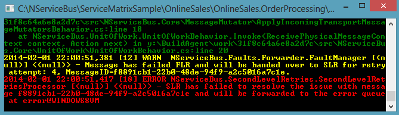

In [the previous section](getting-started-with-servicematrix-2.0.md) you used ServiceMatrix to created a web application that communicates with a backend processing system using NServiceBus. In this section you will continue on with your OnlineSales example and see how using NServiceBus and durable messaging can get past all sorts of failure scenarios.

1. [Durable messaging](#durable-messaging)
2. [Fault tolerance](#fault-tolerance)
3. [Retries, errors, and auditing](#retries-errors-and-auditing)

## Durable messaging

Creating a website that can communicate with a backend platform is nothing new and can easily be done in a variety of ways, commonly using web services or direct connection to a database. 

To demonstrate the durability and fault tolerance you will use your Online Sales example from the last section. You will run the solution but shut down the backend system as you place orders. Let's see what happens.

### Run the online sales solution

In Visual Studio, hit F5 and run the `OnlineSales` solution again and make sure the messages are being processed. The console application will indicate the `SubmitOrder` message was [received](images/servicematrix-reqresp-orderprocessor.png "Order Processing Console").

### Shut down order processing

Close the Order Processing console application by clicking the 'X' in the top right corner. Be sure to leave the website application running.

Go to the 'Test Messages' page of the web application and click the 'Send' button a few times to send a few messages.

Notice that the website remains responsive and able to take orders even though the backend system is now shut down. The front end and backend are not synchronously communicating so there is no blocking and no error in the front end when the backend is offline. This makes it easier to upgrade the backend and provides for a more highly available system. Contrast this to your experience when connecting directly to web services or a database. In both cases your site would be down!

Perhaps you are wondering where are the `SubmitOrder` messages?       

### Review the message queue
Leave the web application running and go back to Visual Studio. Open 'Server Explorer' by going to the 'View' menu and selecting 'Server Explorer' or by clicking Ctrl-W followed by 'L'. If you expand the tree view under your machine name and look at the private queues you should see the following:


Notice the envelope icons. All the messages you sent to the `OrderProcessing` endpoint are safely queued in MSMQ, waiting for the process to come back online. You can click each message, press F4, and examine its properties in the properties window. Notice specifically the `BodyStream` property of the message where the serialized data is stored.

### Restart OrderProcessing
Now bring the `OrderProcessing` endpoint back online. Open the Solution Explorer and right click the OrderProcessing project. Select Debug then 'Start new instance'.

When the console application opens notice that it immediately processes all the queued messages. If you go back to the queue shown above and right click Refresh, the queue is empty.

### Advantages of durable messaging

If your example used a traditional synchronous communication scenario, what would have happened if the backend system was shut down?  Most likely a connection timeout or other exception would have occurred in the web application. The user would have been expected to retry and the order would have been potentially lost.

The asynchronous communication and durable messaging features of NServiceBus provide a more robust integration pattern. Orders that are received while the processing system is down are securely stored and processed from the queue when it comes back up. 

## Fault tolerance
In a realistic scenario, your `OrderProcessing` endpoint would need to store information in a database or integrate with some other backend integration points. 

### First-level retry

Now let's consider scenarios where the processing of an order fails. This could be due to something transient like a deadlock in the database, in which case some quick retries a few moments apart might overcome the problem. NServiceBus automatically retries immediately when an exception is thrown during message processing. This occurs up to five times by default and is configurable. In the log and console window, you will see these messages as shown below:


### Second-level retry

If the problem is something more protracted, like a third-party web service going down or a database being unavailable, it might make sense to wait a longer period of time before trying again. This is also built-in in NServiceBus and referred to as "[second-level retries](/nservicebus/errors/automatic-retries.md) ". Configure its behavior by selecting the OrderProcessing endpoint in Solution Builder and opening its properties by right mouse clicking or pressing `F4`.


We will review the Error Queue and other general properties later. For now, focus on the SecondLevelRetriesConfig section.

- The **Enabled** attribute defines whether this endpoint performs the second-level retry logic.
- The **NumberOfRetries** attribute defines how many times a message    has its processing attempted again. The TimeIncrease attribute defines how much time is added on each attempt. 

The defaults are three retries and ten seconds, resulting in a wait of 10 seconds, then 20 seconds, and then 30 seconds; after which the message moves to the defined **ErrorQueue**.

### Demonstrating second-level retry

To demonstrate this feature you must make the processing of messages in `OrderProcessing` fail. The easiest way to do this is to throw an exception in the `SubmitOrderHandler` code, like this:

```C#
namespace OnlineSales.Sales
{
    public partial class SubmitOrderHandler
    {
		
       partial void HandleImplementation(SubmitOrder message)
        {
        
            Console.WriteLine("Sales received " + message.GetType().Name);

            //Throw an exception to simulate an error!
            throw new Exception("Oh no.. something bad happened");
        }
    }
}
```

Run your solution again, but this time use Ctrl-F5 or from the menu choose [start without debugging](images/servicematrix-startnodebugging.png "Start without debugging") so that Visual Studio does not break each time the exception is thrown.

NOTE: Be sure you have [selected a persistence store](getting-started-with-servicematrix-2.0.md#selecting-a-persistence-store). Otherwise, you will get an error message when running your solution without the debugger attached.

Now send a `submitorder` message from the ECommerce app by clicking 'Send'. You should see the endpoint scroll a bunch of warnings, ultimately putting out an error, and stopping, like this:



While the endpoint can now continue processing other incoming messages
(which will also fail in this case as the exception is thrown for all cases), the failed message has been diverted and is being held in one of the NServiceBus internal databases.

If you leave the endpoint running a while longer, you'll see that it tries processing the message again. After three retries, the retries stop and the message ends up in the error queue (in the default configuration this should be after roughly one minute).

NOTE: When a message cannot be deserialized, it bypasses all retry behaviors and moves directly to the error queue.

## Retries, errors, and auditing

If a message fails continuously (due to a bug in the system, for example), it ultimately moves to the error queue that is configured for the endpoint after all the various retries have been performed.

## Setting the error queue

Since administrators must monitor these error queues, this can be made much more convenient if all the endpoints use the same error queue. You can set the error queue for all endpoints via the properties of your top level design element in  the Solution Builder. In this case right mouse-click OnlineSales or  press `F4` to see the properties window. 


NOTE: If you specify an error queue for a specific endpoint in the config file or through the configuration api, it won't change when you change the top level error queue. Changing the top-level error queue only sets the value for endpoints for which you haven't modified the error queue.

## Designating the audit queue

The second value, ForwardReceivedMessagesTo, defines the queue to which all messages will be audited. Any message that is processed by an endpoint is forwarded to this queue. This too can be overridden per endpoint.

The audit and error queues can be on a remote machine by appending `@machinename` on the end of the queue. In production it is considered best practice to set both of these queues on a central machine by setting a value like "error@machine" or "error@IP-Address". Read about how to [configure retries](/nservicebus/errors/automatic-retries.md).

## Monitoring the errors and audits

Traditionally, administrators used a variety of techniques and monitoring tools to keep tabs on the endpoints and the error queues. This has been made much easier with the introduction of  [ServicePulse](http://particular.net/ServicePulse "ServicePulse") and [ServiceInsight](http://particular.net/ServiceInsight "ServiceInsight"). ServicePulse provides the ability to monitor the uptime and SLA of your endpoints. ServiceInsight is designed to provide visibility into the processes and the relationship among them.

Make sure you remove the code that throws an exception before going on.

## Next steps

See how to use NServiceBus for [Publish/Subscribe](getting-started-with-nservicebus-using-servicematrix-2.0-publish-subscribe.md).

