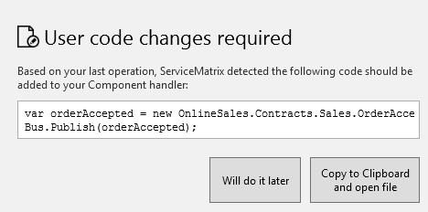
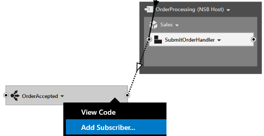
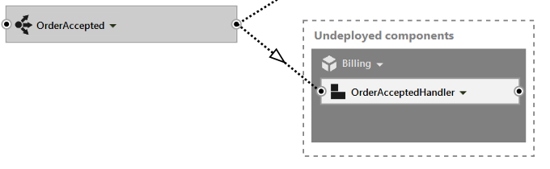
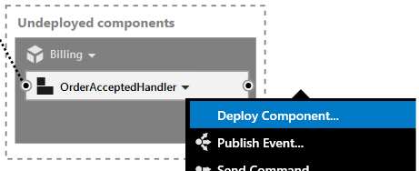
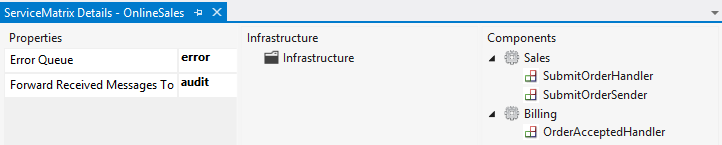
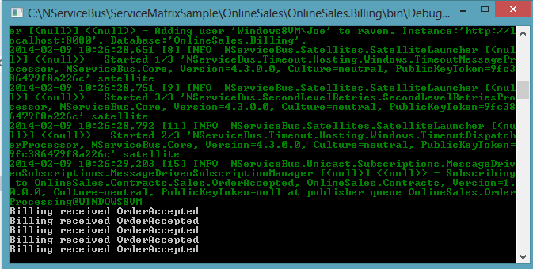

In the [previous article](getting-started-with-nservicebus-using-servicematrix-2.0-fault-tolerance.md "ServiceMatrix Fault Tolerance") introducing ServiceMatrix, you explored some of the fault tolerance features of NServiceBus.

In this article you will expand the Online Sales system and introduce the Publish/Subscribe pattern using ServiceMatrix.


# Introduction to Publish/Subscribe

Before you move on, please confirm that the `OnlineSales` solution you created previously is still working correctly. Picking up where you left off, your `OnlineSales` solution ServiceMatrix Canvas should look like this:


## Expanding the OnlineSales Example

So far the [Online Sales](getting-started-with-servicematrix-2.0.md "Getting Started with ServiceMatrix") example implements the request response messaging pattern to facilitate communication between the website and your order processing system. We've all purchased items online and know that in reality many different things will need to happen when an order is accepted for processing. Arguably the most important business step should be billing the customer! In your example, consider how to add a billing capability to charge the customer for the order.
## Create the OrderAccepted Event
In your example the `SubmitOrderHandler` component handles the `SubmitOrder` messages. Using the drop-down menu of `SubmitOrderHandler`, select 'Publish Event' as shown.


Name the new event `OrderAccepted`.


## Adding the Code to Publish the Event

When you create the `OrderAccepted` event you will be prompted by a dialog informing you of code changes that should be made.



In order to publish this new event, the event message must be initialized and published by the `SubmitOrderProcessor`. To make this easier, ServiceMatrix has generated the code in a convenient window for review. Select the option to `Copy to Clipboard and Open File`. The `SubmitOrderHandler` partial class file will be opened. Paste the code from the clipboard after the comment as shown below.

```C#
namespace OnlineSales.Sales
{
    public partial class SubmitOrderHandler
    {
        partial void HandleImplementation(SubmitOrder message)
        {
            // TODO: SubmitOrderHandler: Add code to handle the SubmitOrder message.
            Console.WriteLine("Sales received " + message.GetType().Name);
           
            var orderAccepted = new OnlineSales.Contracts.Sales.OrderAccepted();
            Bus.Publish(OrderAccepted);
        }
    }
}

```
This code will publish the `OrderAccepted` event immediately upon receipt of the `SubmitOrder` message.


## Adding the Subscriber

To create a subscriber for this new event, select the dropdown of the `OrderAccepted` event and choose 'Add Subscriber' as shown here:



In the 'Add Event Subscriber' window use the 'Add new Service' text box to add a [new service called Billing](images/servicematrix-addeventsubscriber.png "New Billing Service"). You should notice that `OrderAcceptedHandler` has been created in a new Billing Service. The dashed container indicates that the component has yet to be deployed. Also notice that the lines representing the `OrderAccepted` event messages are dashed. This is because they are events. The `SubmitOrder' messages are commands and are illustrated with a solid line.

.


## Deploy the OrderAcceptedHandler

To deploy the `OrderAcceptedHandler` use the drop down menu and choose 'Deploy Component' as shown here:



In the resulting '[Deploy To Endpoint](images/servicematrix-deploytonewendpointv2.2.0.png "Deploy to Endpoint")' window choose the 'New Endpoint' option and [create an endpoint](images/servicematrix-newbillingendpoint.png "Add Billing Endpoint") called `Billing`.

At this point with a little re-arranging your ServiceMatrix canvas should look like this:


The `SubmitOrderHandler` raises the `OrderAccepted` event, to which `OrderAcceptedHandler` of the `Billing` service is subscribed.

As you would expect, the ServiceMatrix [Solution Builder](images/servicematrix-pubsubsolutionbuilderv2.2.0.png "SolutionBuilder") reflects the new endpoint, service, component, and event you added using the ServiceMatrix canvas. Of course the [`OnlineSales` solution](images/servicematrix-pubsubsolution.png "Visual Studio Solution") in Visual Studio has the new project for `Billing` as well as the new 'OrderAccepted' event.


### Explore the ServiceMatrix Solution Views

The Solution Builder of ServiceMatrix provides various views into the solution you have created. Look at the [toolbar](images/servicematrix-solutionbuilder-final.png "Solution Builder Toolbar") and review some of the other buttons. In addition to the Default View represented by the hammer, note the ServiceMatrix View icon.

Select an endpoint in the SolutionBuilder then press the 'ServiceMatrix View' icon. A new 'ServiceMatrix Details' window is displayed as shown here:



This view provides a convenient look into the properties and components of the endpoint.


## Review the Code

ServiceMatrix generates the initial code for publishing and processing the event and both the publishing and subscribing end.


### Event Publisher Code

When we created the `OrderAccepted` event ServiceMatrix generated the code to publish the event and modify the `SubmitOrderHandler` component. 


### Subscriber Code

In the `OrderAcceptedHandler` drop-down menu select `View Code` and you should see the following.

```C#
namespace OnlineSales.Billing
{
    public partial class OrderAcceptedHandler
    {
        partial void HandleImplementation(OrderAccepted message)
        {
            // TODO: OrderAcceptedHandler: Add code to handle the OrderAccepted message.
            Console.WriteLine("Billing received " + message.GetType().Name);
        }
    }
}

```

There is nothing new here!  Notice that this generated `OrderAcceptedHandler` code is the exactly the same as was generated for the  `SubmitOrderHandler`.


# Build and Run the Solution

Go ahead and run the solution. This time, in addition to the [sales web site](images/servicematrix-demowebsite.png "Demo Website") and [`OrderProcessing` endpoint console](images/servicematrix-reqresp-orderprocessor.png "Order Processing"), you should see another console window for `Billing`.

Send a few test messages from the website. You should see them handled by the `OrderProcessing` console as before. You should almost immediately see that the `Billing` endpoint has received your new `OrderAccepted` event as shown below:

 


## You Did It!##

Congratulations! You have created a complete working solution for communicating via publish/subscribe messaging. 

As you see, it's very easy to get started with NServiceBus and ServiceMatrix. 


### Explore the use of Sagas

Continue on and integrate a payment component into the billing service. [The next article](getting-started-sagasfullduplex-2.0.md "Sagas in ServiceMatrix Request Response") will continue on with the creation of the OnlineSales solution.

