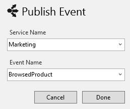

This article introduces the Publish/Subscribe pattern using ServiceMatrix.  You will proceed through the following steps:

1. [Create a New Project](#create-a-new-project)
2. [Create the BrowsedProduct Event](#create-the-browsedproduct-event)
3. [Add A Subscriber](#adding-the-subscriber)
4. [Deploy the Event Processor](#deploy-the-browsedproductprocessor)
5. [Review the Code](#review-the-code)
6. [Build and Run the Solution](#build-and-run-the-solution)

# Creating a New Project

To demonstrate the publish/subscribe pattern, create a simple ServiceMatrix project named OnlineSales with an ASP.NET frontend named OnlineSales.ECommerce and a separate backend endpoint named OnlineSales.Marketing.  (For a walkthrough of creating a ServiceMatrix project, see [Getting started with ServiceMatrix](getting-started-with-servicematrix-2.0.md).) Your canvas should look something like this:

## Create the BrowsedProduct Event

Let's say you want to have an event published whenever a potential customer browses a product on the web site. You'll create a Marketing service that will subscribe to this event to compile analytics or perhaps send follow-up emails to the customer.

On the `ECommerce` endpoint, click the dropdown menu and choose Publish Event...

Name the service `Marketing` and the new event `BrowsedProduct`.

## Adding the Subscriber

To create a subscriber for this new event, select the dropdown of the `BrowsedProduct` event and choose 'Add Subscriber' as shown here:

In the 'Add Event Subscriber' window select the existing Marketing service.

You should notice that `BrowsedProductHandler` has been created in the Marketing Service. The dashed container indicates that the component has yet to be deployed. Also notice that the lines representing the `BrowedProduct` event messages are dashed.  This is because they are events. (Messages that are commands and are illustrated with a solid line.)

.

## Deploy the BrowsedProductHandler

To deploy the `BrowsedProductHandler` use the drop down menu and choose 'Deploy Component' as shown here:

In the resulting '[Deploy To Endpoint](images/servicematrix-deploytonewendpointv2.2.0.png "Deploy to Endpoint")' window choose the existing `Marketing` endpoint created earlier.

At this point with a little re-arranging your ServiceMatrix canvas should look like this:

The `ECommerce` application raises the `BrowsedProduct` event, to which `BrowsedProductHandler` of the `Marketing` service is subscribed.

As you would expect, the ServiceMatrix [Solution Builder](images/servicematrix-pubsubsolutionbuilderv2.2.0.png "SolutionBuilder") reflects the new endpoint, service, component, and event you added using the ServiceMatrix canvas.  Of course the [`OnlineSales` solution](images/servicematrix-pubsubsolution.png "Visual Studio Solution") in Visual Studio has the  project for `Marketing` with the new 'BrowsedProduct' event.

NOTE: You may need to rebuild the solution to force all of the source files to be generated.

## Review the Code

ServiceMatrix generates the initial code for publishing and processing the event and both the publishing and subscribing end. 

### Event Publisher Code 

When we created the `BrowsedProduct` event ServiceMatrix generated test code in the TestMessages ASP.NET Controller to publish a new `BrowsedProduct` event message to the bus. You can view this code in the ECommerce project in `Controllers\TestMessagesController.generated.cs`...

<!-- import ServiceMatrix.OnlineSalesPubSub.ECommerce.TestMessagesController -->

### Subscriber Code

In the `BrowsedProductHandler` drop-down menu select `View Code` and you should see the following. 

<!-- import ServiceMatrix.OnlineSalesPubSub.Marketing.BrowsedProductHandler -->

# Build and Run the Solution

Go ahead and run the solution. You should see the ASP.NET MVC ECommerce application open in a browser window and a console window for `Marketing`.

Send a few test messages from the website.  You should almost immediately see that the `Marketing` endpoint has received your new `BrowsedProduct` event as shown below:

  
 
Return to the ServiceMatrix [table of contents]('').