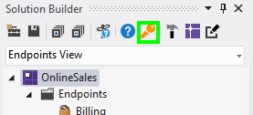
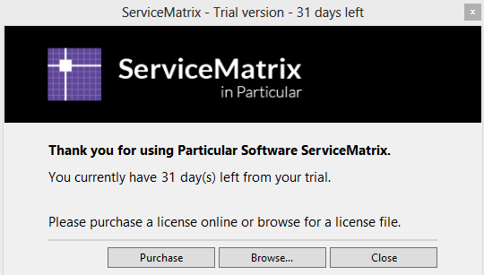

When you download and install ServiceMatrix it includes a 45 day license. Ten days before the trial license expires you'll see a dialog box informing you that your licensing is close to expiring. To view the license status, select the 'Register ServiceMatrix' button in the Solution Builder toolbar as highlighted:

Selecting the 'Key' button will show the license screen:

Clicking the 'Purchase' button will open your browser to the [Particular.net licensing page](http://particular.net/licensing?product=ServiceMatrix "Licensing Page for Particular.net"). From there you can purchase a license and receive a file that you can install using the 'Browse' button. 

If you continue beyond the trial period you will no longer be able to create new projects using ServiceMatrix. ServiceMatrix features, including the canvas and Solution Builder will be disabled. However, existing code will remain available and operational in the Visual Studio Solution Explorer.
