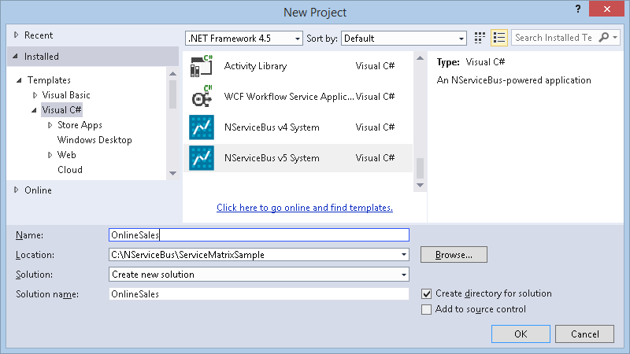
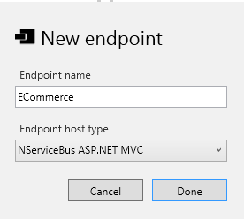
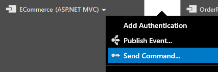
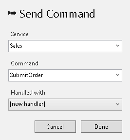
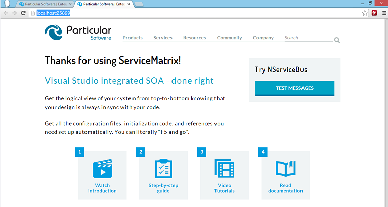
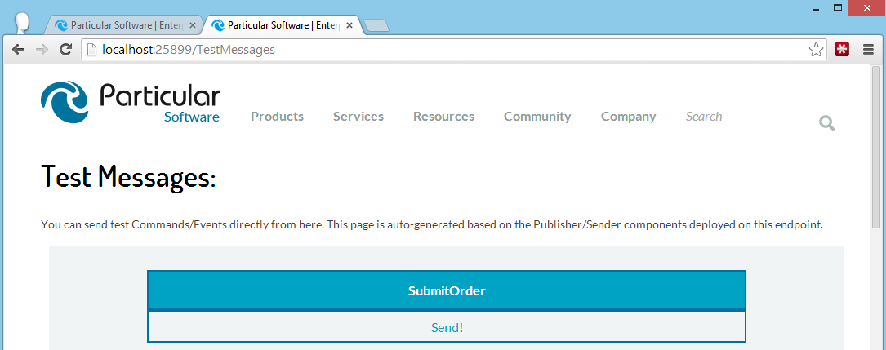
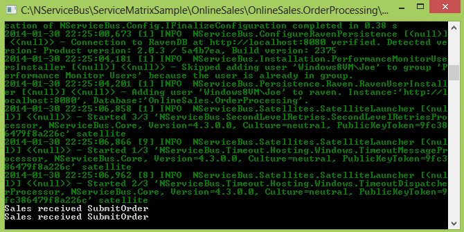

This article demonstrates how to setup a simple send and receive example with ServiceMatrix using the following steps:

1.  [Creating a New Project](#creating-a-new-project)
2.  [Creating Endpoints](#creating-endpoints)
3.  [Creating a Message](#creating-a-message)
4.  [Creating Services](#creating-services)
5.  [Deploying Components](#deploying-components)
6.  [Handling a Message](#handling-a-message)
7.  [Running the Application](#running-the-application)

For a more thorough introduction to ServiceMatrix, refer to the [getting started guide](getting-started-with-servicematrix-2.0.md).

## Creating a New Project

In Visual Studio, select `File\New\Project` and select 'NServiceBus v5 System' under the Visual C\# project type. Target the .NET Framework 4.5 for this project.

In the Solution name, type 'OnlineSales' (or any other name) for the name of your application.

NOTE: It is recommended that you use the 'NServiceBus v5 System' project template unless you need to remain on NServiceBus v4 for some particular reason. NServiceBus V5 is wire compatible with earlier versions, so you should be able to use the latest version without breaking compatibility with services that may already be deployed and running on an earlier version. [Read this document](../nservicebus/upgradeguides/4to5.md) for an overview of the differences in V5 from V4.

## New Endpoint

To create an endpoint on the canvas either select the dashed 'New Endpoint' area on the canvas or the button at the top of the canvas.

Name the endpoint `ECommerce` and choose ASP.NET MVC as the endpoint host.  

NOTE: MVC Endpoints require that ASP.NET MVC be installed on the local machine. You can [install ASP.NET MVC from here](http://www.asp.net/downloads) or use the Web Platform Installer.

### Create OrderProcessing Endpoint

Create another endpoint called `OrderProcessing`.  This time select 'NServiceBus Host' as the host.  

At this point your solution should have both endpoints on the NServiceBus canvas.

 

## Creating a Message

To facilitate communication between the website and the backend `OrderProcessing` endpoint, use a command message. Create this message using the drop-down menu of the `ECommerce` endpoint, and select `Send Command` as shown.  

## Creating Services 

As you create the new command message, you are prompted for the name of a service.  In NServiceBus a service contains components responsible for facilitating the communication between the website and order processing.  Name the new service `Sales` and the command `SubmitOrder` as shown. Leave 'Handled with' as '[new handler]'.

  
The canvas now illustrates the new Sales service with two components.  The `SubmitOrderSender` component sends the command and is deployed to the `ECommerce` endpoint.  The `SubmitOrderHandler` component receives the command message and is shown in an 'Undeployed Components' box.  

## Deploying Components

You cannot build the solution with components that are not deployed.  If you try to build at this point you will get an error indicating that the `Sales.SubmitOrderHandler` must be allocated to an endpoint.  Deploy the `SubmitOrderHandler` component using its drop-down menu and the `Deploy Component` option.  When prompted, deploy the component to the `OrderProcessing` endpoint.

At this point, with a little reorganizing, the canvas should illustrate the `ECommerce` and `OrderProcessing` endpoints using the `Sales` service components to send and process the `SubmitOrder` command.

By deploying these components to each endpoint, the `Sales` service affords your systems the capability to easily communicate reliably and durably, using a command message containing the data for the submitted order.  

## Review the Message

The `SubmitOrder` command is a simple message meant to communicate the order between your endpoints.  To view the generated class file, click the drop-down menu of the `SubmitOrder` command and select View Code [as shown](images/servicematrix-submitorderviewcode.png "View SubmitOrder Code"). This is a very simple C# class.  You can add all sorts of properties to your message to represent the order data: strings, integers, arrays, dictionaries, etc. Just make sure to provide both a get accessor and a set mutator for each property. 

<!-- import ServiceMatrix.OnlineSales.Internal.Commands.Sales -->

## Handling a Message

Now build the solution and see how everything turns out.  Look at the `SubmitOrderHandler` code by selecting its drop-down menu and choosing 'View Code'.  As you can see below, there is not much there.  A partial class has been created where you can add your order processing logic. 

<!-- import ServiceMatrix.OnlineSales.Sales.SubmitOrderHandler.before -->

You can locate the ServiceMatrix-generated partial class counterpart in the `OnlineSales.OrderProcessing` project and the `Infrastructure\Sales` folder. There is not much to see; just a class that implements `IHandleMessages<submitorder>` and has a reference to `IBus` that you can use from within your partial class to send out other messages, publish events, or to reply to commands.  The partial method `HandleImplementation(message)` is a call to the implementation above.  To learn more about the way to use the generated code, see [Using ServiceMatrix Generated Code](customizing-extending.md).  
    
<!-- import ServiceMatrix.OnlineSales.Sales.SubmitOrderHandler.auto -->

## Sending a Message 

Lastly, review how the 'ECommerce' website sends a message.  When ServiceMatrix generated the MVC endpoint, it created a demonstration site already capable of sending the commands created using the tool.

### Review MVC Code

Find the `TestMessagesController.generated.cs` file in the Controllers folder in the OnlineSales.ECommerce project.  ServiceMatrix generates this file as part of the MVC application. Notice the `SubmitOrderSender.Send` method that sends the command message `SubmitOrder`.  This method was generated in a different partial class file located in the `Infrastructure\Sales\SubmitOrderSender.cs` file.

<!-- import OnlineSales.ECommerce.Controllers.TestMessagesController.auto --> 

This is a demonstration site that provides an initial reference application in MVC.  Any modifications to this file will be overwritten by subsequent regeneration of the demonstration site.  To accomodate your changes, before the `SubmitOrderSender.Send` is called, the code invokes a partial method called `ConfigureSubmitOrder` that accepts your `SubmitOrder` message as a parameter.  You can implement this in the `SubmitOrderSender.cs` file in the `\Sales` directory of the `OnlinesSales.ECommerce` project, as shown in the following code snippet:  

<!-- import ServiceMatrix.OnlineSales.Sales.SubmitOrderSender -->

## Running the Application

Now press `F5` or press the 'Play' button in Visual Studio to debug the application. You should see both the eCommerce website launched in your default browser and a console window for the NServiceBus host that is running your OrderProcessing endpoint.  

### eCommerce Website

The ECommerce website generated by ServiceMatrix should look like the image below.

Notice the 'Try NServiceBus' box and the 'Test Messages' button on the right side.  When you click the button another page opens with a button to publish the `SubmitOrder` to the bus as shown.

To send the `SubmitOrder` message just click the word 'Send!'. Go ahead and click to send a few times.

### Order Processing

Since you selected the NServiceBus host for your OrderProcessing endpoint it is launched as a console application for convenient development.  Your console window should look like this.

As you click the Send button in the website, you will see the console indicate that the `OrderProcessing` endpoint has received the messages.

Return to the ServiceMatrix [table of contents]('').