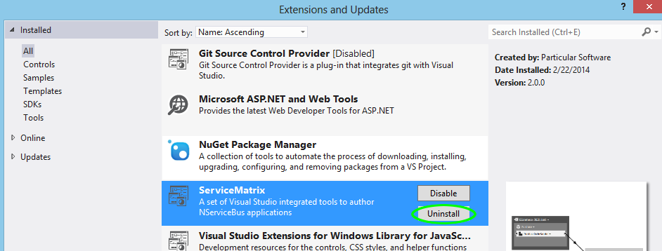

This article provides information on how to troubleshoot ServiceMatrix.

1.  [Issues Uninstalling](#issues-uninstalling-servicematrix)
2.  [Accessing the Log File](#access-the-servicematrix-log-file)
3.  [Microsoft FixIt Tool](#using-the-microsoft-fixit-tool)
4.  [Disconnecting a solution from ServiceMatrix](#disconnecting-a-solution-from-servicematrix)


## Issues Uninstalling ServiceMatrix

Older versions of ServiceMatrix must be uninstalled prior to the installation of a new version.  The following are issues that can occur when uninstalling:


### Unable To Uninstall using Control Panel

If you are unable to uninstall the old version using the traditional method through control panel you can uninstall it from inside Visual Studio.  Locate the Extension in Visual Studio through the `Tools\Extensions and Updates` [Menu](images/servicematrix-vstudio-toolsmenu.png "Extensions Menu") options.  You'll see the extension listed as shown here:




### After Uninstalling, the ServiceMatrix still shows as installed

If you completed the uninstall and your system still shows ServiceMatrix as installed, try the following actions.  If one does not work, proceed to the next.

- Try uninstalling again through the `Programs and Features' list.  The last attempt may not have completed successfully. 
- Restart your machine.  This can clear residual issues.
- Try using the Microsoft [FixIt](#using-the-microsoft-fixit-tool) tool described below.


### Manually Remove The Registry Keys

**Warning**: Only advanced users should edit the registry keys.  If none of the options above work you can try locating and removing the keys from the registry manually. Launch the registry editor by opening the run prompt (press the window button and 'R') and typing [regedit](images/servicematrix-runregedit.png "Running Regedit").  Inside the registry editor, navigate the tree on the left to locate the keys indicated below for your operating system and remove them.

```C#
// 64bit:
HKEY_LOCAL_MACHINE\SOFTWARE\Wow6432Node\Microsoft\Windows\CurrentVersion\Uninstall\Particular Software ServiceMatrix 2.0.0

// 32bit:
HKEY_LOCAL_MACHINE\SOFTWARE\Microsoft\Windows\CurrentVersion\Uninstall\Particular Software ServiceMatrix 2.0.0
```


## Access the ServiceMatrix Log File

In case of any errors or exception the ServiceMatrix log file may contain information about the cause.  The log file is located in the ServiceMatrix extension installation location.  By default the location is:
```
//Visual Studio 2012
%localappdata%/Microsoft/VisualStudio/11.0/Extensions/{extensions-unique-id}/[MachineName]-[UserName].logging

//Visual Studio 2013
%localappdata%/Microsoft/VisualStudio/12.0/Extensions/{extensions-unique-id}/[MachineName]-[UserName].logging
```


## Using the Microsoft FixIt tool

The Microsoft FixIt tool can help troubleshoot general installation issues including registry problems.  You may download it [here](https://support.microsoft.com/mats/program_install_and_uninstall/en-us "Microsoft FixIt tool").


## Disconnecting a solution from ServiceMatrix

One of the primary goals of ServiceMatrix is to dramatically improve the speed of prototype development with NServiceBus to validate the message flow design, without limiting the developer's options in any way (i.e. no lock-in of developers to ServiceMatrix).

To disconnect a solution developed with ServiceMatrix from ServiceMatrix (and continue developing the solution without ServiceMatrix) rename the file `*.slnbldr` that is located under the `Solution Items` folder in the Solution Explorer.

NOTE: Disconnecting a solution from ServiceMatrix may make it impossible to re-connect the ServiceMatrix to the solution (depending on the scope and type of changes performed on the solution after it has been disconnected).
