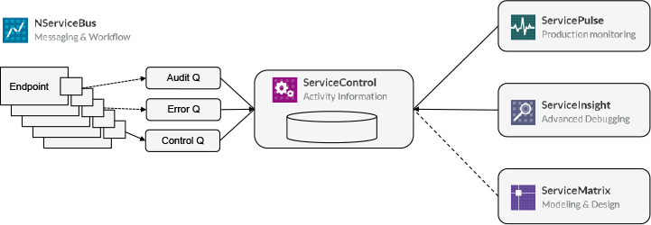

## Custom notification and alerting using ServiceControl's events
When your system is ready to go to production it is time to look at operational monitoring, who gets notified and how when an issue occurs. You don't want someone to be watching ServicePulse's dashboard 24/7, instead you want to build notifications/integrations that will alert of something going wrong in your system.

[ServiceControl](servicecontrol) is a process running in the background, it consumes and processes the messages from the Audit, Error and Control queues (including their metadata, headers, and body) in a given system and raises events while processing theses messages (error, heartbeat, custom check), you can subscribe to these events and build custom functionality like sending emails, push notifications, build integrations, to notify the team/s supporting the system of these events so they can attend to them. 

Take a look [here for more information on ServiceContol's plugins](plugins).


### Alerting on FailedMessages Event
Once a message ends up in the error queue ServiceControl will publish a [MessageFailed](https://github.com/Particular/ServiceControl.Contracts/blob/master/src/ServiceControl.Contracts/MessageFailed.cs) event. As you can see the message contains enough context to help identify the cause of the error, the endpoint, the time, the stack trace and more. if you need more information you can call ServiceControl's HTTP API.

### Subscribing to ServiceControl's Events

ServiceControl publishes MessageFailed event when a message gets to the error queue, let’s see how we can tap in by subscribing to these events and act on them (send an email, pager duty and so on)…

Let's see how we can subscribe to a MessageFailed Event and push a notification into HipChat.
All it takes is to have an endpoint that subscribes to MessageFailed, and a simple HTTP call to HipChat's API

#### Endpoint config
### In Version 4
<!-- import MessageFailedEndpointConfigV4 -->

### In Version 5
<!-- import MessageFailedEndpointConfigV5 -->

#### Custom action example
<!-- import MessageFailedHandlerV4 -->

### Alerting on HeartbeatStopped Event

Heartbeats are used to track endpoints health see [this into for more information](/servicepulse/intro-endpoints-heartbeats#active-vs-inactive-endpoints)

Once an endpoint stops sending heartbeats to ServiceControl queue ServiceControl will publish a [HeartbeatStopped](https://github.com/Particular/ServiceControl.Contracts/blob/master/src/ServiceControl.Contracts/HeartbeatStopped.cs) event. As you can see the message contains enough context to help identify the endpoint, the time it was detected, the last heartbeat tiem and the hots.

Similarly to the code above you can subscribe to the event, handle it and provide custom actions.

### Alerting on HeartbeatRestored Event

Once an endpoint resumes sending heartbeats to ServiceControl queue ServiceControl will publish a [HeartbeatRestored](https://github.com/Particular/ServiceControl.Contracts/blob/master/src/ServiceControl.Contracts/HeartbeatRestored.cs) event. We can identify the endpoint, the time the heartbeat was restored, the endpoint name and the hots.

Similarly to the code above you can subscribe to the event, handle it and provide custom actions.

### CustomCheckFailed Event

This is not implemented yet but it's in the pipeline...

