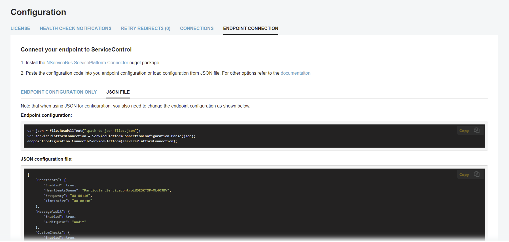

Settings required for [connecting an endpoint to the Platform](/platform/connecting.md) are available in the Configuration page of ServicePulse by selecting the Endpoint Connection tab.

> [!NOTE]
> Platform connection settings require ServicePulse version 1.31 or later, and ServiceControl version 4.21 or later.

The tab can be also be accessed from a link in the footer.

