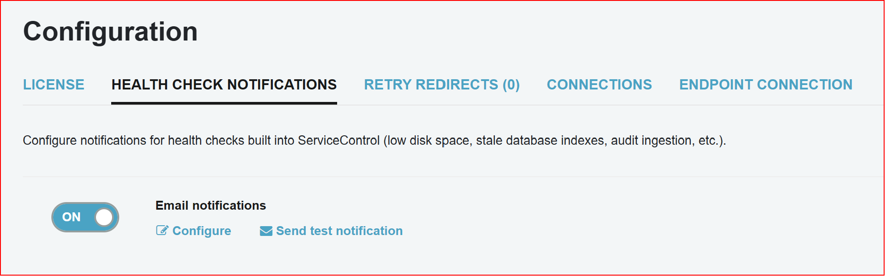

Every ServiceControl instance performs periodic health checks and raises notifications when they fail. By default, notifications are published as [integration events](/servicecontrol/contracts.md) but it's also possible to deliver them as email messages.

NOTE: Email notifications require ServicePulse version 1.29 or later, and ServiceControl version 4.17 or later.

Email notification settings can be managed from the Configuration page by selecting the Health Check Notifications tab.

