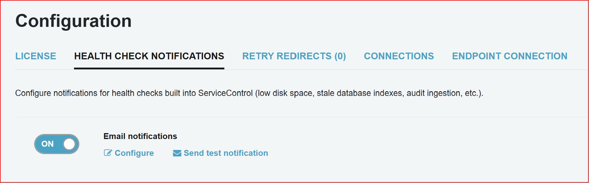

Every ServiceControl instance performs periodic internal health checks and raises notifications when the health checks fail. By default, notifications are published as [integration events](/servicecontrol/contracts.md) but it is also possible to deliver them as email messages.

> [!NOTE]
> Email notifications require ServicePulse version 1.29 or later, and ServiceControl version 4.17 or later.

Email notification settings can be managed from the Configuration page by selecting the Health Check Notifications tab. When configured, emails are sent only when internal health checks fail, for example when ServiceControl cannot reach remote instances or when audit ingestion fails.

