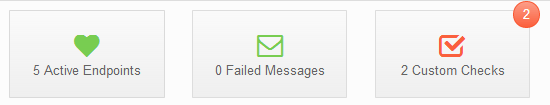

**ServicePulse monitors NServiceBus endpoints for:**

1. Endpoint availability (using heartbeat signals sent from the endpoint)
1. Failed messages (by monitoring the error queue defined for the endpoints)
1. Custom checks (defined and developed per application needs)
1. And more (see [An Introduction to ServicePulse for NServiceBus](http://particular.net/blog/an-introduction-to-servicepulse-for-nservicebus) for additional upcoming monitoring features)

**Prerequisites for ServicePulse monitoring of endpoints:**

1. An endpoint plugin DLL must be deployed in the binaries directory of each NServiceBus endpoint (required for endpoint availability and custom checks monitoring).
1. Supported NServiceBus Endpoints:
    * NServiceBus version 5.0.0 or higher;
    * NServiceBus version 4.0.0 or higher;
    * NServiceBus version 3.0.4 or higher;
1. Auditing must be enabled for all monitored endpoints (see [Auditing With NServiceBus](/nservicebus/operations/auditing.md)).
1. All endpoints must forward audited data to a single audit and error queue that is monitored by a ServiceControl instance.

**Deploying Endpoint Plugins in each Endpoint**

1. The endpoint plugin consists of these NuGet packages:
    * NServiceBus version 5.x: 
        * [`ServiceControl.Plugin.Nsb5.Heartbeat`](http://www.nuget.org/packages/ServiceControl.Plugin.Nsb5.Heartbeat/)
        * [`ServiceControl.Plugin.Nsb5.CustomChecks`](http://www.nuget.org/packages/ServiceControl.Plugin.Nsb5.CustomChecks/)
        * [`ServiceControl.Plugin.Nsb5.SagaAudit`](http://www.nuget.org/packages/ServiceControl.Plugin.Nsb5.SagaAudit/)
    * NServiceBus version 4.x: 
        * [`ServiceControl.Plugin.Nsb4.Heartbeat`](http://www.nuget.org/packages/ServiceControl.Plugin.Nsb4.Heartbeat/)
        * [`ServiceControl.Plugin.Nsb4.CustomChecks`](http://www.nuget.org/packages/ServiceControl.Plugin.Nsb4.CustomChecks/)
        * [`ServiceControl.Plugin.Nsb4.SagaAudit`](http://www.nuget.org/packages/ServiceControl.Plugin.Nsb4.SagaAudit/)
    * NServiceBus version 3.0.4 or higher: 
        * [`ServiceControl.Plugin.Nsb3.Heartbeat`](http://www.nuget.org/packages/ServiceControl.Plugin.Nsb3.Heartbeat/)
        * [`ServiceControl.Plugin.Nsb3.CustomChecks`](http://www.nuget.org/packages/ServiceControl.Plugin.Nsb3.CustomChecks/)

1. Install the plugins from NuGet in your endpoints: 
     * `install-package ServiceControl.Plugin.Nsb5.Heartbeat`
     * `install-package ServiceControl.Plugin.Nsb5.CustomChecks`
    
     If you want the saga visualization in ServiceInsight, 
     * `install-package ServiceControl.Plugin.Nsb5.SagaAudit`

     * or use the appropriate version 4 package if your endpoint targets NServiceBus version 4:
	     * `install-package ServiceControl.Plugin.Nsb4.Heartbeat`
	     * `install-package ServiceControl.Plugin.Nsb4.CustomChecks` 
     	     * `install-package ServiceControl.Plugin.Nsb4.SagaAudit`

     * or use the appropriate version 3 package if your endpoint targets NServiceBus version 3:
	     * `install-package ServiceControl.Plugin.Nsb3.Heartbeat`
	     * `install-package ServiceControl.Plugin.Nsb3.CustomChecks`

**NOTE**: Saga Visualization plugin is only available from version 4 and higher.
	     
1. For manual deployment, copy the endpoint plugin DLL files to each endpoint bin directory (and restart the endpoint to load the plugin).
1. By default, the endpoint plugin sends a heartbeat indication to ServiceControl every 30 seconds. If a heartbeat indication is not received within 30 seconds, ServicePulse raises an event that indicates the issue.
