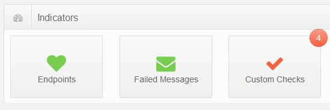

include: servicepulse

## System status overview

The Dashboard provides a visual overview of the current state of the monitored NServiceBus system.

## Endpoints health

## Failed messages

## Custom checks

