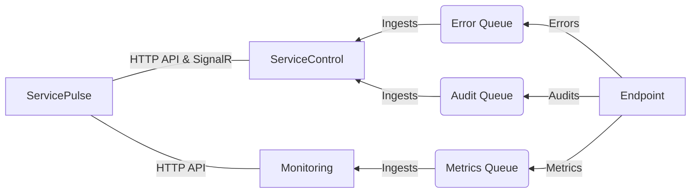

include: servicepulse

ServicePulse uses information provided by ServiceControl. In order to use ServicePulse, first set up [ServiceControl](/servicecontrol/).

NOTE: By default ServicePulse can be accessed on the hosting machine at the following URL: `http://localhost:9090`

### Relationship between ServicePulse, ServiceControl, Monitoring, and Endpoints

## System status overview

The dashboard provides a visual overview of the current state of the monitored NServiceBus system. It provides information about the latest events in the system, such as detecting a new endpoint or a message processing failure.

## Endpoint health

ServicePulse automatically detects existing endpoints in the system by analyzing metadata from [audited messages](/nservicebus/operations/auditing.md). By default, all detected endpoints will be listed in the Endpoints tab, but will not be automatically monitored.

NOTE: Endpoints will not appear unless messages from the endpoint have been successfully processed by ServiceControl.

In order to monitor an endpoint's health and activity, it is necessary to [configure it for monitoring](/servicepulse/how-to-configure-endpoints-for-monitoring.md).

**Learn more:**

 * [Heartbeats in ServicePulse](/monitoring/heartbeats/in-servicepulse.md).

## Real-time monitoring

The monitoring view shows an overview of all logical endpoints in a system showing various metrics. Navigate to the details by clicking on an endpoint name. This shows the same metrics split by message type or endpoint instance.

<iframe width="560" height="315" src="https://www.youtube-nocookie.com/embed/is9kF7eWkrQ?rel=0&amp;showinfo=0&amp;autoplay=0&amp;vq=hd1080" frameborder="0" gesture="media" allow="encrypted-media" allowfullscreen></iframe>

**Learn more:**

 * [Explanation of metrics](/monitoring/metrics/)
 * [Setup Monitoring tutorial](/tutorials/monitoring-setup/)

## Failed messages

Failed messages are indicated in the ServicePulse dashboard by a red icon showing the number of failing messages.

The Failed Messages tab allows inspection of failed messages in more detail and to react to failures (by manually retrying or deleting messages). The messages are grouped by:

* The exception type
* The exception message
* The endpoint name
* The endpoint instance ID
* The queue address

**Learn more:**

 * [Failed Message Monitoring in ServicePulse](/servicepulse/intro-failed-messages.md)
 * [Deleted Message Management in ServicePulse](/servicepulse/intro-archived-messages.md)

## Custom checks

Endpoint health monitoring ensures that the endpoint is functional, i.e. it can receive, process and send messages. However, in some situations, the system's operation might depend on other factors, such as a 3rd party webservice.

ServicePulse allows development of custom and period checks that can verify any required condition using custom .NET code. If the specified condition cannot be satisfied, ServicePulse will raise alerts.

**Learn more:**

 * [Custom Check Monitoring in ServicePulse](/monitoring/custom-checks/in-servicepulse.md).
