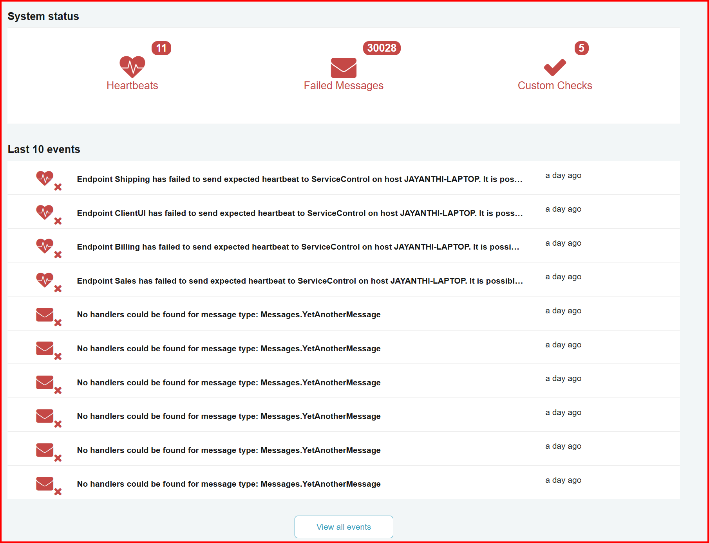

include: servicepulse

ServicePulse uses information provided by ServiceControl. In order to use ServicePulse, first set up [ServiceControl](/servicecontrol/).

## System status overview

The Dashboard provides a visual overview of the current state of the monitored NServiceBus system. It informs about the latest Events in the system, such as detecting a new endpoint or a message processing failure.

## Endpoints health

ServicePulse automatically detects what endpoints exist in the system by analyzing metadata from [audited messages](/nservicebus/operations/auditing.md). All detected endpoints will, by default, be listed in the Endpoints tab, but will not be automatically monitored.

In order to monitor endpoints health and activity it is necessary to [configure them for monitoring](/servicepulse/how-to-configure-endpoints-for-monitoring.md).

See also: [Endpoints and Heartbeats in ServicePulse](/servicepulse/intro-endpoints-heartbeats.md).

## Failed messages

ServicePulse informs about the failed messages by showing in the Dashboard event messages and showing a red Failed Messages icon with the number of failing messages. 

The Failed Messages tab allows inspection of failed messages in more detail and to react to failures (by manually retrying or archiving messages). The messages are grouped by the exception type and the exception message to simplify group actions.

For more information about monitoring message failures refer to the [Failed Message Monitoring in ServicePulse](/servicepulse/intro-failed-messages.md) and [Archived Message Management in ServicePulse](/servicepulse/intro-archived-messages.md) articles.

## Custom checks

Endpoints health monitoring ensures that the endpoint is functional, meaning it can receive, process and send messages. However, in some situations the system's operation might depend on other factors, such as a 3rd party webservice.

ServicePulse allows for developing Custom and Period Checks that can verify any required condition using custom .net code. If the specified condition cannot satisfied, ServicePulse will raise alerts.

See also: [Custom Check Monitoring in ServicePulse](/servicepulse/intro-endpoints-custom-checks.md).
