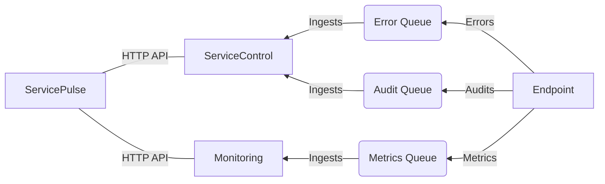

include: servicepulse

#### Pre-requisites

ServicePulse uses information provided by ServiceControl. To use ServicePulse, first set up [ServiceControl](/servicecontrol/).
  - For failed message viewing and retries, only the base [error instance](/servicecontrol/servicecontrol-instances/) is required.
  - For message flow visualisation and viewing successful messages, one or more [audit instances](/servicecontrol/audit-instances/) are required.
  - For monitoring throughput and other metrics, a [monitoring instance](/servicecontrol/monitoring-instances/) is required.

#### Relationship between ServicePulse, ServiceControl, Monitoring, and Endpoints

## ServicePulse views

ServicePulse provides a variety of views to help monitor and manage the health of an NServiceBus system. These views offer insights into system status, endpoint health, real-time metrics, and message processing. Each view is designed to give users actionable information to ensure smooth operation and quick resolution of issues. The following views are available in ServicePulse,

See the video below to get an overview of the views available in ServicePulse.

youtube: https://www.youtube.com/watch?v=-N-T1y6sDjg

### Dashboard

The dashboard provides a visual overview of the current state of the monitored NServiceBus system. This includes unhealthy endpoints, failed messages and failing custom checks. It also provides information about the latest events in the system, such as detecting a new endpoint or a message processing failure.

**Learn more:**

 * [ServicePulse events](/servicepulse/event-types.md).

### Heartbeats

ServicePulse automatically detects existing endpoints' health in the system by analyzing metadata from [audited messages](/nservicebus/operations/auditing.md). By default, all detected endpoints will be listed but will not be automatically monitored.

In order to monitor an endpoint's health and activity, it is necessary to [configure it for monitoring](/servicepulse/how-to-configure-endpoints-for-monitoring.md).

**Learn more:**

 * [Managing endpoint heartbeats in ServicePulse](/monitoring/heartbeats/in-servicepulse.md).

### Monitoring

The "Monitoring" view provides a real-time overview of all logical endpoints in the system, along with various metrics. To see more details, click on an endpoint name. This opens a view showing the same metrics, broken down by message type or endpoint instance.

youtube: https://www.youtube.com/watch?v=is9kF7eWkrQ

**Learn more:**

 * [Explanation of metrics](/monitoring/metrics/)
 * [Setup Monitoring tutorial](/tutorials/monitoring-setup/)

### All messages

The "All Messages" view displays messages processed by the system within a specified timeframe. If [audit instances](/servicecontrol/audit-instances/)  are not deployed, only failed messages will be shown, and the individual message view will lack detailed flow, sequence, and saga information.

**Learn more:**

 * [ Audited/Failed Message Display and Discovery](/servicepulse/all-messages.md).

### Failed messages

Failed messages are highlighted in the ServicePulse dashboard with a red icon displaying the number of failures.

The Failed Messages tab allows inspection of failed messages in more detail and to react to failures (by manually retrying or deleting messages). The messages are grouped by:

* The exception type
* The exception message
* The endpoint name
* The endpoint instance ID
* The queue address

**Learn more:**

 * [Failed Message Monitoring in ServicePulse](/servicepulse/intro-failed-messages.md)
 * [Deleted Message Management in ServicePulse](/servicepulse/intro-archived-messages.md)

### Custom checks

Endpoint health monitoring verifies that an endpoint is operational—able to receive, process, and send messages. However, in some cases, overall system functionality may depend on external factors, such as third-party web services.

ServicePulse supports the development of custom health checks using custom .NET code. Custom checks allow an endpoint to notify ServicePulse if a business-related condition is not met. If a condition is not met, ServicePulse will raise an alert.

**Learn more:**

 * [Managing custom checks in ServicePulse](/monitoring/custom-checks/in-servicepulse.md).

### Events

This dedicated events page shows all events captured within ServiceControl.

**Learn more:**

 * [ServicePulse events](/servicepulse/event-types.md).
