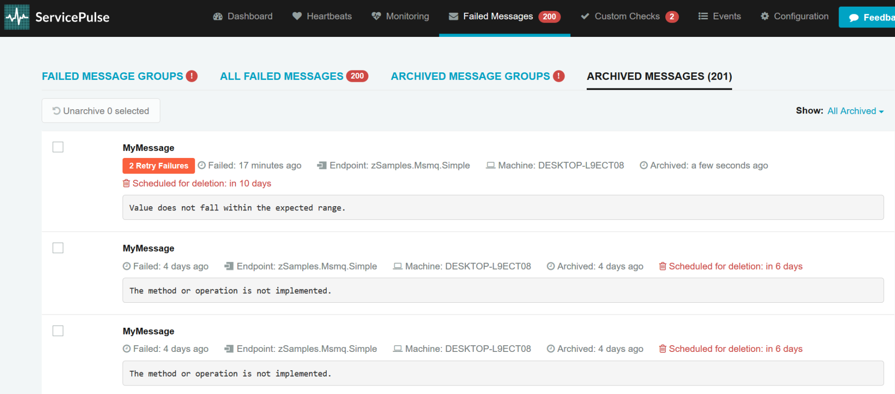
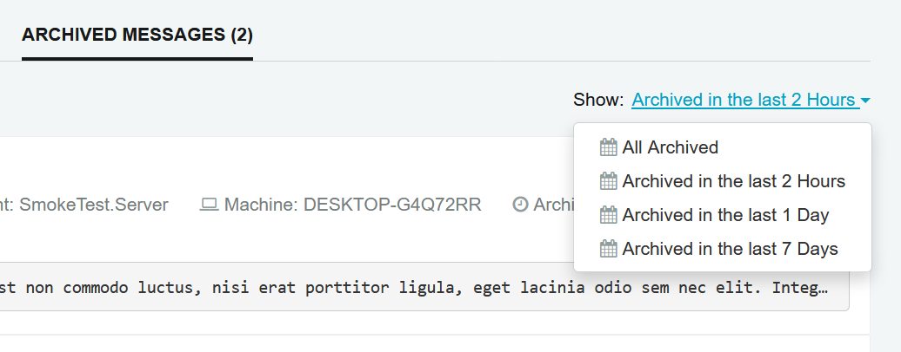
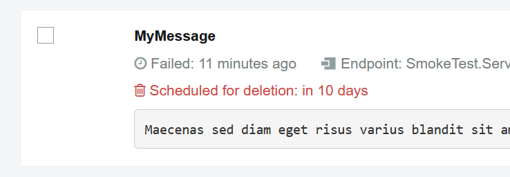

### Introduction

In SerivcePulse 1.5.0 and higher screens to manage archived messages have been introduced in response to changes in ServiceControl relating to Archived Message retention and disposal. 

ServiceControl version 1.12.0 and higher has a configurable [ErrorRetentionPeriod](/servicecontrol/creating-config-file.md) that schedules the disposal of archived failed messages.

Archived messages can be found by going to the failed messages screen.

### Archived Messages

The Archived Messages page will open showing messages archived in the last 2 hours. To limit the set of displayed messages, select an option from the available predefined range.

A scheduled task runs at a [configurable interval](/servicecontrol/how-purge-expired-data.md) to delete archived messages that have been in the archive for the [error retention period](/servicecontrol/creating-config-file.md) configured in ServiceControl. 

The displayed data about each message contains information about when it's scheduled for deletion. "Immediate deletion" means that the message has expired, and will be deleted the next time the deletion task runs.

The archived message may be unarchived by clicking the Unarchive button. It will be then displayed in the Failed Message Groups and Failed Messages screen, where it can be retried or archived again. 

