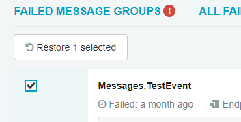

## About deleting messages

In Versions 1.5.0 and above, a screen to manage deleted messages has been introduced in response to changes in ServiceControl relating to Deleted Message retention and disposal.

Archiving can be useful for failed messages that no longer have business value. Once a message is deleted it can be automatically cleaned up according to the configuration of the [retention policy](/servicecontrol/creating-config-file.md#data-retention-servicecontrolhourstokeepmessagesbeforeexpiring).

Archiving in ServicePulse means that the failed messages are marked as `Deleted`. Data from an deleted message is still available, but it is no longer displayed in the Failed Messages list in ServicePulse, is not counted by the Failed Messages indicator in the ServicePulse dashboard, nor will it appear in any failed message groups.

NOTE: Deleted failed messages are still included in [ServiceInsight](/serviceinsight/) diagrams and search results.

## Deleting messages

Deleted messages can be found in ServicePulse in a tab in the Failed Messages page. From the Failed Messages page, messages can also be deleted from:

* Failed Groups tab
* Any failed group's contents view
* All Messages tab
* The message details page

## Managing deleted messages

The Deleted Messages tab will open showing messages deleted and not yet cleaned up according to the [retention policy](/servicecontrol/creating-config-file.md#data-retention-servicecontrolhourstokeepmessagesbeforeexpiring).

To limit the set of displayed messages, select an option from the available predefined range.

Each message on screen contains information about when it's scheduled for deletion. "Immediate deletion" means that the message has expired, and will be deleted the next time the deletion task runs.

See [Service Control Error Retention Period](/servicecontrol/creating-config-file.md) to learn more about scheduling automatic disposal of deleted messages.

### Deleted Message Groups

The Deleted Message Groups tab shows the deleted messages grouped by the following options:

 * **Exception Type and Stack Trace** - groups messages both by exception type and stack trace. It is the default way of categorizing failed messages.   
 * **Message Type** - groups messages by message type. 
 * **Endpoint Address** - groups messages by endpoint address where the failure occurred.
 * **Endpoint Instance** - groups messages by endpoint instance identifier where the failure occurred.
 * **Endpoint Name** - groups messages by name of the endpoint where the failure occurred.
 
Note: the number of listed groups may differ depending on the selected classifications type view.

Clicking on a group of messages will navigate to the Deleted Messages page containing all the messages from that group.

## Restoring failed messages

If there are failed messages that were deleted by mistake, they can be restored via the Deleted Messages tab. Once restored, they will be displayed in the [Failed Message Groups and Failed Messages screen](intro-failed-messages.md), where they can be retried or deleted again.

