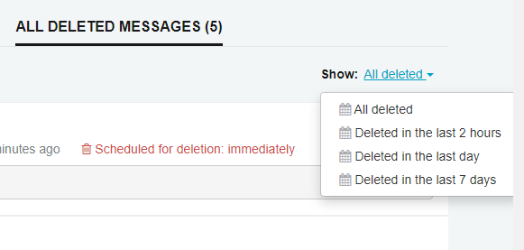

### Introduction

ServiceControl version 1.12.0 and higher has a configurable [ErrorRetentionPeriod](/servicecontrol/creating-config-file.md) that schedules the disposal of archived failed messages. In SerivcePulse 1.5.0 and higher screens to manage archived messages have been introduced.

Archived Messages can be found by going to the failed messages screen.

### Archived Messages

The archived message page will open showing messages archive in the last 2 hours. Users can select from the available predefined ranges to limit the set of messages you are reviewing

Each message displays when it is scheduled for deletion. Messages may display that they a scheduled for immediate deletion. This means they have expired but the scheduled task that deletes them from the data store hasn't run yet.

By selecting individual messages and clicking the unarchive button an archived message can be returned back to the Failed Message Groups and Failed Messages screen where they can be retried or archived again.  

