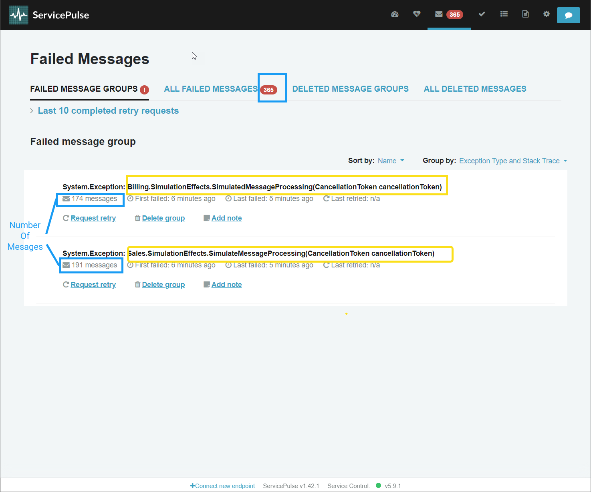
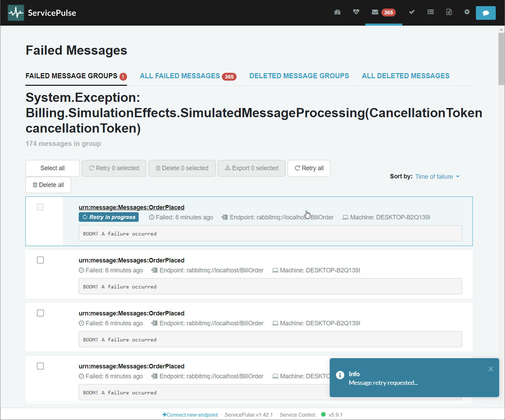
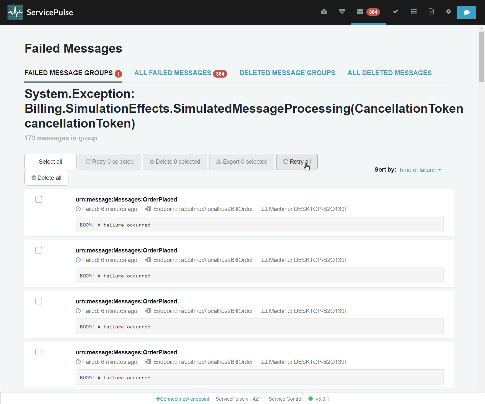
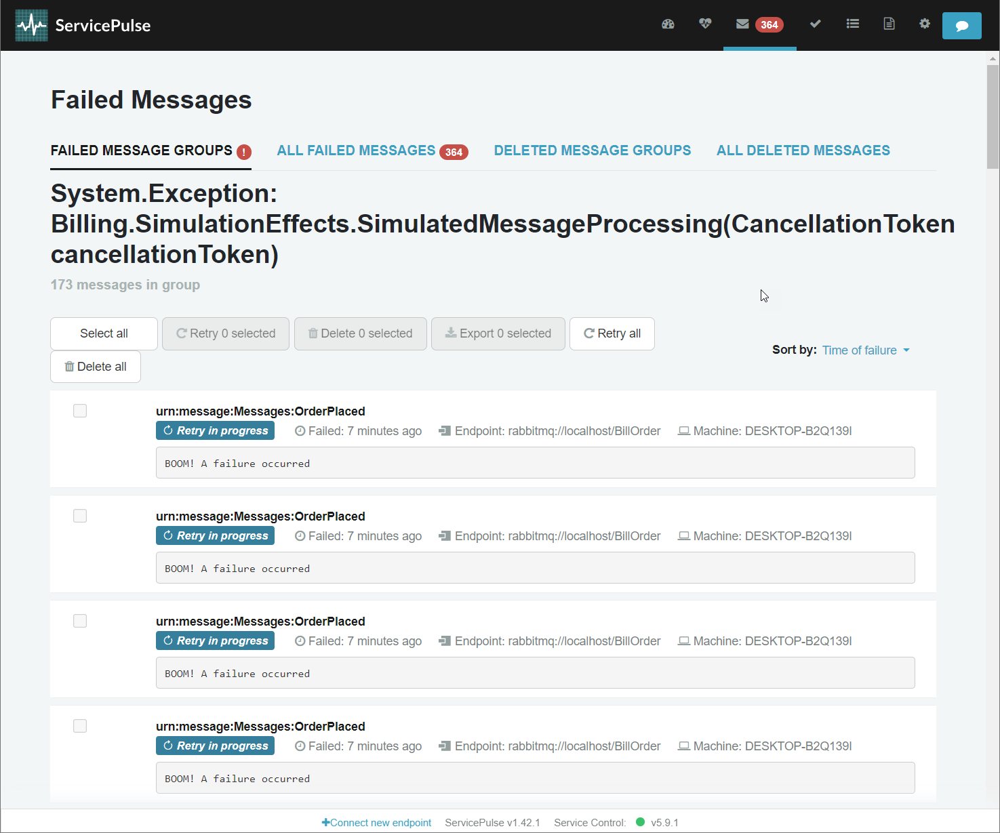

After resolving the issue that caused message processing failures, failed messages can be re-sent for reprocessing by the corresponding endpoint(s). This is referred to as a "retry" (or a manual retry, as opposed to the automated and configurable [recoverability](/nservicebus/recoverability/) process).

Manual retries of failed messages can be requested via the [Failed Messages page in ServicePulse](/servicepulse/intro-failed-messages.md).

A message that is sent for retry is marked as such and is not displayed in the failed message list or included in failed message groups unless reprocessing the message fails again.

ServiceControl keeps track of all retry attempts in the background. If a retry operation fails, ServicePulse will show the number of failed retry attempts.

If a message was retried and came back to ServiceControl as failed it might mean that this message is malformed and the receiver is not able to process it successfully no matter how many times it tries, for example, when the sending endpoint has a bug.

There are two ways to deal with this scenario. If the issue in the sender can be fixed, there will be no new malformed messages coming. The ones already sent can be redirected to an endpoint that specifically addresses the malformed messages. [This sample](/samples/servicecontrol/fix-messages/) shows how this can be done using the ServiceControl redirects feature.

If the sender cannot be fixed it is better to use a pipeline behavior to repair the messages at the receiver endpoint before they are passed to the handler. [This sample](/samples/pipeline/fix-messages-using-behavior/) demonstrates this scenario.

## ServicePulse interface

ServicePulse allows you to view and retry failed messages. By default, failed messages are grouped by exception type and stack trace and a message count is displayed for each group.

### Retrying failed messages

The messages can be retried in different ways:

#### 1. Individually

You will see a notification that a retry has been requested and is in progress.

#### 2. By group

You will see a notification that retries have been requested and are in progress, and the number of failed messages will decrease.

