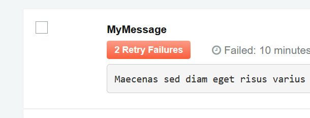
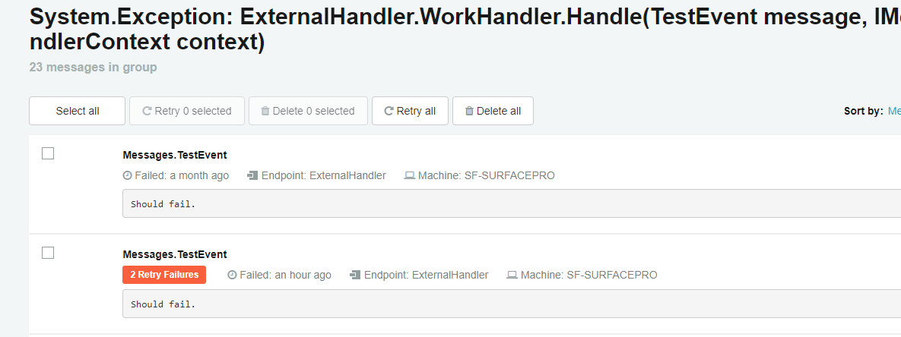

When an NServiceBus endpoint fails to process a message, it performs a set of configurable attempts to recover from this failure. These attempts are referred to as First Level Retries (FLR) and Second Level Retries (SLR) and in many cases allow the endpoint to overcome intermittent communication failures. For more details see [Second Level Retries](/nservicebus/errors/automatic-retries.md).

If the FLR and SLR processing attempts also fail, the endpoint forwards the failed message to the central error queue defined for all endpoints in the system. (See [Auditing with NServiceBus](/nservicebus/operations/auditing.md).) 

ServicePulse (via ServiceControl) monitors the central error queue and displays the current status and details of failed messages as an indicator in the ServicePulse dashboard.

    

### Failed Messages Page

To see a detailed display of the failed messages, click the Failed Messages indicator (or the "Failed Messages" link in the navigation bar). This page is split into two tabs.

The first tab shows error groups. A group is a set of failed messages where the same **Exception Type** has been thrown from the method in your solution. Each group has:

* a **Title** made up of the **Exception Type** and **Call Site** where the failure occurred.
* a **Count** of how many unresolved messages there are in the group.
* the **First Fail** time and the **Last Fail** time indicating when the first and most recent unresolved errors occurred respectively.
* **Actions** which can be used to Archive or Retry an entire group of messages (see below).

Click the title of a group to open the second tab which shows a list of all of the errors within the group.

* **Message Details:** For each failed message, displays the message type, exception description, endpoint name and location, and failure timestamp.    
* **StackTrace:** Displays the full .NET exception stacktrace when you click the "Show stacktrace" link.
* **Headers:** Displays a complete set of message headers when you click the "Show headers" link.
* **Body:** Displays the serialized message body when you click the "Show body" link.
* **Copy Message Id:** Copies the failed message unique identifier to the clipboard, for future reference, when you click "Copy Id to clipboard". 
* **Open in ServiceInsight:** Launches ServiceInsight, focusing on the failed message for in-depth analysis of the failure causes. (For more details, see [ServiceInsight](/serviceinsight/).) Only works if ServiceInsight is installed on the local machine.   

### Failed Message Retry

After addressing the root cause of the message's processing failure, you can resend the failed message for reprocessing by the endpoint(s). This is referred to as a "retry" (or a manual retry, in contrast to the automated and configurable FLRs and SLRs).

To retry a failed message, select the failed message(s) in the failed messages list and click the "Retry Selected" button (or click "Retry All Messages").

A message that is sent for retry is marked as such, and is not displayed in the failed message list or included in failed message groups, unless the reprocessing fails again.

If a message fails repeated retry attempts, an indication is added, including the number of times it has failed. 
   
   

NOTE: Tracking the number of repeated retry attempts may be significant to your specific solution implementation, since each retry may invoke custom and/or third party logic that may not participate in the NServiceBus endpoint transactional  processing (and is therefore not rolled back on processing failure). 

**Related articles:**

* [Failed Messages display and Retry in ServiceInsight](/serviceinsight/#errors-and-retries)

### Archiving Failed Messages

Failed messages that cannot be processed successfully (or should not be retried due to various application-specific reasons) can be archived.

Archiving in ServicePulse means that the failed messages are marked as "Archived". Its data is still available, but it is no longer displayed in the Failed Messages list in ServicePulse and is not counted by the Failed Messages indicator in the ServicePulse dashboard. It also will not appear in any failed message groups.

NOTE: You can search for and analyse an archived failed message in ServiceInsight.
