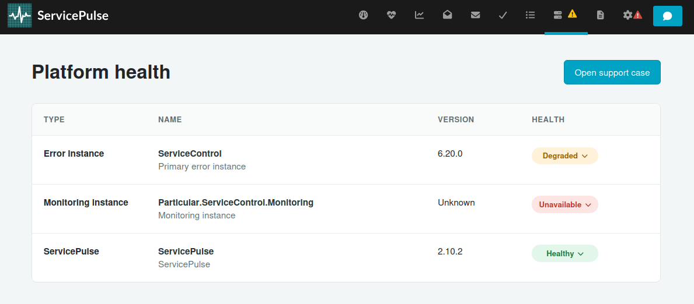
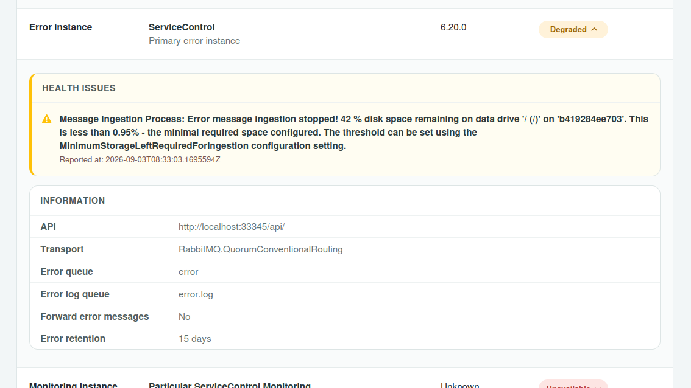
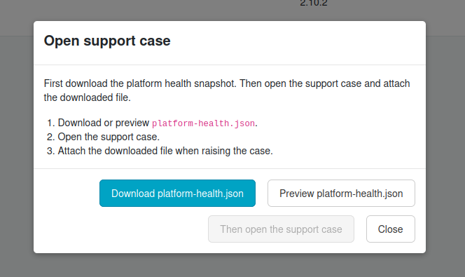

The Platform Health dashboard provides a central view of the Platform components.

The main screen of the Platform Health dashboard displays a list of all the Platform components along with their current versions, upgrade availability, and overall health status. Each of these can be expanded to view any alerts and some basic information about the instance configuration.

#### Opening a Support Case

The Open Support Case on this page allows you to quickly export a snapshot of the status of your installed Platform components before contacting support.

Opening a Support Case from the Platform Health dashboard will assist the support team by including an up to date snapshot of the Platform instances and their details.

> [!NOTE]
> While ServicePulse does not include sensitive information such as connection strings in the snapshot, it is still recommended that you review the content for any confidential information before sending it to support.
