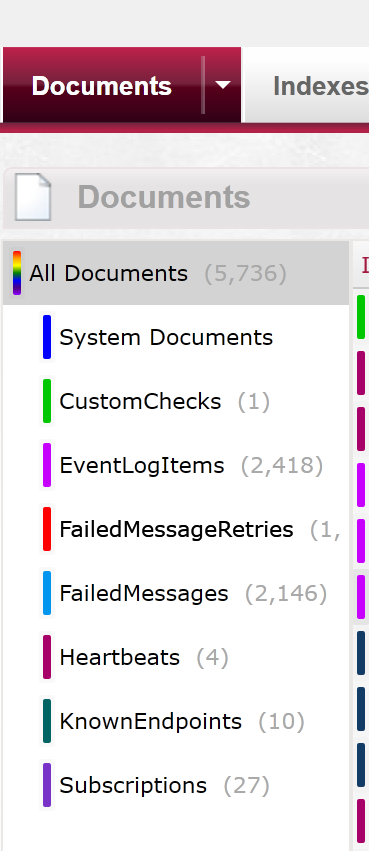

### Remove Obsolete Endpoints

Sometimes, usually in non-production environments, you might want to remove endpoint data completely from your environment.

Mostly people want to do this because the Interface in ServicePulse gets a bit 'noisy' with a bunch of artifacts that could confuse a user new to the system or that the user no longer cares about. 

This is a feature we've been considering adding to the platform for a while now but it has a number of issues that need consideration before going ahead and deleting the unwanted records.

For the most part you don't want to lose data. When considering doing this, please be sure that you only remove endpoints that no longer have any messages associated with them i.e. endpoints with messages that have expired and no new messages. The last thing you want is to be flushing queues for messages you didn't want to process in the first place.

Not only that deleting Endpoints will also remove them from ServiceInsight. You only want to do this if you truly have no need to ever look at these EndPoints again.

### Delete all the things

The simple thing to do is to stop ServiceControl and delete the database

```
net stop "Particular ServiceControl"
RD C:\programdata\particular\ServiceControl\localhost-33333 /S
net start "Particular ServiceControl"
```

This is something you would ONLY do in non-production environments where you were wanting to start from a completely clean slate.

### Ok that's fine for Dev and Test environments but how do I handle it in Production?

The noise obsolete Endpoints make in production because of constant change with new versions of Endpoints and Messages through the regular upgrade process still needs to be dealt with.

1. If you haven't already, follow the instructions here to [Expose the Data via RavenDB Studio](http://docs.particular.net/servicecontrol/use-ravendb-studio) 
2. In a browser navigate to http://localhost:33333/storage/raven/studio.html
3. Click on Documents 



4. Then Click on KnownEndpoints 


5. You should be able to right click and delete any document in there or double click the document you don't want anymore and press the delete button.
6. And you're done, open up ServicePulse and the list of EndPoints will reflect your deletes.

Deleting all of them will make the KnownEndpoints document collection disappear, don't panic, that's ok.

After your system starts pushing a few messages through ServiceControl again the 'live' endpoint should appear in ServicePulse and RavenDb again.