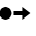

Sagas in NServiceBus coordinate long-running workflows by maintaining state, handling timeouts, and correlating related messages. ServicePulse offers the **Saga Diagram**, which renders a chronological visualization of state transitions and message flows for each saga instance. It provides a visual representation of saga execution, allowing users to trace how a saga instance processes incoming messages, changes state, and emits outgoing messages and timeouts. This visualization is especially useful for understanding complex workflows, debugging message flows, and validating long-running business processes.


## Prerequisites

The Saga Diagram relies on audit data collected via the `NServiceBus.SagaAudit` plugin, which tracks saga state changes and message relationships, sending them to ServiceControl. ServicePulse uses this data to generate saga visualizations.

To view saga diagrams in ServicePulse:

1. Install the `NServiceBus.SagaAudit` package in all endpoints that are participating in the Saga:
   ```
   install-package NServiceBus.SagaAudit
   ```

2. Configure saga auditing in the endpoint configuration:
   ```
   endpointConfiguration.AuditSagaStateChanges(
       serviceControlQueue: "particular.servicecontrol");
   ```

## How to Access the Saga Diagram

The "Saga Diagram" tab in ServicePulse appears when viewing a message involved in a saga. If the message isn't part of a saga, the tab won't be visible.

- Navigate to a message in ServicePulse (from the [All Messages](/servicepulse/all-messages.md) or [Failed Messages](/servicepulse/intro-failed-messages.md) view).
- If the message is part of a saga, the "Saga Diagram" tab will be visible.
- Click on the "Saga Diagram" tab to view the saga visualization.
- The selected message is highlighted in blue in the "Saga Diagram".
- If the saga audit plugin isn't installed, ServicePulse will display a notification with installation instructions.


## Saga Diagram Layout


The top of the diagram displays the following saga metadata:

- **Saga Name**: The name of the saga class.
- **Saga ID**: The unique identifier (GUID) for this saga instance. This information helps identify and correlate the saga across different systems.

All saga events are displayed in chronological order from top to bottom. This timeline provides a clear progression of the saga's lifecycle. The Saga Diagram visualizes the saga lifecycle using a three-column layout. This layout clearly represents the full saga execution flow, from incoming messages (left column) to state changes (center column) to outgoing messages (right column).

Each message includes the following details:

- Originating endpoint.
- Timestamp of processing.
- Message type: Command , Event , Timeout .


### Incoming Messages (Left Column)

The left column of the layout displays all messages that triggered a state change in the saga (e.g., events, commands, or timeouts). The first message usually initiates the saga.

**Example:** A `PlaceOrder` command message might be shown as the incoming message that initiated a saga.


### Saga State Changes (Center Column)

The center column represents how saga data evolves after processing each message. It has the following saga states:

- **Saga Initiated**: Represents the first message that starts a new saga instance.
- **Saga Updated**: Represents subsequent state changes as messages are processed, highlighting the updated properties.
- **Timeout Requested**: Represents when a saga schedules a timeout message to be sent at a future time.
- **Timeout Invoked**: Represents when the previously requested timeout message is actually processed after the elapsed timeout period.
- **Saga Completed**: Represents the final state when the saga finishes, marked with a "Saga Completed" header and timestamp.


- **State Changes View**: State transitions are shown using a diff view, highlighting properties that have changed. The left panel shows the previous state, and the right panel shows the current state. If no visible state changes appear, it’s likely because the message didn’t alter core business properties or only modified standard fields (e.g., `Id`, `Originator`, `OriginalMessageId`), which are filtered out. The diff view also has a maximize option to enable viewing the state changes in a larger modal popup.

**Example:** After an `OrderBilled` event, the saga state is updated with new values for `RunningTotal` properties.


### Outgoing Messages (Right Column)

The right column of the saga diagram visualizes all outbound communications from a saga instance, including commands, events, and timeout requests. An outgoing item can be:

- **Command Messages**: These are direct commands sent to specific handlers and are displayed with the command name and timestamp.
- **Event Messages**: These are events published by the saga and are displayed with the event name and timestamp.
- **Timeout Requests**: These are messages that are scheduled by the saga for a future time and are displayed with the timeout duration, which can be in seconds, minutes, hours, or days. When processed, it provides visual linkage to the corresponding incoming timeout message.

**Example:** After updating its state, a saga might send a `ShipOrder` command and schedule a `CheckOrderStatus` timeout for 24 hours later.

### Message Data Viewer

The layout also has a "Show Message Data"  toggle button that shows/hides the message data beneath each incoming or outgoing message. The data view also has a maximize option to enable viewing the data in a larger modal popup, with an option to copy to the clipboard.

### Timeout Behavior

The timeout message component visualizes delayed message processing in saga workflows. It displays timeout requests and their subsequent invocations with interactive navigation between the two states.

1. When a saga schedules a timeout:
   - The timeout request appears in the right column.
   - It displays the timeout duration (e.g., "Timeout: 2 days").

2. When the timeout is later processed:
   - The corresponding timeout message appears in the left column of a later saga update.
   - The middle column shows "Timeout Invoked" along with "Saga Updated."
   - State changes resulting from the timeout are displayed.
   - Any new outgoing messages appear in the right column.

When navigating between related messages, the view automatically scrolls to show the relevant section.

