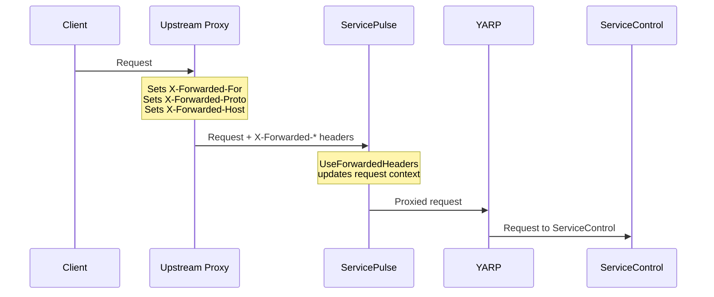
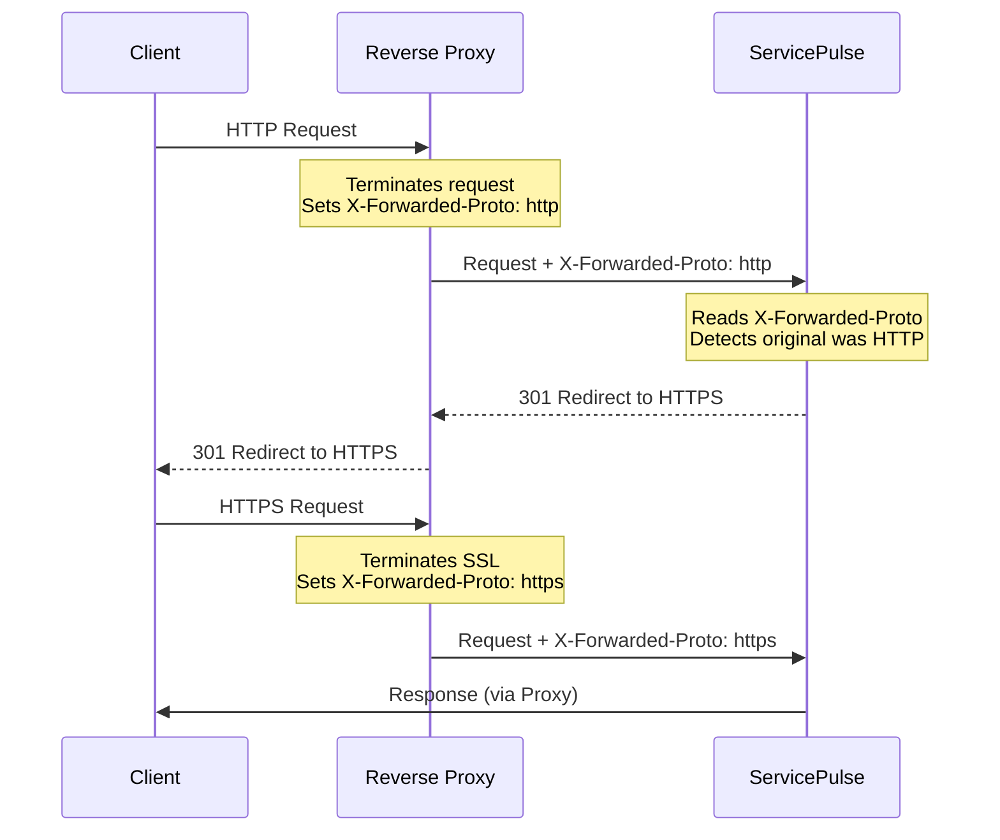

> [!NOTE]
> This page is **not** relevant if the [ServicePulse static files have been extracted](/servicepulse/install-servicepulse-in-iis.md), and is being hosted in anything other than the [Container](/servicepulse/containerization/) or [Windows Service](/servicepulse/installation.md) hosting options provided. Forward header configuration is only required if using a reverse proxy.

When ServicePulse is deployed behind a reverse proxy that terminates SSL/TLS (like nginx, Traefik, or a cloud load balancer), you need to configure forwarded headers so ServicePulse correctly understands the original client request.

## Configuration

There are two hosting options for ServiceControl, [Container](/servicepulse/containerization/) and [Windows Service](/servicepulse/installation.md). The container is configured via environment variables and the windows service is configured using command-line arguments. See the [Hosting Guide](../hosting-guide.md) for example usage of these configuration settings in conjustion with [Authentication](authentication.md) and [TLS](tls.md) configuration settings in a scenario based format.

| Container Environment Variable                  | Windows Service Command-Line Argument | Default | Description                                                      |
|-------------------------------------------------|---------------------------------------|---------|------------------------------------------------------------------|
| `SERVICEPULSE_FORWARDEDHEADERS_ENABLED`         | `--forwardedheadersenabled=`          | `true`  | Enable forwarded headers processing                              |
| `SERVICEPULSE_FORWARDEDHEADERS_TRUSTALLPROXIES` | `--forwardedheaderstrustallproxies=`  | `true`  | Trust all proxies (auto-disabled if known proxies/networks set)  |
| `SERVICEPULSE_FORWARDEDHEADERS_KNOWNPROXIES`    | `--forwardedheadersknownproxies=`     | (none)  | Comma-separated IP addresses of trusted proxies                  |
| `SERVICEPULSE_FORWARDEDHEADERS_KNOWNNETWORKS`   | `--forwardedheadersknownnetworks=`    | (none)  | Comma-separated CIDR networks (e.g., `10.0.0.0/8,172.16.0.0/12`) |

> [!WARNING]
> The default configuration (`TrustAllProxies = true`) is suitable for development and trusted container environments only. For production deployments accessible from untrusted networks, its recommended to configure `KnownProxies` or `KnownNetworks` to restrict which sources can set forwarded headers. Failing to do so can allow attackers to spoof client IP addresses.

## What Headers Are Processed

When enabled, ServicePulse processes:

- `X-Forwarded-For` - Original client IP address
- `X-Forwarded-Proto` - Original protocol (http/https)
- `X-Forwarded-Host` - Original host header

When the proxy is trusted:

- `Request.Scheme` will be set from `X-Forwarded-Proto` (e.g., `https`)
- `Request.Host` will be set from `X-Forwarded-Host` (e.g., `servicepulse.example.com`)
- Client IP will be available from `X-Forwarded-For`

When the proxy is **not** trusted (incorrect `KnownProxies`):

- `X-Forwarded-*` headers are **ignored** (not applied to the request)
- `Request.Scheme` remains `http`
- `Request.Host` remains the internal hostname
- The request is still processed (not blocked)

## Interaction with the Container Built-in Reverse Proxy

ServicePulse includes a [built-in YARP reverse proxy with the Container](/servicepulse/containerization/#reverse-proxy) that forwards requests to ServiceControl Primary and Monitoring instances. The forwarded headers configuration does **not** affect this proxy.



- **UseForwardedHeaders** processes incoming headers from an upstream proxy so ServicePulse understands the original client request (scheme, host, client IP)
- **YARP** independently handles outgoing requests to ServiceControl/Monitoring backends

These operate at different points in the request flow and do not conflict.

## HTTP to HTTPS Redirect

When using a reverse proxy that terminates SSL, you can configure ServicePulse to redirect HTTP requests to HTTPS. This works in combination with forwarded headers:

1. The reverse proxy forwards both HTTP and HTTPS requests to ServicePulse
2. The proxy sets `X-Forwarded-Proto` to indicate the original protocol
3. ServicePulse reads this header (via forwarded headers processing)
4. If the original request was HTTP and redirect is enabled, ServicePulse returns a redirect to HTTPS



To enable HTTP to HTTPS redirect, see [TLS Configuration](tls.md) for details on how to do this.

## Proxy Chain Behavior (ForwardLimit)

When processing `X-Forwarded-For` headers with multiple IPs (proxy chains), the behavior depends on trust configuration:

| Configuration             | ForwardLimit      | Behavior                                      |
|---------------------------|-------------------|-----------------------------------------------|
| `TrustAllProxies = true`  | `null` (no limit) | Processes all IPs, returns original client IP |
| `TrustAllProxies = false` | `1` (default)     | Processes only the last proxy IP              |

For example, with `X-Forwarded-For: 203.0.113.50, 10.0.0.1, 192.168.1.1`:

- **TrustAllProxies = true**: Returns `203.0.113.50` (original client)
- **TrustAllProxies = false**: Returns `192.168.1.1` (last proxy)

## Configuration Examples

The following examples show common forwarded headers configurations for different deployment scenarios.

### Single reverse proxy (known IP)

When running behind a single reverse proxy with a known IP address:

**Container:**

```bash
docker run -e SERVICEPULSE_FORWARDEDHEADERS_ENABLED=true \
           -e SERVICEPULSE_FORWARDEDHEADERS_TRUSTALLPROXIES=false \
           -e SERVICEPULSE_FORWARDEDHEADERS_KNOWNPROXIES=10.0.0.5 \
           ...
           particular/servicepulse:latest
```

**Windows Service:**

```cmd
ServicePulse.Host.exe --forwardedheadersenabled=true --forwardedheaderstrustallproxies=false --forwardedheadersknownproxies=10.0.0.5
```

### Multiple reverse proxies

When running behind multiple proxies (e.g., load balancer and application gateway):

**Container:**

```bash
docker run -e SERVICEPULSE_FORWARDEDHEADERS_ENABLED=true \
           -e SERVICEPULSE_FORWARDEDHEADERS_TRUSTALLPROXIES=false \
           -e SERVICEPULSE_FORWARDEDHEADERS_KNOWNPROXIES=10.0.0.5,10.0.0.6 \
           ...
           particular/servicepulse:latest
```

**Windows Service:**

```cmd
ServicePulse.Host.exe --forwardedheadersenabled=true --forwardedheaderstrustallproxies=false --forwardedheadersknownproxies=10.0.0.5,10.0.0.6
```

### Container/Kubernetes environment

When running in a container environment where proxy IPs are dynamic, trust a network range:

```bash
docker run -e SERVICEPULSE_FORWARDEDHEADERS_ENABLED=true \
           -e SERVICEPULSE_FORWARDEDHEADERS_TRUSTALLPROXIES=false \
           -e SERVICEPULSE_FORWARDEDHEADERS_KNOWNNETWORKS=10.0.0.0/8 \
           ...
           particular/servicepulse:latest
```

### Development/trusted environment

For development or fully trusted environments (not recommended for production):

**Container:**

```bash
docker run -e SERVICEPULSE_FORWARDEDHEADERS_ENABLED=true \
           -e SERVICEPULSE_FORWARDEDHEADERS_TRUSTALLPROXIES=true \
           ...
           particular/servicepulse:latest
```

**Windows Service:**

```cmd
ServicePulse.Host.exe --forwardedheadersenabled=true --forwardedheaderstrustallproxies=true
```
